# Wafer2D AIB Benchmark Report

このレポートはリポジトリ直下の `report.md` と `00_report.md` に同じ内容を置く。PDF 版は `00_report.pdf` として出力する。

## 1. 問題設定

本レポートは、CVD steady 条件の 2D wafer ベンチマークで、AIB-ODE モデルが膜厚分布と診断量を一貫して出力できるかを整理したものである。過去の通常 simulation run と `synthetic_inputs.py` には連続勾配を想定したケースが残っていたため、粗い 12 点 `from_fluent_xy` ではなく、中心点と同心リングからなる高密度 wafer 点群で再実行した。

最新 run:

| 項目 | 値 |
|---|---|
| run_id | `benchmark_wafer2d_20260413T233043389619Z` |
| 実行時刻 | `2026-04-13T23:31:13.362975+00:00` |
| 実行コマンド | `./scripts/commands.sh benchmark_wafer2d --with-physviz` |
| project | `demo` |
| model | `aib_ode` |
| domain | `from_fluent_xy` |
| wafer radius | `150 mm` |
| input cloud | 353 points: center + 8 concentric wafer rings |
| case_count | 4 |
| code_version | `188c4209cbf829207c379aa6549531c5ff7ebb7c` |
| 主要成果物 | `results/demo/runs/benchmark_wafer2d_20260413T233043389619Z/` |

今回の面内分布は、円形ウェハー上の高密度リング点群を三角分割して描画する。粗いポリゴン確認用ではなく、半径方向と角度方向に連続的に変化する wafer 空間分布の確認用である。A/AI/AB/AIB の 4 ケースは同じ点群と同じ入出力契約で比較した。

| case | class | A | I | B | 意味 |
|---|---|---|---|---|---|
| `CASE-A` | A | `s0` | なし | なし | 基本の吸着、反応のみ |
| `CASE-AI` | AI | `s0` | `s1` | なし | inhibitor による阻害を追加 |
| `CASE-AB` | AB | `s0` | なし | `s2` | byproduct 輸送フィードバックを追加 |
| `CASE-AIB` | AIB | `s0` | `s1` | `s2` | inhibitor と byproduct の両方を追加 |

このベンチマークの目的は、絶対的な実プロセス適合度を主張することではない。AIB-ODE 実装が、役割の有無に応じて期待される物理的な方向性を出すかを確認することが目的である。

## 2. 課題

| 課題 | 内容 | ベンチで見る指標 |
|---|---|---|
| 役割分離 | A, I, B の役割が混ざらず出力へ反映されるか | `class_id`, `roles`, `phi_B`, `f_I` |
| 阻害効果 | I を入れたときに反応可能サイトが減り、膜厚が抑制されるか | `mean_f_I`, `mean_h_nm` |
| byproduct 効果 | B があるケースだけで B 関連診断が有限値になるか | `mean_phi_B`, `mean_CsB_over_CrefB` |
| ウェハー面内分布 | 円形ウェハー上の空間分布として結果を確認できるか | `physviz_*.png` |
| 測定との比較 | シミュレーション膜厚と測定風データとの差分を計算できるか | `mean_abs_residual_nm`, `residual_nm` |
| 輸送モデルの扱い | fixed scalar `k_m` と CFD flux 由来 `k_m` の比較余地があるか | `km_spread_ratio`, `flux_km_judge` |

今回の run では Flux-KM 比較は無効である。そのため `flux_km_judge.status = SKIP` であり、合否は A/AI/AB/AIB の役割分離と傾向確認を中心に読む。

## 3. ゴール設定

1. A/AI/AB/AIB の 4 クラスをすべて実行する。
2. AI ケースで inhibitor 効果が現れ、`mean_f_I(AI) < mean_f_I(A)` になる。
3. AIB ケースで AB より膜厚が抑制され、`mean_h_nm(AIB) < mean_h_nm(AB)` になる。
4. B なしクラスでは `phi_B` が `NaN`、B ありクラスでは有限値になる。
5. ウェハーを想定した面内分布グラフを成果物として残す。
6. 結果表、ランキング、HTML レポート、Markdown レポート、PDF レポートを第三者が確認できる形で残す。

合否の最終判定は `summary.json` の `trend_assertions.overall_passed` で確認する。

## 4. 手法

### 4.1 入力とウェハー点群

入力は deterministic な Fluent 風データである。各点には XY 座標、参照濃度 `C_ref`、flux sink が含まれる。

過去ケースを確認したところ、連続分布の基準として `synthetic_inputs.py` の `radial_gradient` / `edge_depleted` と、通常 simulation run の `thickness_map.png` / `radial_profile.png` があった。これに合わせ、今回の `benchmark_wafer2d` では 12 点の疎な点群ではなく、中心点と 8 本の同心リングで構成される 353 点の wafer 点群を使った。

入力場の基本形は次である。

$$
r_{norm} = \frac{\sqrt{x^2 + y^2}}{\max(r)}
$$

$$
\theta = \operatorname{atan2}(y, x)
$$

$$
C_{ref,A} = \operatorname{clip}\left(1.2 - 0.4r_{norm} + 0.10\cos\theta\right)
$$

$$
C_{ref,I} = \operatorname{clip}\left((0.55 + 0.20\sin(2\theta))\,s_I\right)
$$

$$
C_{ref,B} = \operatorname{clip}\left((0.65 + 0.35r_{norm}^2)\,s_B\right)
$$

$$
J_{sink,j} = C_{ref,j} \, u(x,y)
$$

| 記号 | 意味 |
|---|---|
| `x, y` | wafer 面内座標 `[mm]` |
| `r_norm` | 正規化半径 |
| `theta` | 面内角度 |
| `C_ref,j` | 種 `j` の参照濃度 |
| `J_sink,j` | 種 `j` の sink flux |
| `s_I`, `s_B` | I/B role がある場合の濃度スケール |
| `u(x,y)` | 簡易的な面内速度スケール |

測定風の膜厚データは次で生成される。

$$
h_{meas} = 0.008 + 0.0015(1-r_{norm})
$$

### 4.2 AIB-ODE モデル

AIB-ODE は wafer 各セルで表面被覆率 `theta_A` と膜厚 `h` を時間発展させる局所モデルである。今回の run は steady mode で、`t_proc_s = 30.0 s`, `dt_s = 0.01 s` を用いた。

#### 被覆率補助変数

$$
\theta_* = \frac{1-\theta_A}{1 + K_I C_{ref,I}}
$$

$$
f_I = \frac{1}{1 + K_I C_{ref,I}}
$$

| 記号 | 意味 |
|---|---|
| `theta_A` | A 種で占有された表面被覆率 |
| `theta_*` | 反応に使える有効空きサイト率 |
| `K_I` | inhibitor の阻害係数 |
| `C_ref,I` | I 種の参照濃度 |
| `f_I` | inhibitor 診断量。小さいほど阻害が強い |

#### A 種の表面濃度

$$
C_{s,A}
= \frac{k_{m,A} C_{ref,A} + \Gamma_s k_{des}\theta_A}
       {k_{m,A} + \Gamma_s k_{ads}\theta_*^{m_{ads}}}
$$

| 記号 | 意味 |
|---|---|
| `C_s,A` | A 種の表面濃度 |
| `C_ref,A` | A 種の参照濃度 |
| `k_m,A` | A 種の物質移動係数 |
| `Gamma_s` | 表面サイト密度スケール |
| `k_ads` | 吸着速度係数 |
| `k_des` | 脱離速度係数 |
| `m_ads` | 吸着項の有効サイト次数 |

#### B 種の表面濃度

B が存在するケースでは、B の表面濃度を次で計算する。

$$
C_{s,B}
= \frac{k_{m,B} C_{ref,B}}
       {k_{m,B} + \Gamma_s k_{rxn}\theta_A^{p_A}\theta_*^{p_*}/C_{B,scale}}
$$

| 記号 | 意味 |
|---|---|
| `C_s,B` | B 種の表面濃度 |
| `C_ref,B` | B 種の参照濃度 |
| `k_m,B` | B 種の物質移動係数 |
| `k_rxn` | 反応速度係数 |
| `p_A` | A 被覆率に対する反応次数 |
| `p_*` | 空きサイト率に対する反応次数 |
| `C_B_scale` | B 寄与の濃度スケール |

B がない A/AI ケースでは、`C_s,B / C_ref,B` と `phi_B` は `NaN` になることが正しい挙動である。

#### 反応イベントと膜厚発展

B がない場合:

$$
r_{event} = k_{rxn}\theta_A^{p_A}\theta_*^{p_*}
$$

B がある場合:

$$
r_{event}
= k_{rxn}\theta_A^{p_A}\theta_*^{p_*}
  \frac{C_{s,B}}{C_{B,scale}}
$$

表面被覆率と膜厚は次で更新される。

$$
\frac{d\theta_A}{dt}
= k_{ads}C_{s,A}\theta_*^{m_{ads}}
  - k_{des}\theta_A
  - \nu_A r_{event}
$$

$$
\frac{dh}{dt}
= \alpha_h \Gamma_s r_{event}
$$

| 記号 | 意味 |
|---|---|
| `r_event` | 成膜に寄与する反応イベント率 |
| `nu_A` | 反応イベントあたりの A 消費係数 |
| `alpha_h` | 反応イベントから膜厚への変換係数 |
| `h` | 膜厚 `[nm]` |

数値解法は implicit Euler である。各時刻で `theta_A` について次を解く。

$$
g(\theta_{A,n+1})
= \theta_{A,n+1} - \theta_{A,n}
  - \Delta t\,F(\theta_{A,n+1})
= 0
$$

ここで `F(theta_A)` は `d theta_A / dt` の右辺である。実装では二分法で解き、解が bracket できない点は explicit fallback で安全側に処理する。

#### B 寄与の診断量

$$
\phi_B
= \frac{\Gamma_s k_{rxn}\theta_A^{p_A}\theta_*^{p_*}}
        {C_{B,scale} k_{m,B}}
$$

`phi_B` は B の輸送制約と反応寄与の強さを表す診断量である。B がないクラスでは `NaN`、B があるクラスでは有限値になることが期待される。

#### Flux-KM 拡張

CFD flux 由来の `k_m` を使う場合は次を使う。

$$
k_{m,CFD}(x,y,t)
= \frac{J_{sink}(x,y,t)}{C_{ref}(x,y,t) + \epsilon}
$$

$$
k_{m,used}(x,y,t)
= \gamma_{km} k_{m,CFD}(x,y,t)
$$

今回の run では Flux-KM 比較は無効であり、`flux_km_judge.status = SKIP` である。

### 4.3 評価指標

各指標は edge mask 内で area weight 付き平均として集計される。

| 指標 | 意味 | 読み方 |
|---|---|---|
| `mean_h_nm` | 平均膜厚 | 小さいほど成膜が抑制されている |
| `mean_f_I` | inhibitor 係数の平均 | 小さいほど阻害が強い |
| `mean_phi_B` | B 寄与診断量の平均 | B なしでは `NaN`、B ありでは有限 |
| `mean_CsA_over_CrefA` | A 表面濃度比 | 表面濃度が参照濃度に対してどの程度か |
| `mean_CsB_over_CrefB` | B 表面濃度比 | B なしでは `NaN` |
| `mean_abs_residual_nm` | `abs(h_sim - h_meas)` の平均 | 測定風データとの差。小さいほどよい |
| `score` | `mean_abs_residual_nm + 0.05 * complexity` | 役割数の複雑さにペナルティを足したランキング値 |

`complexity` は I と B の有無で決まる。A は 0、AI/AB は 1、AIB は 2 である。

### 4.4 ワークフロー

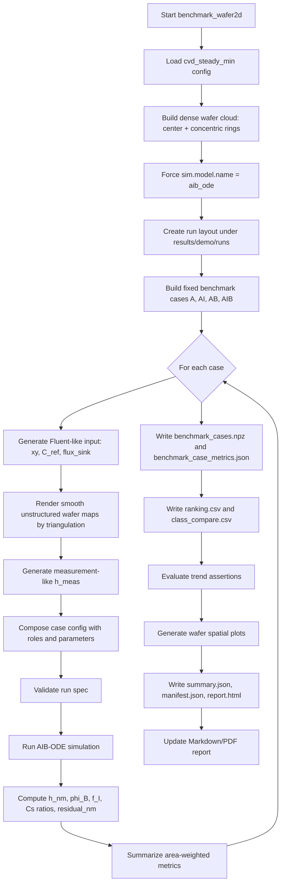

### 4.5 空間分布ごとの計算式と確認観点

この節では、レポートに追加した空間分布グラフがどの方程式から作られ、何を検証しているかを整理する。各図は単なる可視化ではなく、平均値テーブルの判定が wafer 面内でも成立しているかを確認するためのものである。

#### 4.5.1 膜厚分布 `validity_h_all_cases.png`

膜厚分布は、反応イベント率から時間積分して得る。

$$
r_{event}^{noB}(x,y)
= k_{rxn}\theta_A(x,y)^{p_A}\theta_*(x,y)^{p_*}
$$

$$
r_{event}^{B}(x,y)
= k_{rxn}\theta_A(x,y)^{p_A}\theta_*(x,y)^{p_*}
  \frac{C_{s,B}(x,y)}{C_{B,scale}}
$$

$$
h(x,y,t_{end})
= h(x,y,0)
  + \int_0^{t_{end}}\alpha_h\Gamma_s r_{event}(x,y,t)\,dt
$$

離散時間では、今回の実装は次の更新を繰り返す。

$$
h_{n+1}(x,y)
= h_n(x,y)
  + \Delta t\,\alpha_h\Gamma_s r_{event,n+1}(x,y)
$$

この図では、`CASE-A`, `CASE-AI`, `CASE-AB`, `CASE-AIB` の `h(x,y)` を同じ色スケールで並べる。確認したいことは、I を入れた AI/AIB で膜厚が抑制されること、特に `AB - AIB` の差が正になることである。

#### 4.5.2 残差分布 `validity_residual_all_cases.png`

残差分布は、シミュレーション膜厚と測定風膜厚との差である。

$$
e_h(x,y)
= h_{sim}(x,y) - h_{meas}(x,y)
$$

$$
|e_h|_{mean}
= \frac{\sum_{(x,y)\in\Omega} w(x,y)|e_h(x,y)|}
       {\sum_{(x,y)\in\Omega} w(x,y)}
$$

ここで `Omega` は edge mask 内の有効 wafer 領域、`w(x,y)` は面積重みである。この図では、平均残差だけではなく、残差が局所的な破綻や一点異常で支配されていないかを確認する。

#### 4.5.3 阻害効果分布 `validity_inhibition_maps.png`

阻害係数は次で定義する。

$$
f_I(x,y)
= \frac{1}{1 + K_I C_{ref,I}(x,y)}
$$

阻害効果の強さは、非阻害ケースとの差分として見る。

$$
\Delta f_I^{A-AI}(x,y)
= f_I^{A}(x,y) - f_I^{AI}(x,y)
$$

$$
\Delta f_I^{AB-AIB}(x,y)
= f_I^{AB}(x,y) - f_I^{AIB}(x,y)
$$

`Delta f_I > 0` であれば、I を含むケースの `f_I` が小さくなっている。つまり、inhibitor が wafer 面内で反応可能サイトを減らしていることを示す。

#### 4.5.4 B 診断と AIB 膜厚抑制 `validity_b_and_suppression_maps.png`

B 診断量は次で定義する。

$$
\phi_B(x,y)
= \frac{\Gamma_s k_{rxn}\theta_A(x,y)^{p_A}\theta_*(x,y)^{p_*}}
        {C_{B,scale}k_{m,B}(x,y)}
$$

B がない A/AI では `phi_B = NaN`、B がある AB/AIB では有限値になることが期待される。

AIB の膜厚抑制は、AB との差分として見る。

$$
\Delta h^{AB-AIB}(x,y)
= h^{AB}(x,y) - h^{AIB}(x,y)
$$

`Delta h^{AB-AIB} > 0` であれば、B がある条件でも inhibitor を入れた AIB の膜厚が AB より低い。この図は、`assert_aib_inhibition_vs_ab` の空間分布版である。

#### 4.5.5 入力場 `C_ref,A` と `flux_sink,A`

入力濃度と flux sink は、出力分布を解釈するための基準場である。

$$
C_{ref,A}(x,y)
= \operatorname{clip}\left(1.2 - 0.4r_{norm} + 0.10\cos\theta\right)
$$

$$
J_{sink,A}(x,y)
= C_{ref,A}(x,y)u(x,y)
$$

Flux-KM を使う場合、`J_sink,A` は次のように物質移動係数へ変換される。

$$
k_{m,CFD,A}(x,y)
= \frac{J_{sink,A}(x,y)}
        {C_{ref,A}(x,y)+\epsilon}
$$

今回の run では `km_source = fit_scalar` のため、この変換は合否判定には使っていない。入力場は、膜厚や診断量の空間分布が入力の連続勾配と整合しているかを見るために使う。

### 4.6 空間分布生成ワークフロー

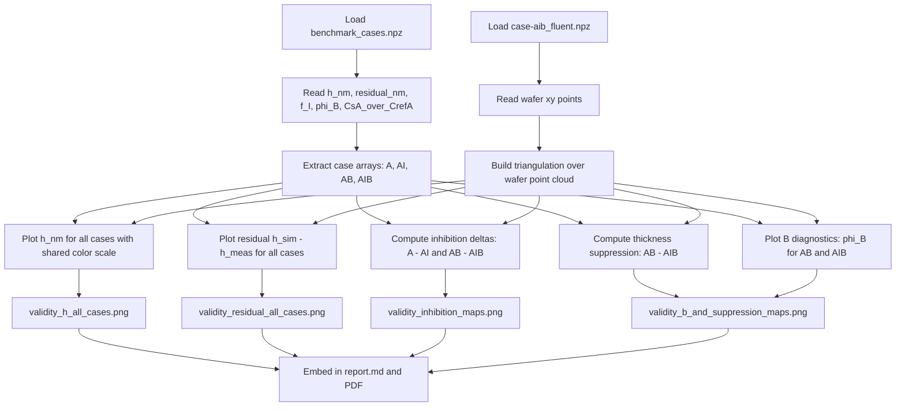

## 5. ベンチマーク結果

### 5.1 全体サマリ

| 指標 | 値 |
|---|---|
| `overall_passed` | `True` |
| `case_count` | 4 |
| `domain.kind` | `from_fluent_xy` |
| `wafer_radius_mm` | `150` |
| input points | `353` |
| radial rings | `9` |
| `km_spread_ratio` | `1.0` |
| `flux_km_judge.status` | `SKIP` |
| `flux_km_judge.reason_codes` | `compare_flux_km_disabled` |
| `p1_recommendation` | `False` |
| `delta_f_I_A_minus_AI` | `0.6479168563878293` |
| `delta_h_AB_minus_AIB` | `0.006434419653494672 nm` |

### 5.2 Trend assertions

| 判定 | 結果 | 意味 |
|---|---|---|
| `assert_class_coverage` | PASS | 4 クラスがすべて評価された |
| `assert_ai_inhibition` | PASS | AI の `mean_f_I` が A より小さい |
| `assert_aib_inhibition_vs_ab` | PASS | AIB の平均膜厚が AB より小さい |
| `assert_ab_phi_b_finite` | PASS | AB の `phi_B` が有限 |
| `assert_aib_phi_b_finite` | PASS | AIB の `phi_B` が有限 |
| `assert_a_phi_b_nan` | PASS | A の `phi_B` が `NaN` |
| `assert_ai_phi_b_nan` | PASS | AI の `phi_B` が `NaN` |
| `overall_passed` | PASS | 必須判定がすべて成立 |

### 5.3 ケース別メトリクス

| case | class | mean_h_nm | mean_abs_residual_nm | score | mean_f_I | mean_phi_B | mean_CsA/CrefA | mean_CsB/CrefB | mean_km_A | mean_tau_A |
|---|---|---:|---:|---:|---:|---:|---:|---:|---:|---:|
| `CASE-A` | A | 0.0849974 | 0.0765173 | 0.0765173 | 1.000000 | NaN | 0.116202 | NaN | 0.020000 | 50.000000 |
| `CASE-AI` | AI | 0.0780897 | 0.0696096 | 0.1196096 | 0.352083 | NaN | 0.271075 | NaN | 0.020000 | 50.000000 |
| `CASE-AB` | AB | 0.0809386 | 0.0724584 | 0.1224584 | 1.000000 | 0.308498 | 0.118210 | 0.765245 | 0.020000 | 50.000000 |
| `CASE-AIB` | AIB | 0.0745041 | 0.0660240 | 0.1660240 | 0.312311 | 0.268921 | 0.297480 | 0.788879 | 0.020000 | 50.000000 |

残差だけを見ると `CASE-AIB` が最小である。`score` は complexity penalty を含むため、最小は `CASE-A` になる。

### 5.4 ランキング

| rank | case | class | score | コメント |
|---:|---|---|---:|---|
| 1 | `CASE-A` | A | 0.0765173 | 単純モデルで score 最小 |
| 2 | `CASE-AI` | AI | 0.1196096 | 阻害が効くが complexity penalty が入る |
| 3 | `CASE-AB` | AB | 0.1224584 | B 診断は有限 |
| 4 | `CASE-AIB` | AIB | 0.1660240 | 残差最小だが I+B の penalty が最大 |

### 5.5 面内分布グラフ

以下は最新 run の `plots/` に保存されたウェハー面内分布である。353 点の wafer 点群を三角分割して描画しており、過去の連続勾配ケースに近い滑らかな空間分布として確認できる。

#### 膜厚分布 `h_nm`

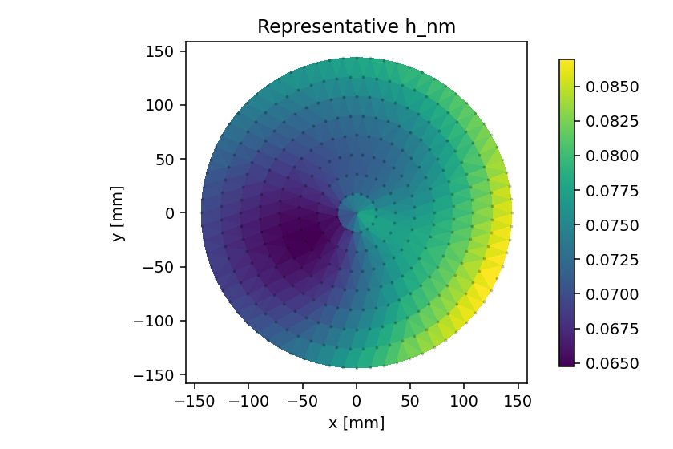

AIB 代表ケースの膜厚分布である。平均膜厚は `0.0745041 nm` で、AB の `0.0809386 nm` より小さい。

#### B 寄与診断 `phi_B`

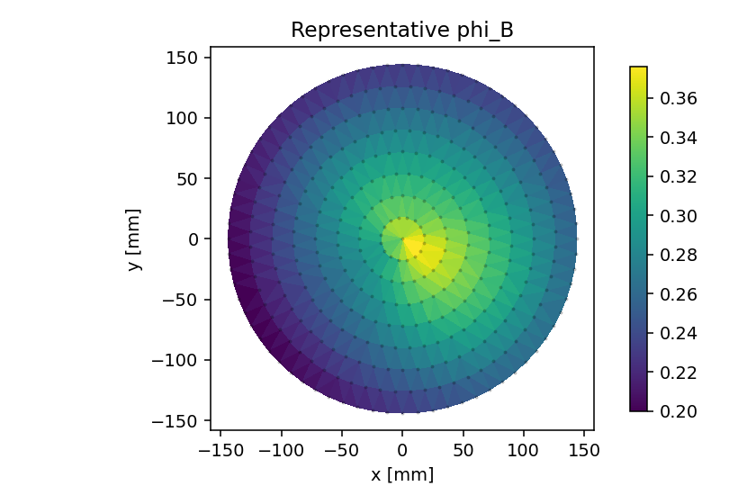

`phi_B` は B が存在するケースで有限になる診断量である。AB と AIB の `mean_phi_B` はそれぞれ `0.308498`, `0.268921` で、A と AI では `NaN` である。

#### inhibitor 診断 `f_I`

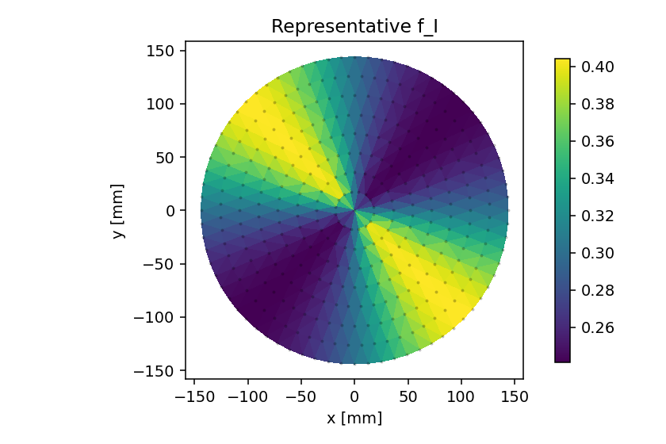

`f_I` は小さいほど阻害が強い。AI の平均 `0.352083`、AIB の平均 `0.312311` は A/AB の `1.0` より小さく、inhibitor role が機能している。

#### A 種の物質移動係数 `k_m,A`

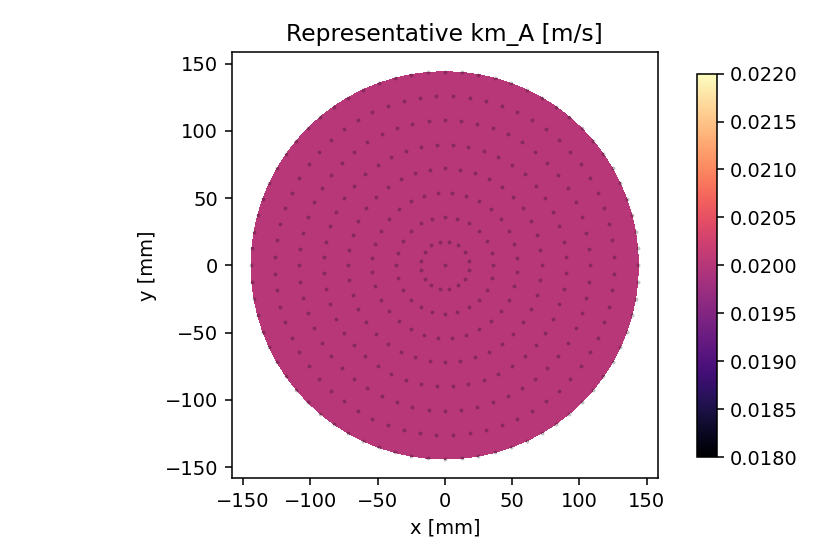

今回の run は fixed scalar `k_m` であり、`mean_km_A = 0.02` で一定である。そのため `km_spread_ratio = 1.0` になる。

#### 輸送時間スケール `tau_A`

`tau_A = z_ref / k_m,A` であり、今回の `z_ref = 1.0 mm`, `k_m,A = 0.02` から平均 `50.0` になる。

#### 入力参照濃度 `C_ref,A`

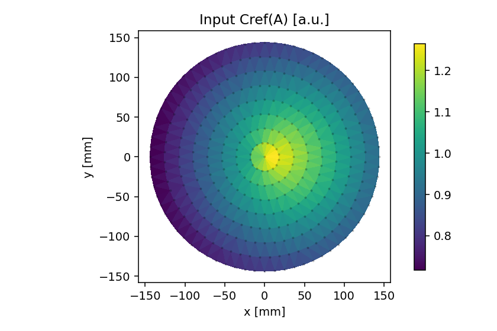

`C_ref,A` は A 種の入力濃度分布である。膜厚や `C_s,A / C_ref,A` を解釈するための基準場である。

#### 入力 flux sink `A`

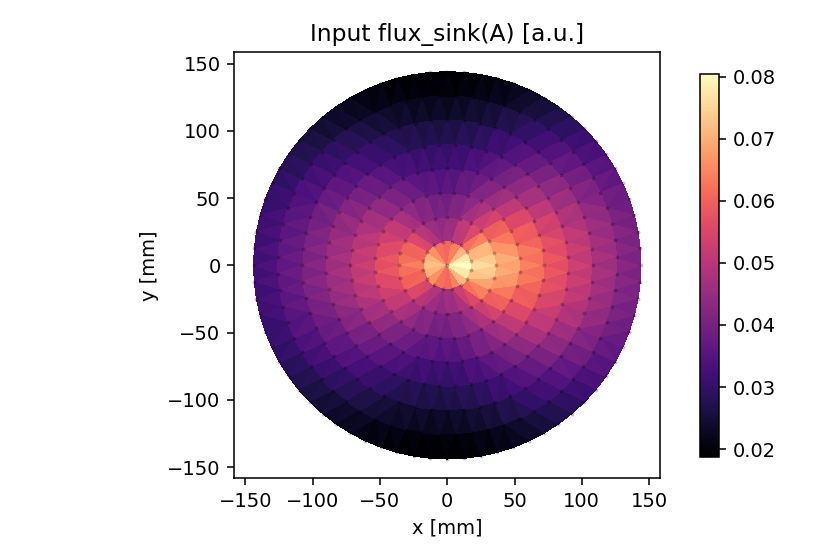

`flux_sink(A)` は CFD flux 由来 `k_m` を評価する場合の入力になる。今回の run では Flux-KM 比較は無効のため、参考入力として扱う。

### 5.6 解析妥当性を示す空間分布

以下の図は、今回の解析が表の平均値だけでなく、wafer 面内でも期待される方向に変化していることを確認するために追加した。

#### 全ケースの膜厚分布

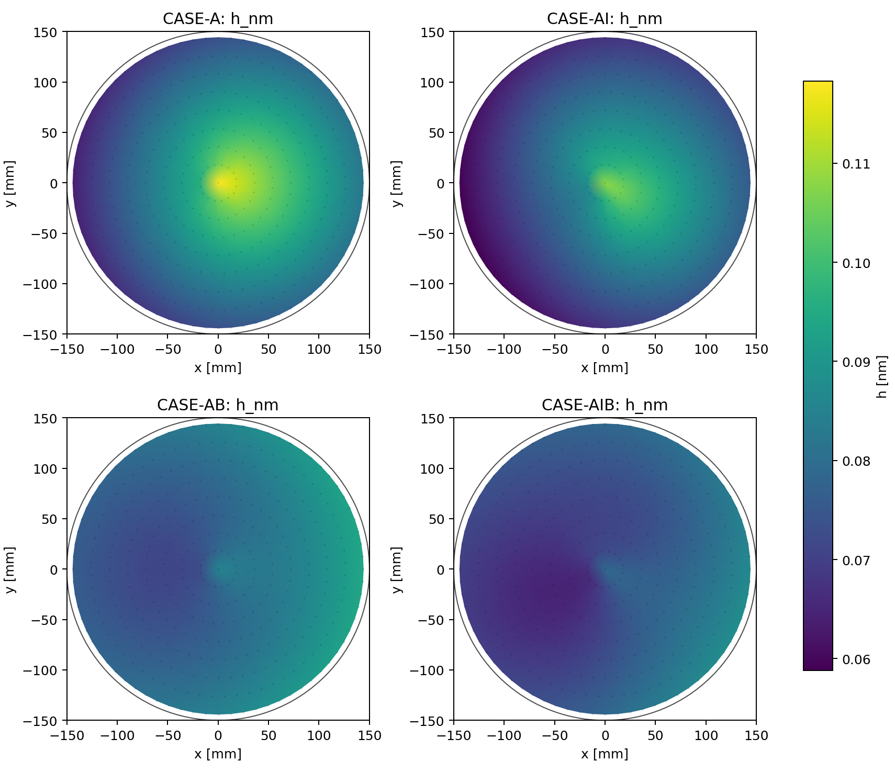

A/AI/AB/AIB の膜厚を同じ色スケールで比較した図である。AI は A より、AIB は AB より膜厚が低くなる傾向を面内でも確認できる。これは `assert_ai_inhibition` と `assert_aib_inhibition_vs_ab` の平均値判定を空間分布として裏付ける。

#### 全ケースの残差分布

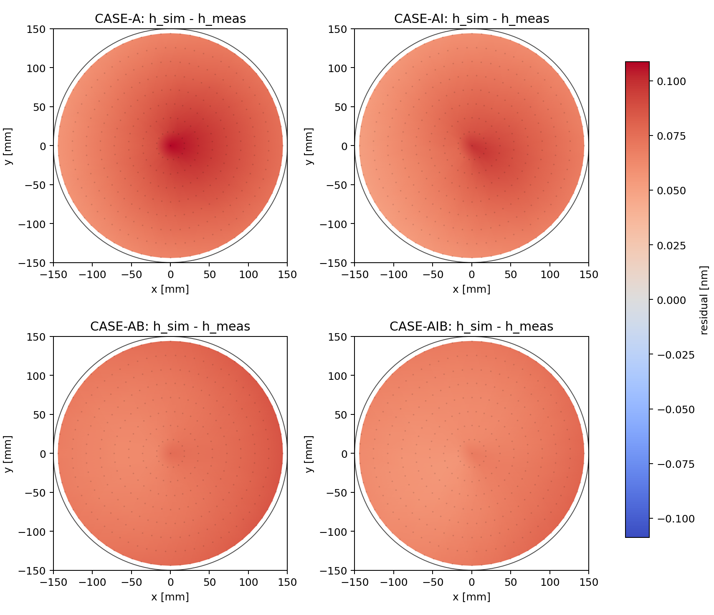

`h_sim - h_meas` の分布である。残差が一点だけの異常値ではなく、入力分布に沿った滑らかな空間パターンとして出ていることを確認する。平均残差だけでは見落としやすい、局所的な破綻がないかを見るための図である。

#### 阻害効果の空間分布

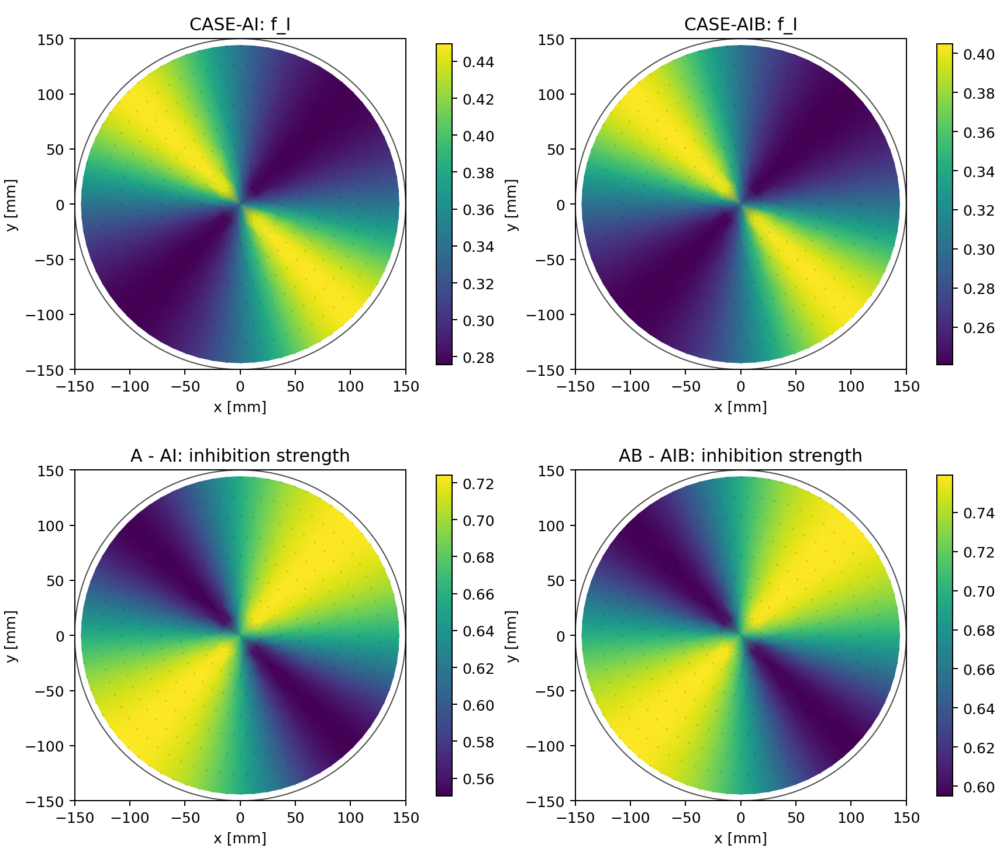

AI/AIB の `f_I` と、非阻害ケースとの差分を示す。`A - AI` と `AB - AIB` が正に出る領域では、inhibitor によって `f_I` が下がっている。これは、阻害が平均値だけでなく wafer 面内の各領域で働いていることを示す。

#### B 診断と AIB 膜厚抑制

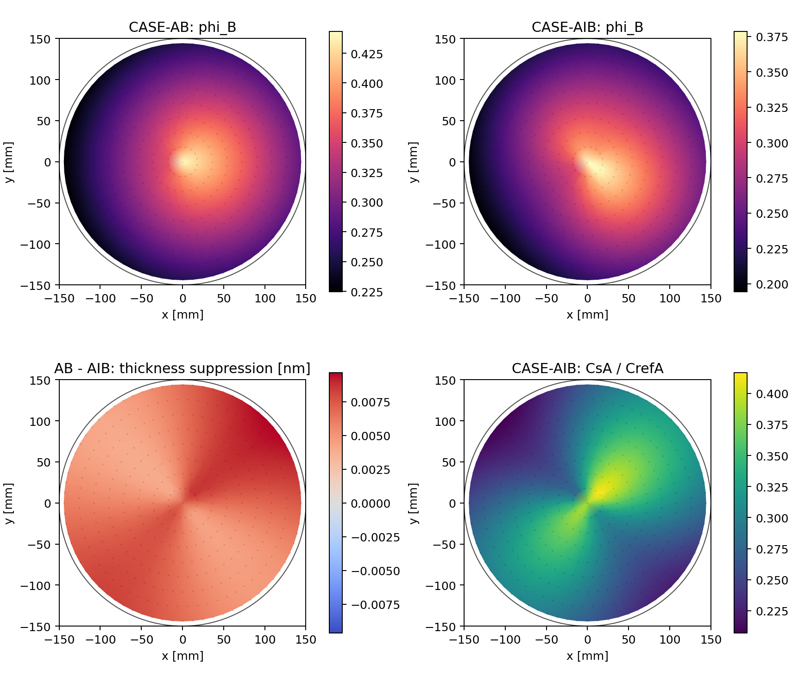

AB/AIB の `phi_B`、`AB - AIB` の膜厚差、AIB の `CsA/CrefA` をまとめた図である。`AB - AIB` が正の領域では、B がある条件でも inhibitor を加えた AIB の膜厚が AB より抑制されている。B 診断 `phi_B` が B ありケースで有限になっていることも、役割分離の妥当性を支える。

## 6. 考察

最新の高密度 wafer 点群 run は `overall_passed=True` であり、AIB-ODE の基本的な役割分離と方向性は確認できた。

AI で `mean_f_I` が `1.0` から `0.352083` へ下がっている。これは inhibitor が反応可能サイトを減らす方向に働いていることを示す。AIB では `mean_f_I = 0.312311` まで下がり、阻害はさらに強い。

膜厚については、AIB の `mean_h_nm = 0.0745041 nm` が AB の `0.0809386 nm` より小さい。つまり、B がある条件でも inhibitor による膜厚抑制が残っている。これは `assert_aib_inhibition_vs_ab` の PASS と整合する。

B 関連診断も期待通りである。A/AI では `phi_B = NaN`、AB/AIB では有限値になっている。これは B role の有無が診断量へ正しく反映されていることを示す。

一方で、今回の run では Flux-KM 比較はしていない。`flux_km_judge.status = SKIP` で、理由は `compare_flux_km_disabled` である。したがって、CFD flux sink から求めた `k_m` が fixed scalar `k_m` よりよいかは、この結果からは結論できない。

score の読み方にも注意が必要である。`mean_abs_residual_nm` は AIB が最小だが、`score` は complexity penalty を含むため A が最小になる。この設計は、単純なモデルで十分なら単純なモデルを優先するランキングであり、物理的に最も豊かなモデルを常に上位にするものではない。

総合すると、今回の結果は「連続勾配を持つ wafer 面内分布上で AIB-ODE のクラス差、阻害効果、B 診断の有無、成果物生成が正常に機能している」ことを示す。ただし、実測データへの絶対適合、Flux-KM の優位性、より実 CFD に近い高密度入力点群での頑健性は、別 run または追加ベンチで確認する必要がある。

## 7. 参照成果物

| 成果物 | パス |
|---|---|
| HTML report | `results/demo/runs/benchmark_wafer2d_20260413T233043389619Z/report.html` |
| summary | `results/demo/runs/benchmark_wafer2d_20260413T233043389619Z/summary.json` |
| metrics JSON | `results/demo/runs/benchmark_wafer2d_20260413T233043389619Z/outputs/benchmark_case_metrics.json` |
| ranking CSV | `results/demo/runs/benchmark_wafer2d_20260413T233043389619Z/outputs/ranking.csv` |
| class compare CSV | `results/demo/runs/benchmark_wafer2d_20260413T233043389619Z/outputs/class_compare.csv` |
| plots | `results/demo/runs/benchmark_wafer2d_20260413T233043389619Z/plots/` |
