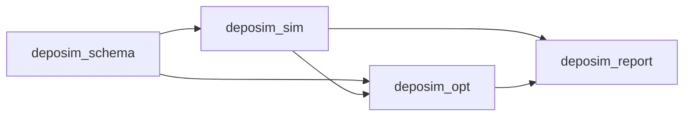

# Architecture and model responsibilities

## Design objective

The architecture serves one product decision: determine which anonymous Fluent fields
can act as transferable reaction roles when predicting measured film maps, while keeping
numerically similar but physically different explanations visible.

The main path is

```text
raw Fluent fields
-> aligned role fields
-> explicit reaction-input selection
-> registered equation or process model
-> parameter fit to measured film response
-> optional post-selection spatial residual response
-> condition and spatial validation
-> role/equation stability
-> concise evidence statement
```

CVD and ALD use the same role vocabulary and evidence rules but retain separate process
models. A steady response equation, a dynamic state model, a transport closure, and a
net-film composition model solve different subproblems and are not interchangeable.

## Package boundaries



| Package | Responsibility | Must not own |
| --- | --- | --- |
| `deposim_schema` | YAML structure, public model names, defaults, and compatibility validation | Numerical integration, fitting, reporting |
| `deposim_sim` | Forward simulation, process-state kernels, transport providers, mass-transfer utilities, net-film composition, run artifacts | Candidate ranking or chemical-role adoption |
| `deposim_opt` | Observation adaptation, role enumeration, fitting, cross-validation, reduction comparison, stability, and decision evidence | Process equations hidden inside optimizer branches |
| `deposim_report` | Generic plots and run presentation from computed outputs | Fitting, role selection, or changes to model meaning |

The dependency direction keeps the simulator usable without optimization libraries.
Heavy packages remain optional.

## Model layers

| Layer | Registry or implementation | Inputs | Output meaning |
| --- | --- | --- | --- |
| Reaction input | `deposim_opt.role_fields` | reference concentration, wall concentration, or independently calculated transport-capacity flux | one explicitly selected local driver and its location/unit metadata |
| Steady observable response | `deposim_sim.models.aib_reductions` | normalized selected driver and role assignment | dimensionless response shape and interpretable surface-state proxies |
| Spatial residual response | `deposim_opt.spatial_response` | frozen chemical prediction and identification-condition residual maps | positive condition-shape factor that preserves the chemical mean and makes no chemical claim |
| Dynamic process state | `deposim_sim.models.process_models` plus `aib_ode.py`, `mvk_state.py`, `ald_role_state.py` | time-resolved role concentrations and transport provider | state trajectory, surface concentrations, fluxes, and thickness |
| Transport source | `deposim_sim.transport_provider` | wall concentration, (k_m), or CFD transport-capacity flux | role-specific (k_m) and concentration-location metadata |
| Mass-transfer utility | `deposim_sim.models.mass_transfer` | diffusivity, film thickness, rotation, viscosity | candidate (k_m) field |
| Net film | `deposim_sim.models.net_models` | deposition, etch, and loss rates | signed net thickness rate |

The steady census reports the MvK steady equivalent once rather than giving an
algebraically duplicate mechanism an additional selection vote. Dynamic MvK remains a
separate process model because its redox memory can only be tested with time-resolved
data.

## File responsibilities

| File or module | Single responsibility |
| --- | --- |
| `scripts/analyze_cvd_multicond_case.py` | Small CLI for model inventory and steady multi-condition execution |
| `deposim_opt/cvd_analysis_io.py` | Format-level numeric CSV reading, coordinate matching, source hashing, and artifact serialization |
| `deposim_opt/cvd_conditions.py` | CVD condition-file discovery, column semantics, data-quality facts, and assembly of aligned role fields |
| `deposim_opt/spatial_validation.py` | Shared spatial blocks and ordinary rate metrics |
| `deposim_opt/empirical_response.py` | Legacy-compatible empirical role candidates and constrained linear fitting |
| `deposim_opt/role_fields.py` | Aligned arrays and explicit selection of reference concentration, wall concentration, or transport-capacity flux |
| `deposim_opt/spatial_response.py` | Post-selection radial residual models; condition-mean preservation and transfer application |
| `deposim_sim/models/aib_reductions.py` | Registered steady equations, exact reductions, symmetries, required evidence, and formula metadata |
| `deposim_opt/surface_fit.py` | Whole-wafer weighting, positive shape-parameter orchestration, and separable rate-scale profiling |
| `deposim_opt/losses.py` | Pure dimensional, wafer-normalized, symmetric, Huber, L1, and uncertainty-standardized losses |
| `deposim_opt/metrics.py` | Prediction, bias, spatial-shape, and thickness-unit reporting metrics; never changes the fitted objective |
| `deposim_opt/parameter_space.py` | Model-aware filtering and validation of shared or per-condition search variables |
| `deposim_opt/samplers.py` | Random, TPE, CMA-ES, DE, PSO, Lévy-flight, and CMA-MAE backends; budgets, seeds, stopping, and traces |
| `deposim_opt/surface_optimization_benchmark.py` | Fixed-equation Loss-by-sampler comparison using training-condition CV and an untouched test audit |
| `deposim_opt/parameter_fit.py` | One candidate fit: condition simulation, cache, sampler call, holdout prediction, and identifiability diagnostics |
| `deposim_opt/fit_conditions.py` | Condition parsing and the sole simulator-to-observation adapter used by train and holdout evaluation |
| `deposim_opt/evidence_requirements.py` | Translate failed capability criteria into reusable measurement and experimental-design requirements |
| `deposim_opt/cvd_multicond_analysis.py` | Candidate census orchestration, nested condition evaluation, evidence assembly, and artifact production |
| `deposim_opt/class_compare.py` | Generic candidate ranking, reduction comparisons, role evidence, stability, and adoption decision |
| `deposim_opt/cvd_multicond_report.py` | Rendering of already computed steady results; no fitting or selection |
| `deposim_sim/models/aib_ode.py` | Continuous adsorbed-(A) state and local A/B transport-reaction closure |
| `deposim_sim/models/mvk_state.py` | Bounded redox-reservoir integration and reduction/regeneration fluxes |
| `deposim_sim/models/ald_role_state.py` | ALD storage, release, conversion, and inhibitor state integration |
| `deposim_sim/transport_provider.py` | `direct_surface`, `fit_scalar`, and `from_cfd_flux_sink` semantics |
| `deposim_sim/pipeline.py` | One process dispatcher connecting config, Fluent input, transport, model, measurement, and outputs |
| `deposim_schema/sim_config.py` | Public configuration shape and allowed process-model names |

This separation makes a new equation family a local model change: register its metadata,
response, reductions, and evidence requirements; then exercise the existing enumeration,
fit, comparison, and reporting path. Model-name conditionals should not be added to the
analysis unless the model supplies a genuinely different observation type.

## Configuration contract

Simulation and fitting configurations are kept separate:

```text
configs/sim/    forward process and state execution
configs/opt/    parameter estimation and role comparison
```

Public process models are:

- `role_cvd_aib`
- `role_cvd_mvk`
- `role_ald_state`

Implementation module names such as `aib_ode.py` are internal numerical details. The
steady equation-family registry is selected by the analysis CLI rather than by a dynamic
process-model name.

Every concentration-bearing configuration must state the Fluent file, field keys,
species ordering, coordinate unit, reference-plane metadata, and time mode. Every
transport closure must state the concentration location or the source of (k_m). See
[inputs_fluent.md](inputs_fluent.md) and [transport_km.md](transport_km.md).

State-model fitting declares `parameter_fit.search` independently of the search space.
`method` selects `random`, `tpe`, `cmaes`, `de`, `pso`, or `levy`; the trial budget is bounded by
`min_trials`, `max_trials`, and `trials_per_dimension`; `repetitions` supplies independent
seeds. CMA-MAE additionally requires two behavior measures and is connected by the
steady surface fitter, which supplies mean wafer CV and the log condition-rate span.
Optuna and OptunaHub backends fail explicitly when the optional dependency is missing.
A requested method is never replaced silently.

Steady surface fitting independently selects one of `mse`, `wafer_normalized_mse`,
`wafer_normalized_mae`, or `symmetric_normalized_mse` and one sampler. Every fit still
uses one parameter set across all identification wafers. Optional radial uncertainty
changes point weights within each wafer and then renormalizes that wafer to the same
total mass as every other condition.

`--reaction-input` is fixed before candidate enumeration. Reaction-family ranking cannot
choose between sampling locations or between concentration and flux. The supported
steady choices are `bulk_concentration`, `surface_concentration`, and
`transport_capacity_flux`. They all enter a steady equation as
\(u_j=X_j/X_{j,\mathrm{ref}}\), while the stored quantity, location, unit, and physical
interpretation remain different. A realized reactive wall flux is retained as a closure
observation and is never used as its own reaction driver.

`--spatial-response` runs after chemical-family and role selection. `none`,
`radial_quadratic`, and `radial_quartic` are available. The spatial coefficients do not
enter `role_ranking.csv`, reduction evidence, or chemical parameter fitting. Every outer
condition fold refits the spatial response using only the remaining conditions, then
applies it to the held-out chemical prediction. Wafer temperature is uniform by design;
an optional scalar value is provenance, not a fitted radial field.

`parameter_fit.objective.loss` selects `mse`, `huber`, or `l1`. With
`standardized: auto`, supplied measurement uncertainty changes all active conditions to
a dimensionless residual. Mixing standardized and unstandardized conditions in one fit
is rejected because their losses are not commensurate. Spatial, purge, plateau, role,
and pathway quantities enter the objective only when supplied as measured observations
with uncertainty. Unmeasured heuristic role and complexity penalties are not part of
selection; simpler structures break numerical ties only after predictive scoring.

## Results and provenance

Generated inputs are written under `runs/generated_inputs/`; run outputs are written
under `results/`. They are excluded from version control because they are reproducible
artifacts rather than source fixtures.

A steady role-evaluation run writes machine-readable CSV/JSON evidence, plots, a compact
generated report, a notebook, and a manifest. Source file paths and SHA-256 values are
stored in `analysis_summary.json`. The general scientific specification remains in
`docs/`; a generated run report cannot redefine the equations or decision thresholds.

The five leading chemical-decision artifacts are:

1. `role_summary.csv`
2. `role_ranking.csv`
3. `role_stability.csv`
4. `condition_scores.csv`
5. `data_requirements.csv`

State-model fits additionally write `optimization_summary.csv`,
`optimization_trace.csv`, `loss_components.csv`, `optimization_convergence.png`, and
`loss_components.png`. Main fits and condition-refit folds use the same rows. They
separate optimizer behavior from model error and show the exact data-loss scale used in
ranking. A single seed is marked as repeatability not assessed rather than assigned a
zero repeatability range.

Additional files diagnose extrapolation, structure sensitivity, coefficients, and input
quality. `data_requirements.csv` connects each unresolved target use to the measurement,
experimental variation, ambiguity resolved, and workflow stage needed to establish it.
This keeps the user-facing path short without discarding evidence needed for audit.

Steady-role interpretation also writes `optimization_history.csv`,
`best_model_role_assignments.csv`, `condition_mean_input_correlations.csv`,
`role_input_sensitivity.csv`, `role_importance_and_stability.csv`,
`role_response_curves.csv`, `reaction_state_summary.csv`,
`reaction_model_predictions.csv`, `reaction_model_states.csv`,
`parameter_sensitivity_correlations.csv`, and `parameter_loss_slices.csv`. The fitting
layer computes these quantities; the report layer only renders them. Input sensitivity
is a one-at-a-time reference replacement for a nonlinear equation and is not presented
as an additive or causal rate decomposition. Reaction diagrams render registered model
steps, while held-out prediction differences and role-selection frequencies determine
whether ambiguity matters to prediction. Parameter loss slices vary one kinetic ratio,
reprofile the rate scale, and leave the other ratios fixed.

`spatial_response_summary.csv` and `spatial_response_coefficients.csv` form a separate
prediction artifact pair. They report chemical and corrected spatial scores side by side
and explicitly record that the correction did not participate in chemical selection.

Visualization follows the same ownership rule as tabular evidence:

| Computed evidence | Owner | Rendered views |
| --- | --- | --- |
| Objective-evaluation history | `surface_fit.py`, `cvd_multicond_analysis.py` | `optimization_convergence.png` |
| Equation ranking, registered paths, and family holdout predictions | equation registry and analysis orchestration | equation comparison, reaction-path, and model-prediction-agreement figures |
| Role selection and reference-substitution sensitivity | `cvd_multicond_analysis.py` | assignment, response-curve, and importance-versus-stability figures |
| Model-defined site/pathway fractions | equation registry plus prediction adapter | state summary and heldout state maps |
| Local derivative design and parameter slices | `surface_fit.py` | kinetic-parameter sensitivity and Loss-slice figures |
| Heldout predictions and spatial-response rows | prediction and `spatial_response.py` | measured/predicted/residual maps, radial profiles, and correction-performance figures |

`cvd_multicond_report.py` receives these stored rows and only formats tables, notebook
content, Markdown, and plots. A new figure must have a machine-readable source artifact
and manifest entry before it is cited as evidence. This prevents plotting code from
becoming a second selection or fitting path.

## Extension rules

### Add a steady equation family

1. Implement a pure normalized response and optional state summary in
   `aib_reductions.py`.
2. Register required roles, inputs, reductions, symmetry, physical question, and minimum
   evidence.
3. Add equation tests for limiting cases and exact reductions.
4. Confirm that enumeration and reports work without a family-name branch.
5. Update [THEORY.md](THEORY.md) when the model meaning changes.

### Add a dynamic process model

1. Define the bounded state, rates, units, and required observations.
2. Implement the state kernel without optimization dependencies.
3. Register its supported process and time mode in `process_models.py`.
4. Connect it once in `pipeline.py` and add a minimal YAML example.
5. Test conservation/bounds, zero-input limits, transport limits, and time-step behavior.

### Add transport physics

Transport changes belong in a provider or mass-transfer utility. The reaction model
receives (C_{\mathrm{ref}}), (C_s), or (k_m) under explicit semantics. A CFD realized
reactive flux cannot be reinterpreted as transport capacity, because that would feed the
modeled reaction result back into its own boundary condition.

### Add an adoption rule

Adoption rules belong in `class_compare.py` and must apply to empirical and physical
paths consistently. A new diagnostic should only gate adoption when it corresponds to a
clear scientific failure mode and can be evaluated from the available data. Application
tolerances remain user-supplied because the code cannot infer acceptable process error.

## Why this design is useful

- Equations remain inspectable and testable independently of optimization.
- All raw-species assignments receive the same fit and validation procedure.
- Exact reductions distinguish “a coefficient was fitted” from “the associated effect
  improved transfer.”
- Nested condition evaluation separates model selection from performance estimation.
- Transport and state models can evolve without changing role-ranking semantics.
- Scientific limits are expressed as missing evidence rather than hidden defaults or
  excessive validation scaffolding.

The remaining architectural boundary is that the steady CSV census and dynamic NPZ
fitting paths are separate. MvK now emits observation-time state, pathway,
surface-concentration, and flux histories; configured NPZ measurement keys can pass
aligned histories and their uncertainties to the existing multi-observation objective.
The adapter intentionally requires the measured timestamps to match the Fluent time
grid. General time resampling and correlated-error models are not implemented.
