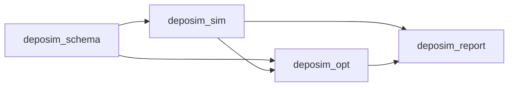

# アーキテクチャとモデル責務

## 設計目的

本構成が支える判断は一つである。測定膜マップを予測するとき、匿名のFluent場のどれを
条件間で転用可能な反応役割として扱えるかを調べ、数値的には似ていても物理的に異なる
説明を比較可能なまま残す。

主要な処理経路を示す。

```text
Fluentの生の場
-> 位置合わせした役割場
-> 反応入力の明示的な選択
-> 登録済み方程式またはプロセスモデル
-> 測定膜応答へのパラメータフィット
-> 任意の選択後空間残差応答
-> 条件間および面内の検証
-> 役割・方程式の安定性評価
-> 簡潔な証拠の記述
```

CVDとALDは同じ役割語彙と証拠規則を使うが、プロセスモデルは分離する。定常応答式、
動的状態モデル、輸送閉包、正味膜合成モデルはそれぞれ異なる部分問題を解くものであり、
相互に置き換えられない。

## パッケージ境界



| パッケージ | 責務 | 所有してはならない処理 |
| --- | --- | --- |
| `deposim_schema` | YAML構造、公開モデル名、既定値、互換性検査 | 数値積分、フィッティング、レポート作成 |
| `deposim_sim` | 順方向計算、プロセス状態計算核、輸送供給方式、物質移動補助式、正味膜合成、実行成果物 | 候補順位または化学役割の採用判断 |
| `deposim_opt` | 観測変換、役割列挙、フィッティング、交差検証、縮約比較、安定性、判断証拠 | 最適化器分岐内に隠したプロセス方程式 |
| `deposim_report` | 計算済み出力からの汎用図と実行結果の表示 | フィッティング、役割選択、モデル意味の変更 |

この依存方向により、最適化ライブラリがなくてもシミュレーターを利用できる。重いパッケージは
任意依存に留める。

## モデル層

| 層 | レジストリまたは実装 | 入力 | 出力の意味 |
| --- | --- | --- | --- |
| 反応入力 | `deposim_opt.role_fields` | 参照濃度、壁面濃度、または独立計算した輸送容量フラックス | 明示的に一つ選んだ局所ドライバーと、その位置・単位メタデータ |
| 定常観測応答 | `deposim_sim.models.aib_reductions` | 正規化した選択ドライバーと役割割当て | 無次元応答形状と解釈可能な表面状態指標 |
| 空間残差応答 | `deposim_opt.spatial_response` | 固定した化学予測と同定条件の残差マップ | 化学条件平均を保ち、化学的主張を行わない正の条件内形状因子 |
| 動的プロセス状態 | `deposim_sim.models.process_models` と `aib_ode.py`、`mvk_state.py`、`ald_role_state.py` | 時間分解した役割濃度と輸送供給方式 | 状態履歴、表面濃度、フラックス、膜厚 |
| 輸送供給源 | `deposim_sim.transport_provider` | 壁面濃度、\(k_m\)、またはCFD輸送容量フラックス | 役割別 \(k_m\) と濃度位置メタデータ |
| 物質移動補助式 | `deposim_sim.models.mass_transfer` | 拡散係数、膜厚さ、回転数、動粘度 | 候補 \(k_m\) 場 |
| 正味膜 | `deposim_sim.models.net_models` | 成膜、エッチング、損失速度 | 符号付き正味膜厚速度 |

定常網羅評価では、代数的に重複する機構へ追加の選択票を与えないため、MvK定常等価式を
一度だけ報告する。動的MvKは酸化還元記憶を時間分解データでのみ検証できるため、独立した
プロセスモデルとして残す。

## ファイル責務

| ファイルまたはモジュール | 単一責務 |
| --- | --- |
| `scripts/analyze_cvd_multicond_case.py` | モデル一覧と定常多条件実行の小さなCLI |
| `deposim_opt/cvd_analysis_io.py` | 数値CSV読込み、座標対応、入力ハッシュ、成果物直列化 |
| `deposim_opt/cvd_conditions.py` | CVD条件ファイル探索、列の意味、データ品質、位置合わせ済み役割場の組立て |
| `deposim_opt/spatial_validation.py` | 共通空間ブロックと通常の速度指標 |
| `deposim_opt/empirical_response.py` | 旧仕様互換の経験的役割候補と制約付き線形フィット |
| `deposim_opt/role_fields.py` | 位置合わせ済み配列と、参照濃度・壁面濃度・輸送容量フラックスの明示選択 |
| `deposim_opt/spatial_response.py` | 選択後の半径残差モデル、条件平均保存、別条件への適用 |
| `deposim_sim/models/aib_reductions.py` | 登録済み定常式、厳密縮約、対称性、必要証拠、式メタデータ |
| `deposim_opt/surface_fit.py` | ウェハー全体の重み、正の形状パラメータ探索、分離可能な速度尺度のプロファイル |
| `deposim_opt/losses.py` | 純粋な有次元・ウェハー正規化・対称・Huber・L1・不確かさ標準化損失関数 |
| `deposim_opt/metrics.py` | 予測、偏り、面内形状、膜厚単位の報告指標。フィット目的関数は変更しない |
| `deposim_opt/parameter_space.py` | モデルに応じた共有・条件別探索変数の除外と検証 |
| `deposim_opt/samplers.py` | ランダム、TPE、CMA-ES、DE、PSO、Lévy飛行、CMA-MAE。計算予算、乱数種、停止、履歴 |
| `deposim_opt/surface_optimization_benchmark.py` | 固定方程式に対する損失関数×サンプラー比較。訓練条件CVと未使用テスト監査を用いる |
| `deposim_opt/parameter_fit.py` | 一候補のフィット。条件計算、キャッシュ、サンプラー呼出し、ホールドアウト予測、識別性診断 |
| `deposim_opt/fit_conditions.py` | 条件解析と、訓練・ホールドアウト双方で使う唯一のシミュレーション・観測 変換部 |
| `deposim_opt/evidence_requirements.py` | 不成立の能力基準を、再利用可能な測定・実験計画要件へ変換 |
| `deposim_opt/cvd_multicond_analysis.py` | 候補網羅評価、入れ子条件評価、証拠組立て、成果物生成 |
| `deposim_opt/class_compare.py` | 汎用候補順位、縮約比較、役割証拠、安定性、採用判断 |
| `deposim_opt/cvd_multicond_report.py` | 計算済み定常結果の描画。フィット・選択は行わない |
| `deposim_sim/models/aib_ode.py` | 連続な吸着A状態と局所A/B輸送反応閉包 |
| `deposim_sim/models/mvk_state.py` | 有界な酸化還元リザーバー積分と還元・再生フラックス |
| `deposim_sim/models/ald_role_state.py` | ALDの蓄積、放出、転化、阻害状態の積分 |
| `deposim_sim/transport_provider.py` | `direct_surface`、`fit_scalar`、`from_cfd_flux_sink` の意味 |
| `deposim_sim/pipeline.py` | 設定、Fluent入力、輸送、プロセス、測定、出力を接続する単一振分け部 |
| `deposim_schema/sim_config.py` | 公開設定構造と許可するプロセスモデル名 |

この分離により、新しい定常方程式族は局所的なモデル変更で追加できる。メタデータ、応答、
縮約、必要証拠を登録し、既存の列挙、フィット、比較、報告経路を使う。モデルが実際に異なる
観測型を供給する場合を除き、解析にモデル名による条件分岐を追加しない。

## 設定契約

シミュレーション設定とフィッティング設定を分ける。

```text
configs/sim/    順方向プロセス・状態計算
configs/opt/    パラメータ推定・役割比較
```

公開プロセスモデルは次の3つである。

- `role_cvd_aib`
- `role_cvd_mvk`
- `role_ald_state`

`aib_ode.py` などのモジュール名は内部の数値実装である。定常方程式族レジストリは動的
プロセスモデル名ではなく解析CLIから選ぶ。

濃度を含む設定では、Fluentファイル、項目キー、化学種順序、座標単位、参照面メタデータ、
時間モードを必須とする。輸送閉包では濃度位置または \(k_m\) の出所を明示する。詳細は
[inputs_fluent.md](inputs_fluent.md) と [transport_km.md](transport_km.md) に示す。

状態モデルのフィッティングでは、`parameter_fit.search` を探索空間と独立に指定する。
`method` は `random`、`tpe`、`cmaes`、`de`、`pso`、`levy` を選ぶ。
試行数は `min_trials`、`max_trials`、`trials_per_dimension` で制限し、
`repetitions` で独立乱数種数を指定する。CMA-MAEはさらに2つの振る舞い指標を必要とし、
定常表面当てはめ処理が平均ウェハーCVと条件速度の対数幅を与える。OptunaまたはOptunaHubの
任意依存がなければ明示的に失敗し、指定方法を別手法へ暗黙置換しない。

定常表面フィットでは独立に、`mse`、`wafer_normalized_mse`、
`wafer_normalized_mae`、`symmetric_normalized_mse` の一つとサンプラーを選ぶ。
どの場合も全同定ウェハーへ一組の共有パラメータを使う。任意の半径方向不確かさは
ウェハー内の点重みを変えた後、各条件の総重みが等しくなるよう再正規化する。

`--reaction-input` は候補列挙前に固定する。反応族の順位付けでサンプリング位置や濃度・
フラックスを選ばせない。定常入力は `bulk_concentration`、
`surface_concentration`、`transport_capacity_flux` に対応する。いずれも
\(u_j=X_j/X_{j,\mathrm{ref}}\) として式へ入るが、保存する量、位置、単位、物理解釈は
異なる。実反応壁面フラックスは閉包観測として保持し、自分自身の反応ドライバーには使わない。

`--spatial-response` は化学族と役割の選択後に実行する。`none`、
`radial_quadratic`、`radial_quartic` を使用できる。空間係数は
`role_ranking.csv`、縮約証拠、化学パラメータ当てはめへ入らない。外側条件分割ごとに、
残りの条件だけで空間応答を再フィットし、ホールドアウトの化学予測へ適用する。ウェハー温度は
設計上一定であり、任意のスカラー値は来歴情報であって半径場の当てはめ値ではない。

`parameter_fit.objective.loss` は `mse`、`huber`、`l1` を選ぶ。
`standardized: auto` では、測定不確かさが与えられた全条件を無次元残差へ変換する。
尺度がそろわないため、標準化条件と非標準化条件を同一当てはめに混在させない。空間、パージ、
停滞域、役割、経路の量は、不確かさ付き測定として与えた場合だけ目的関数へ入る。未測定の
経験的な役割・複雑度罰則項は選択に用いず、単純構造は予測スコアが数値的同点の場合
だけ優先する。

## 結果と来歴

生成入力は `runs/generated_inputs/`、実行出力は `results/` に置く。これらは再現可能な
成果物であり原データではないため、通常はバージョン管理から除外する。

定常役割評価は、機械可読なCSV/JSON証拠、図、簡潔な生成レポート、ノートブック、成果物目録を
出力する。入力ファイルパスとSHA-256は `analysis_summary.json` に保存する。一般の科学
仕様は `docs/` にあり、個別実行レポートが式や判断閾値を再定義することはない。

化学的判断の主要成果物は次の5つである。

1. `role_summary.csv`
2. `role_ranking.csv`
3. `role_stability.csv`
4. `condition_scores.csv`
5. `data_requirements.csv`

状態モデル当てはめでは、さらに `optimization_summary.csv`、`optimization_trace.csv`、
`loss_components.csv`、`optimization_convergence.png`、`loss_components.png` を
出力する。本当てはめと条件再当てはめの分割は同じ列構造を使う。最適化器の挙動とモデル誤差を分離し、
順位に使った正確なデータ損失関数尺度を示す。乱数種が一つの場合、再現性幅をゼロとせず
「未評価」とする。

追加成果物は、外挿、構造感度、係数、入力品質を診断する。`data_requirements.csv` は
未解決用途を、その成立に必要な測定、実験変化、解消される曖昧さ、処理段階へ結び付ける。
監査に必要な証拠を失わず、利用者向けの主要経路を短く保つ。

定常役割解釈では、`optimization_history.csv`、
`best_model_role_assignments.csv`、`condition_mean_input_correlations.csv`、
`role_input_sensitivity.csv`、`role_importance_and_stability.csv`、
`role_response_curves.csv`、`reaction_state_summary.csv`、
`reaction_model_predictions.csv`、`reaction_model_states.csv`、
`parameter_sensitivity_correlations.csv`、`parameter_loss_slices.csv` も出力する。
これらは当てはめ層で計算し、報告書層は描画だけを行う。入力感度は非線形式の一入力を参照値へ
置き換える計算であり、加算可能または因果的な速度分解として表示しない。反応図は登録済み
モデル項を描き、曖昧さが予測へ影響するかはホールドアウト予測差と役割選択頻度で判断する。
パラメータ損失関数断面では一つの速度論比を変え、速度尺度だけを再プロファイルし、他の比は固定する。

`spatial_response_summary.csv` と `spatial_response_coefficients.csv` は独立した
予測成果物の組である。化学のみと補正後の空間スコアを並べ、補正が化学選択に参加して
いないことを明記する。

可視化も表形式証拠と同じ所有規則に従う。

| 計算済み証拠 | 所有モジュール | 表示する図 |
| --- | --- | --- |
| 目的関数評価履歴 | `surface_fit.py`、`cvd_multicond_analysis.py` | `optimization_convergence.png` |
| 方程式順位、登録経路、族ごとのホールドアウト予測 | 方程式登録表と解析制御 | 方程式比較、反応経路、モデル予測一致図 |
| 役割選択と参照値置換感度 | `cvd_multicond_analysis.py` | 割当て、応答曲線、重要度対安定性図 |
| モデル定義のサイト・経路割合 | 方程式登録表と予測変換部 | 状態要約、ホールドアウト状態マップ |
| 局所微分設計とパラメータ断面 | `surface_fit.py` | 速度論パラメータ感度、損失関数断面 |
| ホールドアウト予測と空間応答行 | 予測処理と `spatial_response.py` | 測定・予測・残差マップ、半径プロファイル、補正性能 |

`cvd_multicond_report.py` は保存済み行を受け取り、表、ノートブック本文、Markdown、図だけを
整形する。新しい図は、機械可読な元成果物と成果物目録項目を備えるまで証拠として引用しない。
これにより描画コードが第二の選択・当てはめ経路になることを防ぐ。

## 拡張規則

### 定常方程式族の追加

1. `aib_reductions.py` に純粋な正規化応答と任意の状態要約を実装する。
2. 必須役割、入力、縮約、対称性、物理的問い、最小証拠を登録する。
3. 律速極限と厳密縮約の式試験を追加する。
4. 族名による分岐なしで列挙・報告書が動作することを確認する。
5. モデル意味が変わる場合は [THEORY.md](THEORY.md) を更新する。

### 動的プロセスモデルの追加

1. 有界状態、速度、単位、必要観測を定義する。
2. 最適化依存のない状態計算核を実装する。
3. `process_models.py` に対応プロセスと時間モードを登録する。
4. `pipeline.py` へ一度だけ接続し、最小YAML例を追加する。
5. 保存・範囲、ゼロ入力極限、輸送極限、時間刻み挙動を試験する。

### 輸送物理の追加

輸送変更は供給方式または物質移動補助式へ置く。反応モデルは、意味を明示した
\(C_{\mathrm{ref}}\)、\(C_s\)、\(k_m\) を受け取る。CFD実反応フラックスを輸送容量と
読み替えてはならない。モデル化する反応結果を自分自身の境界条件へ戻すことになる。

### 採用規則の追加

採用規則は `class_compare.py` に置き、経験的経路と物理的経路へ一貫して適用する。
新しい診断が採用を制限できるのは、明確な科学的失敗に対応し、利用可能データから評価できる
場合に限る。コードは許容可能な工程誤差を推定できないため、用途許容差は利用者が与える。

## 本設計の利点

- 方程式を最適化から独立して点検・試験できる。
- 生の化学種割当てすべてに同じ当てはめ・検証手順を適用する。
- 厳密縮約により「係数を当てはめできた」と「その効果が条件間予測を改善した」を区別する。
- 入れ子条件評価により、モデル選択と性能推定を分離する。
- 役割順位の意味を変えずに、輸送・状態モデルを発展させられる。
- 科学的限界を、隠れた既定値や過剰な検査機構ではなく不足証拠として示す。

残る構造上の境界は、定常CSV網羅評価と動的NPZ当てはめが別経路である点である。MvKは現在、
観測時刻の状態、経路、表面濃度、フラックス履歴を出力する。設定したNPZ測定キーにより、
時刻を合わせた履歴と不確かさを既存の多観測目的関数へ渡せる。変換部は意図的に、
測定時刻とFluent時間格子の一致を要求する。一般的な時間再標本化と相関誤差モデルは
未実装である。
