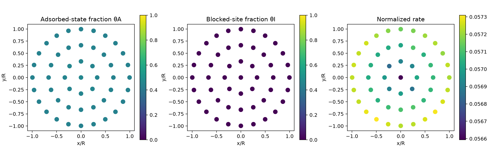
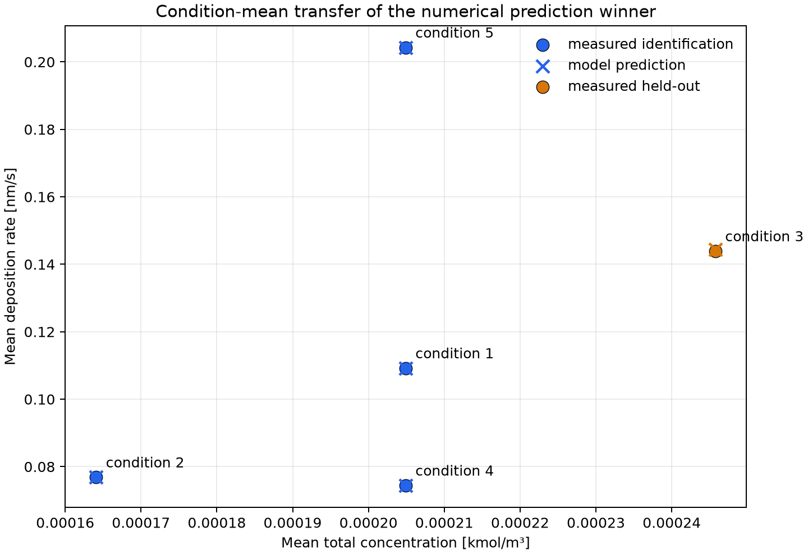
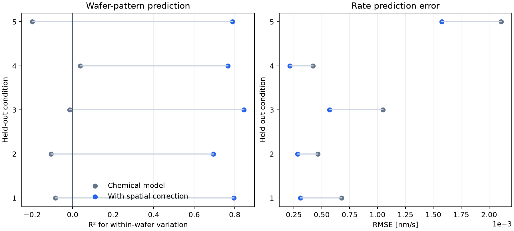
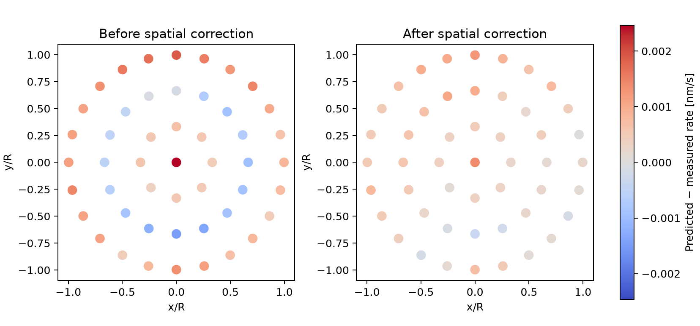
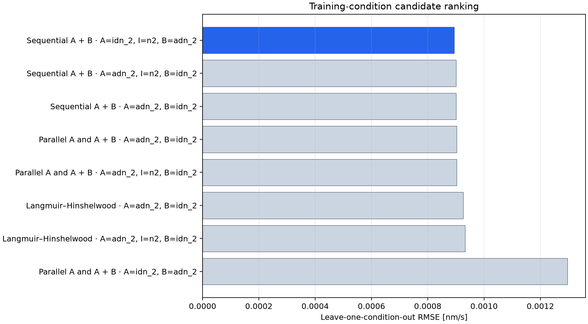
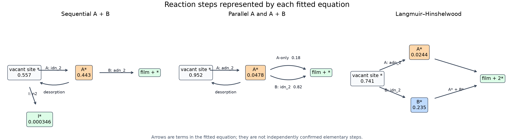
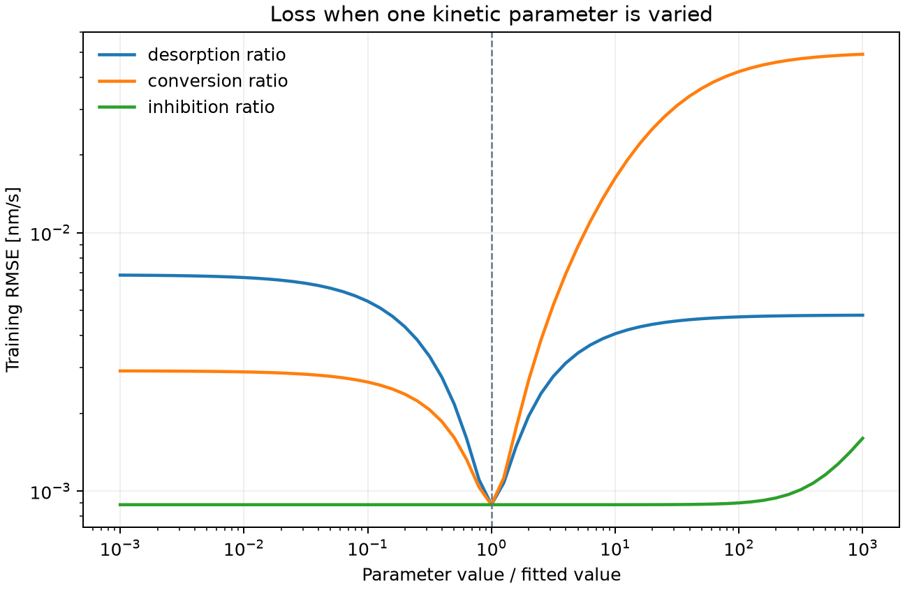
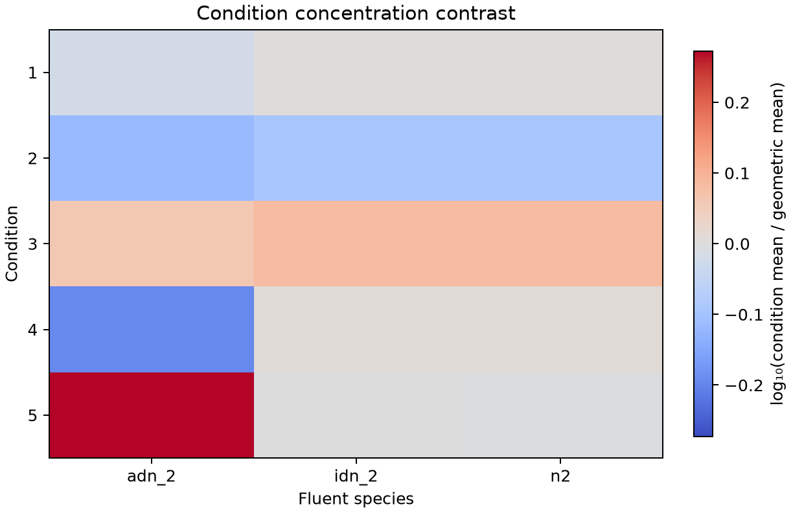

# Evaluation of the current five-condition CVD dataset

## Technical conclusion

The current data support a reduced model for transferring the **condition-mean
deposition rate** across the five supplied conditions. The chemical equation alone does
not predict the measured wafer-scale variation. A separate mean-preserving radial
residual response improves centered spatial prediction on all five outer heldout folds;
this establishes internal transfer over the supplied geometry, but does not identify
the physical cause or validate a new operating domain. The data do not support a unique
raw-species-to-role assignment or a unique surface mechanism.

The numerical AIB quasi-steady winner predicts the fixed no-refit condition-3 mean with a
relative bias of +0.300% and the full map with 0.729% relative RMSE. Its centered
spatial \(R^2=-0.0148\), spatial correlation is 0.172, and it reproduces 34.6% of the
observed rate range. With the post-selection radial response, condition-3 centered
\(R^2\) becomes 0.845 and RMSE becomes 0.000570306 nm s\(^{-1}\). The overall status
remains `review`: condition-level screening is provisionally useful, while spatial use
requires a declared tolerance and a new frozen wafer outside this development set. The
generated `data_requirements.csv` states the measurements and designed variations
needed to establish each requested capability.

## Loss and sampler benchmark

A separate optimization benchmark froze the primary AIB equation and crossed four
whole-wafer losses with pattern search, TPE, CMA-ES, differential evolution, PSO, Lévy
flight, and CMA-MAE. `mse` is explicitly the squared residual in the linear nm s\(^{-1}\)
rate unit; none of the four candidates uses a logarithmic rate residual. Each stochastic
fit used 4,096 shape evaluations, four times the earlier benchmark, and three independent
seeds. Pattern search retained its deterministic 1,010-evaluation design. The combination
was selected by median leave-one-training-condition-out RMSE; condition 3 remained a
fixed audit.

| Loss | Sampler | Condition-CV RMSE (nm s\(^{-1}\)) | Fixed condition-3 RMSE (nm s\(^{-1}\)) | Result |
| --- | --- | ---: | ---: | --- |
| Wafer-normalized MSE | Pattern | 0.000888134 | 0.000993829 | Best training-CV result |
| Symmetric normalized MSE | Pattern | 0.000889261 | 0.000994608 | Similar accuracy; slower because scale needs one-dimensional profiling |
| Linear-rate MSE | Pattern | 0.000894084 | 0.00104863 | Current reference |
| Wafer-normalized MAE | Pattern | 0.000945823 | 0.000995128 | More robust point loss, but worse condition transfer |
| Wafer-normalized MSE | CMA-ES | 0.000892628 | 0.00100971 | Best stochastic median; converged across seeds |
| Wafer-normalized MSE | DE | 0.000892792 | 0.00100985 | Nearly converged; small remaining seed spread |

Wafer-normalized MSE improved the fixed-equation training CV by 0.665% and the fixed
test RMSE by 5.226%. The fixed-test centered spatial \(R^2\) remained negative
(-0.0153), so this is an improvement in absolute-rate transfer, not wafer-pattern
prediction. A complete normalized-MSE census retained the same primary AIB candidate,
but its five outer folds selected AIB once and Langmuir-Hinshelwood four times. The raw
MSE census selected AIB three times and Langmuir-Hinshelwood twice. The normalized Loss
therefore exposes useful scale sensitivity while increasing model-selection
instability on these five conditions.

Increasing the budget from 1,024 to 4,096 evaluations changed the sampler conclusion.
Across the four Losses, DE reduced median condition-CV RMSE by 71-81% and reached the
same basin as CMA-ES. CMA-ES produced essentially identical parameters across all three
seeds. PSO was almost unchanged; Lévy flight improved by 27-72% but remained unstable;
CMA-MAE remained unsuitable as a minimum-Loss optimizer. TPE showed a good best seed but
large median and worst-seed errors and required the most time.

For linear-rate MSE, pattern search gave condition-CV RMSE 0.000894084 nm s\(^{-1}\).
DE and CMA-ES minimized the full-training MSE slightly better but gave condition-CV RMSE
0.000896204 and 0.000896275 nm s\(^{-1}\), respectively. Their fitted inhibitor ratio was
about 0.017, whereas pattern search stopped near the zero-inhibition boundary. Pattern's
small CV advantage is consistent with implicit underfitting, but the fold parameters
were not retained and do not establish that as the sole cause. It is not evidence that
pattern search located the Loss minimum more accurately. Optimization convergence and
model simplification must be separate decisions: use an exact reduced equation when
inhibition is unsupported.

The generated `benchmark_report.md` records all 28 combinations. Pattern remains the
fast screening default for the present two-to-four-dimensional reductions. CMA-ES is the
preferred convergence audit and DE is the faster global alternative at a sufficient
budget. Neither the sampler nor the Loss establishes the microscopic mechanism.

An explicit sensitivity run that assumed twice the standard uncertainty at the wafer
edge changed normalized-MSE condition CV from 0.000888134 to 0.00109547 nm s\(^{-1}\).
Because the supplied maps contain no replicate-derived uncertainty, this profile is not
used in the primary result. Radial weighting should be activated only from measured or
declared uncertainty information.

## Data and fixed evaluation design

The source consists of five `condition_<id>.csv` Fluent tables and five aligned
`validation_<id>.csv` deposition-rate maps. Each condition contains 49 locations, for
245 paired observations.

| Condition | Points | Mean measured rate (nm s\(^{-1}\)) | Mean `adn_2` (kmol m\(^{-3}\)) | Mean `idn_2` (kmol m\(^{-3}\)) | Mean `n2` (kmol m\(^{-3}\)) |
| ---: | ---: | ---: | ---: | ---: | ---: |
| 1 | 49 | 0.109217 | 3.51446×10\(^{-6}\) | 1.72846×10\(^{-6}\) | 1.99651×10\(^{-4}\) |
| 2 | 49 | 0.0768629 | 2.81368×10\(^{-6}\) | 1.38452×10\(^{-6}\) | 1.59873×10\(^{-4}\) |
| 3 | 49 | 0.143915 | 4.21517×10\(^{-6}\) | 2.07307×10\(^{-6}\) | 2.39457×10\(^{-4}\) |
| 4 | 49 | 0.0744309 | 2.35597×10\(^{-6}\) | 1.73671×10\(^{-6}\) | 2.00803×10\(^{-4}\) |
| 5 | 49 | 0.204294 | 6.90294×10\(^{-6}\) | 1.70349×10\(^{-6}\) | 1.96284×10\(^{-4}\) |

Conditions 1, 2, 4, and 5 identify and select the model. Condition 3 is predicted
without refitting. An outer leave-one-condition-out procedure separately reruns the
complete selection process five times.

All 245 rows are finite. Coordinate sets match within (10^{-8}) in their supplied
numeric unit, no duplicate coordinate is present, and the largest mole-fraction sum
error is (3.689\times10^{-5}). These checks do not limit the current conclusion. The
coordinate unit itself is not supplied, which prevents dimensional interpretation of
the spatial pattern.

## Numerical prediction winner and observable parameters

The 59-candidate census selected

```text
cvd:aib_qss:AIB:full:bulk_as_surface:A=idn_2,I=n2,B=adn_2
```

with

\[
\hat v=R\frac{u_A b u_B}
{u_A+(\delta+b u_B)(1+\kappa u_I)}.
\]

| Observable parameter | Estimate | Conditional spatial-bootstrap 5–95% | Interpretation limit |
| --- | ---: | ---: | --- |
| (R) (nm s\(^{-1}\)) | 2.52722 | 2.52761–2.57796 | Lumped film-rate scale |
| δ | 1.40746 | 1.33352–1.48551 | Finite nonproductive-loss group; does not identify physical desorption |
| (b) | 0.0947464 | 0.0897687–0.0982172 | Dimensionless (B)-assisted conversion group |
| κ | 0.000513970 | 5.23×10\(^{-8}\)–0.0159634 | Weak and unstable inhibitor group |

The bootstrap intervals condition on this chosen structure. They exclude uncertainty in
the equation family and role assignment. The shape search uses deterministic log-space
multistart refinement, so repeated values at refinement locations must not be read as
high parameter precision.




The optimization curves show numerical progress for one best assignment in each family.
They do not establish that a flat fitted parameter direction is identifiable; parameter
information is assessed separately below.

## Predictive performance

| Metric | Fixed condition 3 | Interpretation |
| --- | ---: | --- |
| RMSE | 0.00104863 nm s\(^{-1}\) | 0.729% of the observed mean |
| MAE | 0.000941297 nm s\(^{-1}\) | Small absolute mean-level error |
| Mean bias | +0.000431064 nm s\(^{-1}\) | +0.300% of the observed mean |
| Constant-training-mean RMSE | 0.0277296 nm s\(^{-1}\) | Numerical winner reduces RMSE by 96.2% |
| Centered spatial RMSE | 0.000955934 nm s\(^{-1}\) | Most remaining error is spatial |
| Centered spatial (R^2) | −0.0148 | Worse than predicting no within-map variation |
| Spatial correlation | 0.172 | Weak pattern agreement |
| Predicted/observed range | 34.6% | Spatial amplitude is strongly compressed |


The map comparison should be read after the mean-level metrics: the chemical model
reaches the correct condition scale but leaves a coherent spatial residual and
underestimates the within-wafer variation. Chemical roles are therefore not credited
for the shared radial pattern.

The training-condition leave-one-out RMSE is 0.000894084 nm s\(^{-1}\). The more
conservative maximum of angular and radial blocked-CV RMSE is 0.00178286 nm s\(^{-1}\),
showing that local spatial interpolation is a harder task than condition transfer.



The condition means follow the observed scale closely. This is the evidence supporting
screening use, subject to the concentration-domain and application-tolerance limits
below.

### Post-selection radial response

The optional spatial stage fits centered logarithmic residuals using the two radial
terms \(\rho^2\) and \(\rho^4\) after the chemical model has been selected. It then
rescales the multiplicative correction to preserve the chemical mean on every wafer.
The exact definition is given in [THEORY.md](THEORY.md). No chemical parameter, role,
family, or reduction is refitted from this residual stage.

| Outer heldout condition | Chemical RMSE (nm s\(^{-1}\)) | Corrected RMSE (nm s\(^{-1}\)) | Chemical centered \(R^2\) | Corrected centered \(R^2\) |
| ---: | ---: | ---: | ---: | ---: |
| 1 | 0.000677316 | 0.000310208 | −0.0846 | 0.7960 |
| 2 | 0.000466018 | 0.000282523 | −0.1063 | 0.6950 |
| 3 | 0.00104863 | 0.000570306 | −0.0148 | 0.8452 |
| 4 | 0.000422813 | 0.000213098 | 0.0371 | 0.7660 |
| 5 | 0.00210931 | 0.00157624 | −0.1990 | 0.7889 |







The positive centered \(R^2\) on every outer fold shows that a common radial residual
shape transfers within these five conditions. This is evidence for the empirical
spatial response, not for a shared chemical concentration distribution. The basis uses
each wafer's coordinates and corrects its own chemical prediction. Because all five
maps use the same small coordinate grid and no independent reactor campaign is held
outside code development, production correction still requires a new frozen wafer and
a declared spatial tolerance.

## Competing equation families remain unresolved

| Family | Best inner condition-CV RMSE (nm s\(^{-1}\)) | Gap from best | Outer selections | Interpretation |
| --- | ---: | ---: | ---: | --- |
| Sequential AIB QSS | 0.000894084 | 0% | 3/5 | Primary fixed-split winner; contrast limited |
| Parallel A and A+B QSS | 0.000903338 | +1.04% | 0/5 | Numerically close; (A)-only contribution not stable |
| Langmuir-Hinshelwood QSS | 0.000925961 | +3.57% | 2/5 | Outer alternative; remains exploratory and symmetric |






The fixed split and outer folds select two families and three distinct role/reduction
structures. The mean holdout prediction envelope is 0.000429302 nm s\(^{-1}\), or
0.298% of the condition-3 mean; its maximum width is 0.000771311 nm s\(^{-1}\). This
is model-selection sensitivity, not a confidence interval.


The best fit from each family was also evaluated on the same heldout coordinates:

| Family | Assigned roles | Heldout RMSE (nm s\(^{-1}\)) | RMS difference from selected (nm s\(^{-1}\)) | Difference / selected RMSE |
| --- | --- | ---: | ---: | ---: |
| Sequential AIB | A=`idn_2`, B=`adn_2`, I=`n2` | 0.00104863 | 0 | 0 |
| Parallel A + AB | A=`adn_2`, B=`idn_2` | 0.00184890 | 0.00115630 | 1.103 |
| Langmuir-Hinshelwood | A=`adn_2`, B=`idn_2` | 0.000958571 | 0.000434995 | 0.415 |


The Langmuir-Hinshelwood prediction differs from the selected AIB prediction by less
than half the selected heldout RMSE, so changing between those two interpretations has a
modest prediction consequence on condition 3. The parallel family differs by slightly
more than one selected-model RMSE and is a material prediction alternative. These are
model-conditional differences; they are not mechanism probabilities.

| Outer held-out condition | Selected family | Relative RMSE | Centered spatial (R^2) |
| ---: | --- | ---: | ---: |
| 1 | Sequential AB | 0.620% | −0.0846 |
| 2 | Sequential AIB | 0.606% | −0.1063 |
| 3 | Sequential AIB | 0.729% | −0.0148 |
| 4 | Langmuir-Hinshelwood | 0.568% | 0.0371 |
| 5 | Langmuir-Hinshelwood | 1.032% | −0.1990 |

The pooled outer RMSE is 0.00113168 nm s\(^{-1}\), and the macro-average relative RMSE
is 0.711%. Condition 5 is the worst transfer case. Only condition 4 has a slightly
positive centered spatial (R^2). Thus the complete selection procedure transfers
condition means but does not repeatedly recover the spatial map.

## What the reductions establish

Removing (I) from the numerical AIB winner changes inner CV RMSE from
0.000894084 to 0.000900285 nm s\(^{-1}\), about 0.69%, and the foldwise sign is mixed.
The inhibitor term therefore has no consistent demonstrated benefit, and `n2` cannot be
adopted as an inhibitor from these data.

Removing the finite-loss group increases RMSE to approximately 0.0184 nm s\(^{-1}\),
about 20.6 times the selected error. A finite nonproductive-loss contribution is needed
by this response family. The observation cannot separate desorption, irreversible loss,
deactivation, or an omitted pathway.

The steady MvK representative is algebraically the sequential AB no-loss reduction and
has RMSE 0.0181360 nm s\(^{-1}\). This rejects that **steady projection** for the present
data. It does not reject a dynamic redox reservoir, because no A/B switching or surface
oxidation-state time series is present.

### Kinetic-ratio information in the selected equation

| Parameter | RMS \(\partial\ln\hat v/\partial\ln p\) | Mean sensitivity | Principal reading |
| --- | ---: | ---: | --- |
| Finite-loss ratio δ | 0.5669 | −0.5662 | Active direction; increasing δ lowers the rate |
| B-conversion ratio \(b\) | 0.9529 | +0.9527 | Strong active scale/shape direction |
| Inhibition ratio κ | 0.0003008 | −0.0003002 | Locally inactive over the supplied inhibitor range |

The sensitivity correlation between δ and κ is −0.912, while δ and \(b\) correlate at
−0.586. The near-zero κ sensitivity and its broad partial Loss slice agree with the
exact-reduction result: the supplied data do not require or determine inhibition. The
δ and \(b\) slices change appreciably around the fitted values, although their
correlation prevents interpreting either as an independently calibrated elementary
constant.




## Why role identity is unresolved

The pooled concentration correlations are

| Pair | Pearson correlation |
| --- | ---: |
| `adn_2` / `idn_2` | 0.2134 |
| `adn_2` / `n2` | 0.2178 |
| `idn_2` / `n2` | 0.9798 |

`idn_2` and `n2` are nearly collinear. Across conditions, `adn_2` changes strongly,
whereas `idn_2` and `n2` mostly move together with total concentration. The data can
associate the large condition-level rate change with a response involving `adn_2`, but
they cannot independently assign `idn_2` and `n2` to (A) and (I).

The raw name `n2` must not be interpreted chemically in this analysis. It is merely the
source column selected by one candidate. Chemical identity, feed/byproduct status,
stoichiometry, and surface activity are absent from the dataset.




The assignment instability has two different consequences:

| Role in the fixed winner | Raw species | Outer selection frequency | RMS prediction change (nm s\(^{-1}\)) | Change / heldout RMSE | Consequence |
| --- | --- | ---: | ---: | ---: | --- |
| A | `idn_2` | 40% | 0.0087144 | 8.31 | Influential assignment, unresolved |
| B | `adn_2` | 40% | 0.0526467 | 50.2 | Influential assignment, unresolved |
| I | `n2` | 40% | 0.0000044616 | 0.00425 | Unstable but predictively negligible over this range |


Replacing A or B by its identification reference changes prediction by many times the
heldout error, so their raw-species assignment matters and remains unresolved. Replacing
I has a change far below the heldout error. The latter is a harmless ambiguity for the
current prediction range, although it remains unsuitable for an inhibitor-mechanism
claim. Because the equation is nonlinear, these one-at-a-time changes are not additive
species contributions.

## Extrapolation and practical scope

For the fixed condition-3 prediction, every point lies outside the training range for
total concentration, `idn_2`, and `n2`; `adn_2` remains inside its training range. The
accurate mean prediction is encouraging, but it is one out-of-range condition and cannot
establish general extrapolation performance.

No application conditions, maximum acceptable relative error, or spatial requirement
were declared. The code therefore cannot emit `adopt_candidate` even for condition-mean
screening. A practical use statement requires those tolerances to be set before the
next frozen external evaluation.

| Target use | Current evidence | Data that would establish it |
| --- | --- | --- |
| Rank or screen condition-mean growth within similar operating physics | Provisionally useful; retain `review` status | Declare an error tolerance and pass a new frozen condition over the intended operating window |
| Correct wafer-scale nonuniformity | The separate radial response has positive centered \(R^2\) on all five internal outer holdouts; physical cause and external transfer remain untested | Add a new coordinate-registered wafer campaign with replicate uncertainty and, to attribute cause, co-located temperature and wall/near-wall transport fields; require the declared spatial tolerance on every frozen holdout and residuals without material remaining structure |
| Assign anonymous species to A/B/I roles | Role and family choices change with the training conditions | Independently vary each candidate species, include off/low and saturation regimes, and add a role-linked surface-state or outlet observation; require full-rank contrasts, consistent reduction benefit, and stable assignment across refits |
| Estimate elementary rate constants | Only normalized observable groups are fitted | Add absolute wall concentration or reacting-wall flux, calibrated site density, synchronized transient response, several temperatures, replicates, and uncertainty; require resolved sensitivity directions, finite intervals, Arrhenius consistency, and external dynamic prediction |
| Select dynamic MvK chemistry | Its steady projection is algebraically shared with sequential AB | Add A/B pulse or switch histories plus oxidation-state or reservoir-sensitive observations and hold out a complete transient sequence |

The same evidence-to-measurement mapping is emitted for any dataset in
`data_requirements.csv`; it does not depend on the example names above.

## Code limitations and data responsibilities

### Code-side limits

- The reference census uses deterministic pattern refinement. TPE, CMA-ES, DE, PSO,
  Lévy, and CMA-MAE backends are available for frozen-candidate audits, but numerical
  convergence does not quantify model or parameter uncertainty.
- Conditional bootstrap intervals do not integrate equation-family or role-selection
  uncertainty.
- The steady CSV census and dynamic state-model fit paths remain separate. The dynamic
  MvK result now retains observation-time state, pathway-rate, concentration, and flux
  histories. Configured NPZ keys can supply aligned measured histories and uncertainties
  to the multi-observation loss. The present `data/` contains no such observations, and
  the adapter does not resample mismatched time grids or model correlated errors.
- Full Maxwell-Stefan/Stefan-flow wall transport is absent. The active closures are
  independent scalar-film approximations or CFD-derived (k_m).
- The radial residual response is limited to an axisymmetric \(\rho^2+\rho^4\) basis.
  It cannot represent azimuthal structure and contains no physical temperature or
  transport field. Its five-fold result is internal validation on one supplied campaign.

These limits do not explain the current role ambiguity by themselves. Refining the
optimizer cannot create independent concentration contrast or state information.

### Data-side requirements

1. Vary `idn_2` and `n2` independently while holding total concentration and `adn_2`
   as controlled as feasible.
2. Add a low-(B) or (B=0) regime and independent (A/B) sweeps spanning low coverage
   and saturation.
3. Add an inhibitor perturbation that spans negligible to strong suppression.
4. Supply wall or near-wall concentration, or a CFD transport-capacity flux with known
   sign, boundary concentration, and units.
5. Record wafer coordinate units, temperature and pressure for every condition.
6. Add replicate film maps and measurement uncertainty so effect sizes can be compared
   with experimental noise.
7. For MvK, use A/B pulse or switch experiments and, where possible, a surface/lattice
   oxidation-state measurement.
8. Reserve a new external condition that has not influenced equation or code design.

Model-based experimental design should maximize the prediction difference between the
remaining families while reducing the correlation of the sensitive parameter directions.
Independent (A/B/I) perturbations are therefore more useful than adding many spatial
points under the same five compositions.

## Reproduction and evidence files

Run:

```powershell
uv run python scripts/analyze_cvd_multicond_case.py `
  --data-dir data `
  --train-cases 1 2 4 5 `
  --test-case 3 `
  --response-model surface_compare `
  --reaction-input bulk_concentration `
  --models all `
  --loss mse `
  --sampler pattern `
  --bootstrap-samples 100 `
  --spatial-response radial_quartic `
  --seed 123 `
  --output results/current_cvd_separated
```

The fixed-equation optimization benchmark is reproduced with:

```powershell
uv sync --extra optuna
uv run python scripts/benchmark_surface_optimization.py `
  --candidate-id "cvd:aib_qss:AIB:full:bulk_as_surface:A=idn_2,I=n2,B=adn_2" `
  --trials 4096 `
  --repetitions 3 `
  --samplers pattern tpe cmaes de pso levy cma_mae `
  --workers 8 `
  --output results/surface_optimization_benchmark_4096
```

The exact source hashes, candidate table, fold metrics, coefficient percentiles,
prediction rows, capability assessments, and experimental requirements are stored in
that result directory. The interpretation rules are given
in [EVALUATION_WORKFLOW.md](EVALUATION_WORKFLOW.md); the equations are given in
[THEORY.md](THEORY.md). Every generated figure and its current-data reading are given in
[VISUALIZATION_GUIDE.md](VISUALIZATION_GUIDE.md).
