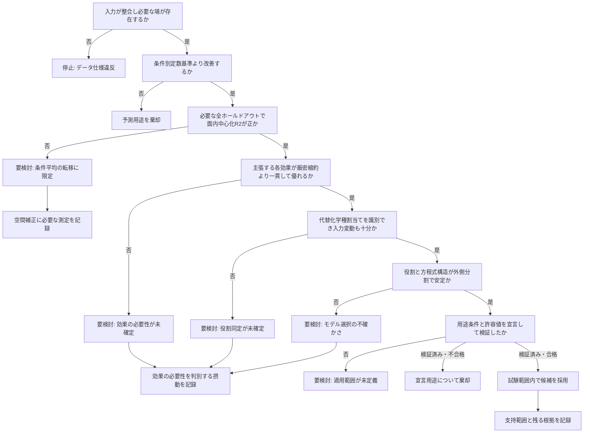

# 反応役割の評価ワークフロー

## 予測性能・表面反応役割・機構根拠を分けて判定する

本リポジトリでは、条件間の予測転移、表面反応における役割の根拠、反応機構の根拠を別々に評価する。条件平均を正確に予測できても、ウェハー面内分布を再現できない場合や、化学種の割当てを裏づけられない場合がある。出力でも、この区別を維持する。

```mermaid
flowchart LR
    F[Fluentの生の化学種場] --> A[観測点と単位を整合]
    A --> I[入力物理量と位置を一つ選択]
    I --> C[A / B / I の割当てを列挙]
    C --> M[適用可能なCVDまたはALDモデルを当てはめ]
    M --> R[厳密縮約モデルと比較]
    R --> V[化学条件と空間分布を検証]
    V --> S[役割とモデル構造の安定性を評価]
    S --> X[任意: 選択後に空間残差を当てはめ]
    X --> D[化学評価と空間評価を分離]
    D --> E[支持できる結論と不足データを記録]
```



主経路は、測定した膜厚または成膜速度に対する反応役割の同化である。動的状態量と輸送診断はこの判断を補助するものであり、独立した製品上の到達点ではない。

## 入力データの能力に応じて実行できるモデルが決まる

| 利用できるデータ | 実行経路 | 推定できる内容 | 根拠の範囲外に残る内容 |
| --- | --- | --- | --- |
| 参照面濃度と成膜速度マップを含む複数条件の定常CSV | `bulk_as_surface` による定常方程式の網羅比較 | 観測可能な応答形状、反応役割の候補、厳密縮約の効果、条件間転移 | 絶対壁面フラックス、素反応定数、動的状態、機構固有の履歴効果 |
| 壁面濃度を測定した定常CSV | `direct_surface` による同じ網羅比較 | 膜境膜による降下を当てはめずに得る表面応答形状 | 輸送容量データがなければフラックス |
| 反応と独立なウェハーへの供給フラックスを含む定常CSV | `direct_flux` による定常比較 | 局所到達・供給フラックスに対する役割応答、条件間転移、空間予測 | 濃度基準の吸着定数、輸送と反応の分離 |
| 参照面濃度とCFD輸送容量フラックス | `from_cfd_flux_sink` を使う動的・シミュレーション経路 | 空間的な \(k_m\)、表面濃度、輸送利用率、表面反応と輸送のフラックス閉包 | CFDまたは将来のMaxwell–Stefan閉包から与えない限り多成分拡散 |
| 時間分解したCVD濃度 | `role_cvd_aib` または `role_cvd_mvk` | 被覆率または酸化還元状態の応答、緩和時間、最終膜厚 | 条件切替えや状態感度を持つ測定がなければ一意な機構 |
| ドーズ・パージ・サイクルを時間分解したALD濃度 | `role_ald_state` | レシピ区間を通した貯蔵、脱離、変換、阻害の役割 | 最終GPCだけから求める素反応の表面逐次機構 |
| 対応するFluent化学種を欠く膜厚マップ | 反応役割の当てはめは実行しない | 測定統計と空間品質管理 | 化学種の役割と反応モデル |

必要な観測量を欠くモデルは比較から除外する。モデルの意味を変える数値既定値で欠測データを補ってはならない。

## 複数条件の定常CVD解析

### 1. データ変換と品質確認

各条件について `condition_<id>.csv` と `validation_<id>.csv` を対応づける。行数、重複、最大座標差、有限値、濃度とモル分率の整合を確認した後、座標を小数点以下6桁で照合する。すべての候補に同じ整列済み観測値を与える。

アダプターは、次の入力能力が存在するかを記録する。

- `bulk_concentration`
- `surface_concentration`
- `transport_capacity_flux`
- `realized_reactive_flux`

役割割当てを解釈する前に、条件間コントラスト、対数幅、行列ランク、条件数、化学種間相関も計算する。

一つの解析全体で `--reaction-input` は一種類に固定する。化学モデルの順位づけに、バルク濃度、表面濃度、輸送容量フラックスの候補を混在させない。局所方程式への入力は

\[
u_{j,qn}=\frac{X_{j,qn}}{X_{j,\mathrm{ref}}}
\]

とする。ここで \(X\) は宣言された物理量、位置、単位を保つ。実現した反応壁面フラックスは、当てはめ対象の表面反応結果をすでに含むため入力候補から除外する。

### 2. 候補の列挙

レジストリは、指定した各方程式系について許容される反応役割割当てをすべて列挙する。宣言済みの厳密縮約を加え、方程式の真の対称性によって生じる重複候補を除く。匿名化した3化学種に対する現在の定常 `--models all` では、定数と全濃度による補助基準モデルを含む59候補を評価する。

候補IDには、プロセス、方程式系、役割クラス、縮約、濃度位置、生の化学種割当てを含める。これにより、生の化学種名に固定した化学的意味を仮定せずに当てはめ結果を再現できる。

### 3. 条件均衡を保った定常応答パラメータ推定

各条件の総重みを等しくする。条件 \(q\) が \(N_q\) 点を含み、測定不確かさが与えられていない場合、

\[
w_{qn}=\frac{1}{Q N_q}
\]

とする。標準不確かさ \(\sigma_{qn}\) が与えられた場合は、逆分散重みを条件内で正規化する。

\[
w_{qn}=\frac{\sigma_{qn}^{-2}}
{Q\sum_{m\in q}\sigma_{qm}^{-2}}.
\]

これにより、空間測定点の多い条件だけがモデル選択を支配することを防ぐ。次元を持つ既定損失関数は、線形成膜速度の単位で評価する。

\[
\mathcal L(\boldsymbol\phi,R)=
\sum_{q,n}w_{qn}\left[Rf(\mathbf u_{qn};\boldsymbol\phi)-v_{qn}\right]^2.
\]

単一目的の代替損失関数を3種類用意する。条件内で和が1となる局所重みを \(\widetilde w_{qn}\)、残差を \(e_{qn}=\hat v_{qn}-v_{qn}\)、尺度を \(s_q^2=\sum_n\widetilde w_{qn}v_{qn}^2\) とすると、

\[
L_{\mathrm{WN\text{-}MSE}}=\frac1Q\sum_q
\frac{\sum_n\widetilde w_{qn}e_{qn}^2}{s_q^2},
\qquad
L_{\mathrm{WN\text{-}MAE}}=\frac1Q\sum_q
\frac{\sum_n\widetilde w_{qn}|e_{qn}|}{s_q},
\]

\[
L_{\mathrm{sym}}=\frac1Q\sum_q
\frac{2\sum_n\widetilde w_{qn}e_{qn}^2}
{\sum_n\widetilde w_{qn}(v_{qn}^2+\hat v_{qn}^2)}.
\]

ウェハー単位の正規化により、同じ相対誤差でも成膜速度の高い条件が自動的に支配することを避ける。これらの目的関数値は尺度が異なるため、相互に直接比較しない。どの損失関数でも、候補選択には再当てはめを行わない条件交差検証RMSE（nm/s）を用いる。

根拠のある半径方向の不確かさモデルを与える場合、正規化半径 \(\rho\)、エッジと中心の標準不確かさ比 \(\gamma\)、指数 \(p\) から

\[
\sigma_{\mathrm{rel}}(\rho)=1+(\gamma-1)\rho^p,
\qquad w_{qn}\propto
\left[\sigma_{qn}\sigma_{\mathrm{rel}}(\rho_{qn})\right]^{-2}
\]

とする。その後、重みを各条件内で再正規化する。\(\gamma=1\) ならこの機能は無効になる。指定した半径プロファイルは不確かさに関する仮定であり、反復測定のない単一膜厚マップから推定するものではない。

正の形状パラメータは、候補が宣言する範囲内を底10の対数空間で探索する。既定範囲は \([-10,10]\) である。−8、−4、0、4、8の粗い直積格子をパラメータ境界で切り詰め、互いに異なる最良5点を決定論的に0.0078125桁まで細分化する。最良点には全近傍探索を維持し、残る初期点には座標方向のパターン探索を使って相関した谷を追跡する。非負の速度尺度 \(R\) は各形状点でプロファイル消去する。MSEとウェハー正規化MSEには重み付き最小二乗の閉形式解を用いる。ウェハー正規化MAEには \(v/f\) の厳密な重み付き中央値を用い、対称損失関数には決定論的な有界一次元最小化を用いる。このため、形状サンプラーは分離可能な振幅に探索次元を使わない。手法と評価回数は `role_ranking.csv` に記録し、境界上の最適解は解釈を弱めるため明示する。

探索規模を抑えているのは、対象が低次元の観測可能な縮約モデルだからである。汎用大域最適化器ではなく、格子分解能をパラメータ不確かさと解釈してはならない。

過渡CVD/ALD状態モデルは、サンプラーに依存しない別経路で同じ条件重みを用いる。`parameter_space.py` が、役割に適用しない変数と固定変数を先に除く。有効次元 \(d\) に対する試行数は

\[
N_{\mathrm{trial}}=\min\!\left(N_{\max},
\max(N_{\min},n_d\max(d,1))\right)
\]

で決める。

`samplers.py` は、ランダム探索、Optuna TPEまたはCMA-ES、およびバージョン固定したOptunaHubの差分進化、粒子群、Lévy飛行、CMA-MAEを実行する。DEとPSOは有限のコンパイル済み探索空間を直接扱う。Lévy飛行は、現在の最良点からの局所移動と裾の重い跳躍を交互に行う。CMA-MAEは、有限の対数パラメータ区間へ滑らかに写像する非拘束内部座標を使い、予測したウェハー平均CVと条件間速度の対数幅で解をアーカイブする。宣言した改善待ち回数の間に実質的改善がなければ最小予算後に停止し、そうでなければ最大予算まで実行する。独立反復には記録された異なる乱数種を使う。別サンプラーへの自動切替えは認めない。

`benchmark_surface_optimization.py` は、損失関数とサンプラーを総当たりする前に、一つの役割方程式を固定する。組合せの順位は同定条件を一つずつ除いたRMSEの中央値だけで決め、乱数種間のばらつきを報告し、固定テスト条件は最終監査にだけ使う。これにより、最適化器の挙動を、方程式や役割選択の変化から分離する。生成する `benchmark_report.md` は、全組合せについて乱数種範囲、固定テスト得点、面内中心化 \(R^2\)、所要時間を列挙し、CSVには個々の実行と条件分割を残す。独立な組合せは並列実行できる。部分CSVチェックポイントにより、長時間の固定予算比較を、乱数種を変えたり完了済み組合せを再実行したりせず再開できる。

データ項はMSE、Huber、L1から独立に選ぶ。不確かさが与えられた場合は、残差を

\[
z_{qn}=\frac{\hat y_{qn}-y_{qn}}{\sigma_{qn}}
\]

として標準化してから当てはめる。複数の測定観測量は、この標準化後にだけ結合し、宣言した重みを正規化する。未測定の被覆率、反応役割の寄与、空間偏り、パージ、飽和域に関する経験則は診断量として報告し、損失関数には加えない。データ以外の項は、明示的に重みを与えた数値解法項と、宣言した階層パラメータ事前項だけである。

### 4. 内側の一条件除外交差検証による選択

各候補について、学習条件を一つずつ除外する。残りの学習条件でモデルを再当てはめし、除外したマップを予測する。選択得点は、再当てはめ予測の条件均衡平均二乗誤差である。

\[
S_m=\frac{1}{Q}\sum_{q=1}^{Q}
\frac{1}{N_q}\sum_{n=1}^{N_q}
\left(\hat v_{m,q,n}^{(-q)}-v_{q,n}\right)^2.
\]

有限な \(S_m\) が最小の候補を選ぶ。浮動小数点上の同点に限り、有効効果数と当てはめパラメータ数が少ない方を優先する。テスト条件、用途上の許容値、図の目視は選択に使わない。

### 5. 厳密縮約と代替割当ての根拠

各親モデルを、同一の条件分割上で独立に再当てはめした縮約モデルと比較する。効果 \(e\) を除いたとき、

\[
\Delta S_e=S_{\mathrm{reduced}}-S_{\mathrm{parent}}
\]

とする。`consistent_benefit` は、分割ごとの損失関数差がすべて非負で、少なくとも一つが数値丸めを超えて厳密に改善した場合に限る。符号が交差すれば `mixed`、差が非正なら `no_benefit` とする。これは予測比較であり、仮説検定ではない。

役割の必要性と役割割当ては別々に評価する。

- 必要性は、その効果を除くと条件間転移が悪化するかを問う。
- 割当ては、別の生の化学種へ置き換えると条件間転移が悪化するかを問う。
- 対称性がある場合、化学種の組が必要でも役割の向きは決まらないことがある。

### 6. 固定ホールドアウトと外側選択手順

主となる固定分割は、条件1、2、4、5で学習し、条件3を再当てはめなしで評価する。別の外側ループでは、5条件を一つずつ除外し、残る4条件で内側選択全体を再実行して、選ばれたモデルを評価する。二つの結果が表すものは異なる。

- 固定ホールドアウトは、一つの選択済みモデルを評価する。
- 外側一条件除外は、選択手順全体を評価する。

この入れ子構造により、選択が生む楽観的偏りを抑える [Varma and Simon, 2006]。外側テスト結果を選択済みモデルへ戻してはならない。

### 7. 空間診断

生のRMSEを、条件平均成分と面内中心化成分に分ける。一条件について、

\[
e_n=(\hat v_n-v_n),\qquad
e_{\mathrm{mean}}=\overline{\hat v}-\bar v,
\]

\[
\mathrm{RMSE}_{\mathrm{centered}}=
\sqrt{\frac{1}{N}\sum_n
\left[(\hat v_n-\overline{\hat v})-(v_n-\bar v)\right]^2},
\]

\[
R^2_{\mathrm{centered}}=
1-\frac{\sum_n[(\hat v_n-\overline{\hat v})-(v_n-\bar v)]^2}
{\sum_n(v_n-\bar v)^2}.
\]

予測範囲の捕捉率は

\[
\rho_{\mathrm{range}}=
\frac{\max\hat v-\min\hat v}{\max v-\min v}
\]

とする。

角度方向と半径方向のブロック再当てはめにより、性能が隣接するウェハー位置に依存していないかを調べる。空間予測を支持するには、対象となるすべてのホールドアウト条件で面内中心化 \(R^2\) が正でなければならない。条件平均が面内変動より十分大きいと、相対RMSEが小さくても面内中心化 \(R^2\) は負になり得る。

### 8. 任意の空間残差応答

前段の化学モデル結果は変更しない。明示的に有効化した場合に限り、第2段で、選択済み化学予測の後に残る中心化対数残差だけを

\[
g(\rho)=\gamma_2(\rho^2-\langle\rho^2\rangle_q)
+\gamma_4(\rho^4-\langle\rho^4\rangle_q)
\]

として当てはめる。

補正予測は正値を保ち、条件内で正規化する。

\[
\hat v^{\mathrm{chem+space}}_{qn}
=\hat v^{\mathrm{chem}}_{qn}e^{g_{qn}}
\frac{\langle\hat v^{\mathrm{chem}}\rangle_q}
{\langle\hat v^{\mathrm{chem}}e^g\rangle_q}.
\]

したがって、空間段は条件平均の誤差を修復できない。反応系の順位、厳密縮約の根拠、役割割当て、観測可能な化学パラメータも変えない。各外側条件分割では、同定条件だけから \(\gamma\) を推定してから、除外ウェハーを予測する。ウェハー温度は一様と仮定し、空間基底項には用いない。

### 9. 安定性と不確かさ

役割安定性は、学習条件の部分集合で選択を繰り返し、役割と方程式構造の選択頻度を記録する。数値パラメータが安定していても、モデル選択が不安定ならその問題は解消しない。

空間ブートストラップは角度群を再標本化し、すでに選ばれた構造を再当てはめして係数の百分位点範囲を報告する。この範囲は、選択済みの方程式系、役割割当て、与えた条件に依存する [Efron and Tibshirani, 1993]。モデル選択の不確かさは含まない。

モデル構造感度では、外側分割で選ばれた相異なる各構造を主学習集合へ再当てはめし、固定ホールドアウト上の予測包絡を示す。この包絡は感度範囲であり、信頼区間ではない。

### 10. 機構の影響と実用上のパラメータ情報

機構と割当ての曖昧さは、安定性だけでなく予測への影響によって分類する。選択済みの各役割について、局所場を同定時の基準値に置き換え、再当てはめせずに予測を計算し直す。その条件均衡RMS変化を、選択モデルのホールドアウトRMSEと比較し、外側選択頻度と結合する。

- 選択頻度が低く、変化がホールドアウト誤差未満：不安定だが、与えた範囲では予測上の影響が小さい。
- 選択頻度が低く、変化がホールドアウト誤差と同程度以上：影響が大きい未解決の割当て。
- 選択頻度が高く、変化が大きい：試験範囲内で安定かつ影響の大きい役割。

変化とホールドアウトRMSEの比は尺度の目安であり、統計的閾値ではない。同じ手順を方程式系にも適用する。各系の最良候補を再当てはめし、同じ位置でのホールドアウト予測を選択系と比較する。予測差が小さければ、機構が未確定でも予測を堅牢に利用できる場合がある。差が大きければ、機構の曖昧さが予測リスクになる。

最後に、速度の対数を運動論比の対数で偏微分した局所感度、その相互相関、一パラメータ損失関数断面を計算する。断面では、一つの比だけを変え、他の比を固定したまま全体速度尺度を再プロファイルする。これにより、不活性な方向と連成した方向を見分ける。ただし、ノイズモデルに基づく同時プロファイル尤度や独立な速度論実験を代替するものではない。方程式と解釈は [THEORY.md](THEORY.md) に示す。

## 判定フロー



`adopt_candidate` には、宣言した相対誤差許容値、指定した空間要件、すべての役割根拠確認を満たす独立な固定モデル評価が必要である。`review` は、より狭い予測用途には使える可能性があるものの、データが完全な解釈を支持しない状態を表す。`reject_prediction` は、基準予測試験に不合格であることを表す。順位が低く同点でない候補には `reject_lower_score` を付ける。これは順位づけの結果であり、その化学反応が不可能だという主張ではない。

したがって、最終的な要検討状態には次の行動を対応させる。ウェハー面内分布補正、匿名化学種の役割割当て、素反応パラメータ推定という三つの用途を独立に評価する。未解決の用途ごとに、必要な測定、実験計画、解消する曖昧さ、ワークフローへの挿入箇所を `data_requirements.csv` に出力する。判定規則は根拠の性質に基づくため、別の化学種集合や条件数にも適用できる。

## 動的状態モデルの手順

動的CVDおよびALD入力には、厳密に単調増加する時刻配列と、全区間に対応する濃度フレームが必要である。シミュレーターは、YAMLを通して登録済みプロセスモデル、輸送供給方式、正味膜成長モデルをそれぞれ一つ選択する。

AIBおよびMvK CVDでは、次状態を

\[
x_{k+1}-x_k-\Delta t\,g(x_{k+1})=0
\]

として、区間 \([0,1]\) 上の二分法による有界陰的Euler法で解く。長い区間は \(\Delta t\le\texttt{dt_max_s}\) となるよう分割する。根を挟まない点では、範囲内へ切り詰めた陽的ステップへ移り、その回数を診断値に記録する。これにより、スカラー状態の物理範囲を保ちながら、仮定した単調な根の挟み込みが成立しない場合を可視化できる。

現在のALD状態計算核は、有界な陽的小刻みステップを用いる。\(\theta_A\)、\(\theta_I\)、または両者の和が物理的な単体領域を外れる場合、逸脱と状態射影を記録する。射影が頻発する場合、時間分解能が不足しているか、そのパラメータ領域が縮約状態モデルと整合しない。

動的モデルの比較には、時間分解膜厚、ステップ応答、サイクル GPC、表面状態測定などのプロセス観測量を用いる。定常CSVの網羅比較から動的状態モデルを実行したり順位づけたりはしない。

## 数値処理と根拠上の役割

| 処理 | 数値上の役割 | 有用性 | 解釈上の限界 |
| --- | --- | --- | --- |
| 決定論的な座標整合 | 各膜測定値を一つのFluent行へ対応づけ、距離を記録 | メッシュ密度や偶発的な重複によって目的関数が変わることを防ぐ | 誤った座標系や不明な単位は修復できない |
| 濃度中央値による正規化 | 同定データだけから \(u_j=C_j/C_{j,0}\) を作る | 形状パラメータを無次元化し、尺度に起因する数値条件を改善する | 共線性を除かず、物理較正も作らない |
| 振幅の解析的プロファイル | 条件付き最小二乗最適値 \(R\) を解く | 非線形探索の一変数を厳密に除き、再現性を高める | \(R\) は膜応答をまとめた尺度のままである |
| 対数格子の細分探索 | 多桁にわたる正の形状群を探索する | 現在の2～4次元縮約モデルでは堅牢で、実行間で決定論的 | 境界解や格子解は素反応定数の精密推定を意味しない |
| DE・PSO・Lévy・CMA-MAEサンプラーインターフェース | 一つの有限形状空間と固定予算を、固定した方程式へ適用 | 物理式や検証分割を変えずに、集団、粒子群、裾の重い探索、品質多様性探索を比較できる | 有限予算では、広い探索が自動的に高精度とは限らない |
| 損失関数とサンプラーの比較試験 | 各組合せを反復し、学習条件間の転移で順位づけ | 損失関数の尺度とサンプラー収束を分離し、固定テストを保護する | 結論は対象方程式とデータ集合に依存する |
| 反復乱数種と収束履歴 | 最良値の推移、停止理由、反復最良値のばらつきを記録 | 数値探索の不安定性とモデル選択の不安定性を分離する | 平坦な履歴でも、識別不能なパラメータの尾根上にいることがある |
| 内側条件再当てはめ | 学習条件を一つ除くたびに全候補を再推定 | 既当てはめ条件の補間ではなく条件間転移を測る | 学習4条件では推定分散がなお大きい |
| 厳密縮約の再当てはめ | 同一分割で親式と縮約式を独立に当てはめ | 一係数の値を読む代わりに、名前を持つ効果が予測を改善するかを試験する | 予測上の必要性は微視的素過程を同定しない |
| 外側条件選択 | 各除外条件について列挙、選択、再当てはめ、予測を反復 | モデル選択が持ち込む方程式系と役割の不安定性を示す | 5 分割では狭い頻度論的不確かさ区間を得られない |
| 角度・半径ブロック評価 | 隣接点ではなく空間群を除外 | 局所的な空間冗長性による楽観的得点を検出する | 新しい反応器条件を代替しない |
| 面内中心化指標 | 条件平均を除いてマップ形状を比較 | 操作点の転移とウェハー分布予測を分離する | 測定位置合わせと未解決空間場に敏感 |
| 角度ブートストラップ | 空間群を再標本化し、固定済み構造を再当てはめ | 局所依存を保ちながら条件付き係数変動を評価する | 方程式系と役割選択の不確かさを含まない |
| 構造予測包絡 | 外側分割で選ばれた各構造を再当てはめし、ホールドアウト予測範囲を得る | 方程式系の選択に対する判断感度を示す | 感度帯であり、較正済み確率区間ではない |
| 尺度調整した感度SVD | 対数パラメータに対する応答を微分し、各方向を尺度化 | 構造上のランク欠損と、実用上の強い共線性を分ける | 閾値は弱い情報を示すが、プロファイル尤度や事後不確かさを代替しない |
| 有界陰解法の二分法 | \([0,1]\) 上でAIBまたはMvKのスカラー状態ステップを解く | 重い解法依存なしに、剛性を持つ取込み・再生でも物理範囲を保つ | 代替処理や未収束が頻発する実行は数値的に無効 |
| 観測時刻でのMvK履歴 | 与えた入力時刻で \(\chi\)、膜厚、還元・再生速度、表面濃度、フラックスを保存 | パルス履歴と状態感度残差を既存の複数観測量目的関数へ渡せる | 科学的当てはめには、時刻と不確かさを整合した実測履歴が必要 |
| 有界ALD 小刻みステップ | ドーズ・パージ区間を分割し、二状態単体領域へ射影 | レシピ切替え下でも貯蔵・阻害被覆率を物理範囲内に保つ | 時間刻みを細かくしたときに射影頻度が減らなければならない |

## 数値出力と用途

| 成果物 | 答える主な問い |
| --- | --- |
| `role_summary.csv` | 数値上の最良候補を、なぜ採用、要検討、または棄却するのか |
| `role_ranking.csv` | どの方程式系、縮約、役割割当てが内側条件誤差を最小化したか |
| `role_stability.csv` | 条件部分集合を変えても役割と方程式系が維持されるか |
| `best_model_role_assignments.csv` | 各方程式系の最良当てはめで、どの生の化学種が表面反応物、阻害種、共反応物を担うか |
| `optimization_history.csv` | 定常方程式系ごとの最良割当てにおける、目的関数評価回数に対する最良誤差 |
| `condition_mean_input_correlations.csv` | 条件間で共変動し、独立に分離しにくい濃度またはフラックス入力はどれか |
| `role_input_sensitivity.csv` | 一つの局所入力を当てはめ基準値へ置換したときの予測RMS変化 |
| `role_importance_and_stability.csv` | 不安定な生の化学種割当ての予測影響が、ホールドアウトRMSEより小さいか大きいか |
| `role_response_curves.csv` | 他入力を基準に保ち、一つの割当て濃度またはフラックスを観測範囲内で変えたときの予測速度 |
| `reaction_state_summary.csv` | 固定ホールドアウト上での当てはめサイト分率と反応経路分率の平均・空間範囲 |
| `reaction_model_predictions.csv` | 各方程式系の最良当てはめについて、ホールドアウトRMSEと選択モデルからの予測差 |
| `reaction_model_states.csv` | 各方程式系の最良当てはめが定義するサイト分率と経路分率 |
| `parameter_sensitivity_correlations.csv` | 当てはめ運動論比に対する局所対数速度感度と感度間相関 |
| `parameter_loss_slices.csv` | 一つの運動論比を変え、全体速度尺度を再プロファイルしたときの当てはめ誤差 |
| `spatial_response_summary.csv` | 全外側条件における化学のみ・補正後のホールドアウトRMSEと面内中心化指標 |
| `spatial_response_coefficients.csv` | 固定した半径基底係数、学習条件、重みの意味 |
| `condition_scores.csv` | どの条件が平均または空間転移に失敗し、どの評価範囲に属するか |
| `optimization_summary.csv` | 主当てはめと条件再当てはめごとのサンプラー、有効次元、試行予算、停止、乱数種間得点幅 |
| `optimization_trace.csv` | 主当てはめと条件再当てはめごとの試行得点と最良値推移 |
| `loss_components.csv` | 候補・条件ごとのデータ損失関数、解法項、事前項、通常誤差指標 |
| `optimization_convergence.png` | 試行数とともに最良候補が改善したか、反復乱数種が同じ解領域に達したか |
| `loss_components.png` | 候補得点差が観測、解法挙動、宣言した事前分布のどこから生じたか |
| `split_sensitivity.csv` | 外側ホールドアウトごとに選択手順全体が何を選ぶか |
| `coefficients.csv` | 観測可能な当てはめパラメータ群と条件付きブートストラップ 百分位点 |
| `test_extrapolation.csv` | 固定ホールドアウトが同定範囲のどこを外れるか |
| `model_structure_uncertainty.csv` | 外側分割で選ばれた構造の違いによる予測幅 |
| `condition_quality.csv` | 座標、数値精度、濃度、モル分率の確認結果 |
| `data_requirements.csv` | 未解決の各用途を確立するために必要な測定と制御摂動 |
| `analysis_summary.json` | モデル、根拠、限界、入力ハッシュの機械可読な統合 |
| `manifest.json` | 成果物一覧、サイズ、ハッシュ |

人が最初に読む順序は、`role_summary.csv`、`role_ranking.csv`、`role_stability.csv`、`condition_scores.csv` とする。詳細診断は判断を支えるために使い、別の採否体系を作らない。

図は、次の順序で読むと解析全体を短く追跡できる。

1. `optimization_convergence.png` は、各反応方程式系の最良割当てについて、目的関数評価回数に対する最良学習誤差を示す。
2. `equation_family_comparison.png` は、ホールドアウト予測誤差と外側分割選択頻度を比較し、`best_model_role_assignments.png` は対応する生の化学種から反応役割への割当てを示す。`reaction_pathway_models.png` は各方程式が表す吸着、阻害、変換段階を、`reaction_model_prediction_agreement.png` は代替機構が実質的に異なるホールドアウト予測を与えるかを示す。
3. `condition_reaction_input_contrast.png` と `reaction_input_correlation.png` は、与えた条件変動と、独立に識別できない濃度・フラックス対を示す。
4. `role_selection_stability.png` は除外条件ごとの割当て頻度を示す。`role_input_sensitivity.png` と `role_response_curves.png` は、非線形効果を加算寄与と誤解せずに当てはめ速度感度を示す。`role_importance_and_stability.png` は、影響が大きい不安定割当てと、予測影響がホールドアウト誤差未満の不安定割当てを区別する。
5. `reaction_state_summary.png` は平均サイト・経路分率を、`selected_surface_state_maps.png` は固定ホールドアウト上の空間分布を示す。`kinetic_parameter_sensitivity.png` と `parameter_loss_slices.png` は、情報の弱い当てはめパラメータ方向と相関方向を示す。
6. `test_spatial_maps.png` と `test_radial_profile.png` は、ホールドアウトマップと半径シェル平均を比較する。`model_structure_prediction_spread.png` は、方程式選択によって予測が変わる場所を示す。
7. 任意の空間段を有効にした場合、`test_spatial_response.png`、`spatial_residuals.png`、`spatial_correction_profile.png`、`spatial_correction_performance.png` は、補正前後の分布、半径方向の効果、全ホールドアウト条件への転移を示す。

[VISUALIZATION_GUIDE.md](VISUALIZATION_GUIDE.md) には、すべての図について生成例、各軸・色尺度・記号・誤差棒の定義、出典成果物、図から支持できる結論と支持できない結論を記載する。報告書作成時には同ガイドを参照し、選択規則は本ワークフローを正とする。

設定駆動のシミュレーションは、バージョン管理した `output.v1` 仕様を使い、成果物一覧を `outputs/manifest.json` に書く。定常方程式の網羅比較では、出力が格子シミュレーション場ではなく表と図であるため、最上位の `manifest.json` を書く。両成果物目録は来歴とハッシュの責務を共有するが、スキーマは異なり、相互に置き換えてはならない。

## 再現可能な定常解析コマンド

```powershell
uv run python scripts/analyze_cvd_multicond_case.py `
  --data-dir data `
  --train-cases 1 2 4 5 `
  --test-case 3 `
  --response-model surface_compare `
  --reaction-input bulk_concentration `
  --models all `
  --loss mse `
  --sampler pattern `
  --bootstrap-samples 100 `
  --spatial-response radial_quartic `
  --seed 123 `
  --output results/current_cvd_separated
```

出力は生成された実行成果物である。一般式と判断規則は [THEORY.md](THEORY.md) と本書に記載し、過去の実行報告から推測しない。
