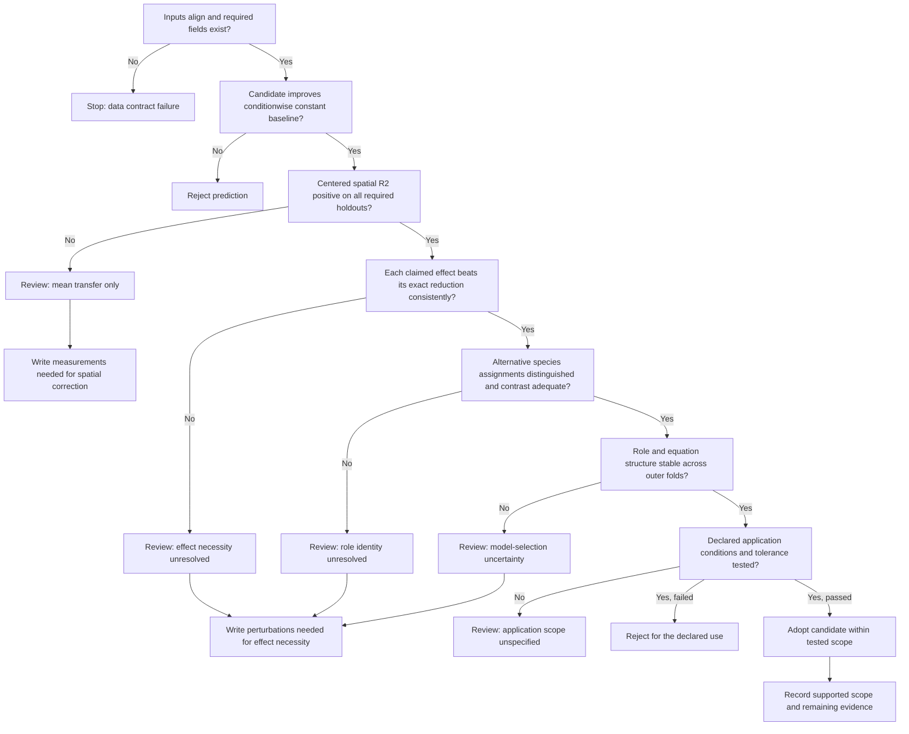

# Reaction-role evaluation workflow

## The workflow answers three separate questions

The repository evaluates predictive transfer, surface-role evidence, and mechanism
evidence separately. A model may predict a condition mean accurately while failing to
reproduce the wafer pattern or justify the assigned chemistry. The output must preserve
that distinction.

```mermaid
flowchart LR
    F[Fluent raw species fields] --> A[Align observations and units]
    A --> I[Choose one input quantity and location]
    I --> C[Enumerate A / B / I assignments]
    C --> M[Fit applicable CVD or ALD models]
    M --> R[Compare exact reductions]
    R --> V[Chemical condition and spatial validation]
    V --> S[Role and structure stability]
    S --> X[Optional post-selection spatial residual fit]
    X --> D[Separate chemical and spatial assessments]
    D --> E[State supported claims and missing evidence]
```



The primary product path is role assimilation against measured film thickness or
deposition rate. Dynamic state metrics and transport diagnostics support that decision;
they are not independent product endpoints.

## Input capability determines the executable model set

| Available data | Executed path | What can be estimated | What remains outside the evidence |
| --- | --- | --- | --- |
| Multi-condition steady CSV with reference-plane concentrations and rate maps | Steady equation census with `bulk_as_surface` | Observable response shape, candidate role assignment, exact-reduction benefit, condition transfer | Absolute wall flux, elementary constants, dynamic state, mechanism-specific memory |
| Steady CSV with measured wall concentrations | Same census with `direct_surface` | Surface-response shape without a fitted film drop | Flux unless transport-capacity data are also available |
| Steady CSV with reaction-independent wafer supply flux | Steady census with `direct_flux` | Role response to local arrival/supply flux, condition transfer, spatial prediction | Concentration adsorption constants and transport/reaction separation |
| Reference-plane concentration plus CFD transport-capacity flux | Dynamic/simulation path with `from_cfd_flux_sink` | Spatial (k_m), surface concentration, transport utilization, surface/transport flux closure | Multicomponent diffusion unless supplied by CFD or a future Maxwell-Stefan closure |
| Time-resolved CVD concentration | `role_cvd_aib` or `role_cvd_mvk` | Coverage or redox-state response, relaxation time, final thickness | Unique mechanism without switching conditions or state-sensitive measurement |
| Dose/purge/cycle-resolved ALD concentration | `role_ald_state` | Storage, release, conversion and inhibitor roles across recipe segments | Elementary surface sequence from final GPC alone |
| Film map only, without aligned Fluent species | No reaction-role fit | Measurement statistics and spatial QA | Species roles and reaction model |

Unsupported observations cause a model to be skipped or held outside the comparison.
Missing data must not be replaced with a numerical default that changes model meaning.

## Steady multi-condition CVD procedure

### 1. Data adaptation and quality checks

For each condition, `condition_<id>.csv` is paired with
`validation_<id>.csv`. Coordinates are matched to six decimal places after checking row
counts, duplicates, maximum coordinate difference, finite values, and concentration/
mole-fraction consistency. All candidates see the same aligned observations.

The adapter records which input capabilities are present:

- `bulk_concentration`
- `surface_concentration`
- `transport_capacity_flux`
- `realized_reactive_flux`

It also measures between-condition contrast, log-span, rank, condition number, and
species correlation before interpreting a role assignment.

One `--reaction-input` value is fixed for the complete run. A model census never mixes
bulk concentration, surface concentration, and transport-capacity flux candidates in one
chemical ranking. The local equation input is

\[
u_{j,qn}=\frac{X_{j,qn}}{X_{j,\mathrm{ref}}},
\]

where \(X\) retains its declared quantity, location, and unit. A realized reacting-wall
flux is excluded because it already contains the surface-reaction result being fitted.

### 2. Candidate enumeration

The registry enumerates every allowed role assignment for each requested equation
family. It adds declared exact reductions and removes duplicate candidates caused by
true equation symmetries. For three anonymous species, the current `--models all`
steady run evaluates 59 candidates, including constant and total-concentration nuisance
baselines.

Candidate IDs include process, equation family, role class, reduction, concentration
location, and raw-species assignment. This makes a fitted result reproducible without
assuming that a raw species name has fixed chemistry.

### 3. Condition-balanced steady-response parameter estimation

Each condition receives equal total weight. If condition (q) contains (N_q) points,

\[
w_{qn}=\frac{1}{Q N_q}
\]

when measurement uncertainty is absent. With supplied standard uncertainty
σqn, inverse-variance weights are normalized within each condition:

\[
w_{qn}=\frac{\sigma_{qn}^{-2}}
{Q\sum_{m\in q}\sigma_{qm}^{-2}}.
\]

This prevents a condition with more spatial samples from dominating model selection.
The dimensional default loss is evaluated in the linear deposition-rate unit:

\[
\mathcal L(\boldsymbol\phi,R)=
\sum_{q,n}w_{qn}\left[Rf(\mathbf u_{qn};\boldsymbol\phi)-v_{qn}\right]^2.
\]

Three alternative single-objective losses are available. With local weights
\(\widetilde w_{qn}\) normalized to one within each condition, residual
\(e_{qn}=\hat v_{qn}-v_{qn}\), and
\(s_q^2=\sum_n\widetilde w_{qn}v_{qn}^2\), they are

\[
L_{\mathrm{WN\text{-}MSE}}=\frac1Q\sum_q
\frac{\sum_n\widetilde w_{qn}e_{qn}^2}{s_q^2},
\qquad
L_{\mathrm{WN\text{-}MAE}}=\frac1Q\sum_q
\frac{\sum_n\widetilde w_{qn}|e_{qn}|}{s_q},
\]

\[
L_{\mathrm{sym}}=\frac1Q\sum_q
\frac{2\sum_n\widetilde w_{qn}e_{qn}^2}
{\sum_n\widetilde w_{qn}(v_{qn}^2+\hat v_{qn}^2)}.
\]

Wafer normalization removes the automatic dominance of a high-rate condition under the
same relative error. These objective values have different scales and are never
compared directly. Candidate selection remains based on no-refit condition-CV RMSE in
nm/s for every Loss.

When a justified radial uncertainty model is supplied, normalized radius \(\rho\),
edge/center standard-uncertainty ratio \(\gamma\), and exponent \(p\) give

\[
\sigma_{\mathrm{rel}}(\rho)=1+(\gamma-1)\rho^p,
\qquad w_{qn}\propto
\left[\sigma_{qn}\sigma_{\mathrm{rel}}(\rho_{qn})\right]^{-2}.
\]

The weights are renormalized within each condition afterward. Setting \(\gamma=1\)
disables this option. A chosen radial profile is an uncertainty assumption; it is not
estimated from a single unreplicated film map.

Positive shape parameters are searched in base-10 log space over candidate-declared
bounds; the default is ([-10,10]). A coarse Cartesian grid at −8, −4, 0, 4, and 8
is clipped to those bounds. The five best distinct seeds are refined deterministically
down to 0.0078125 decade. The best seed retains full-neighbourhood refinement, while
the additional seeds use coordinate pattern sweeps to follow correlated valleys. The
nonnegative rate scale (R) is profiled at every shape point. MSE and wafer-normalized
MSE have closed weighted least-squares solutions. Wafer-normalized MAE uses the exact
weighted median of \(v/f\). The symmetric loss uses a deterministic bounded
one-dimensional minimization. Thus the selected shape sampler never spends a search
dimension on a separable amplitude. The method and evaluation count are recorded in
`role_ranking.csv`; a boundary optimum is reported because it weakens interpretation.

The search is deliberately modest because these are low-dimensional observable
reductions. It is not a general-purpose global optimizer, and grid resolution must not
be mistaken for parameter uncertainty.

Transient CVD/ALD state models use the same condition weights through a separate
sampler-neutral path. `parameter_space.py` first removes role-inapplicable and fixed
variables. For active dimension \(d\), the requested trial count is

\[
N_{\mathrm{trial}}=\min\!\left(N_{\max},
\max(N_{\min},n_d\max(d,1))\right).
\]

`samplers.py` executes random search, Optuna TPE or CMA-ES, and the pinned OptunaHub
differential-evolution, particle-swarm, Lévy-flight, or CMA-MAE implementations. DE and
PSO operate directly on the finite compiled space. Lévy flight alternates local movement
from the current best with heavy-tailed jumps. CMA-MAE uses an unconstrained internal
coordinate mapped smoothly into the finite log-parameter interval and archives
solutions by predicted mean wafer CV and log condition-rate span. A run stops after the
minimum budget when no material improvement has occurred for the declared patience, or
at the maximum budget. Independent repetitions use distinct recorded seeds. No sampler
fallback is allowed.

`benchmark_surface_optimization.py` freezes one role equation before crossing Loss and
sampler choices. It ranks combinations only by median leave-one-identification-condition-out
RMSE, reports seed spread, and uses the fixed test condition only as a final audit. This
separates optimizer behavior from changes in equation or role selection. The generated
`benchmark_report.md` lists every combination with its seed range, fixed-test score,
centered spatial R2, and elapsed time; the CSV files retain the individual runs and
condition folds. Independent combinations may run in parallel. Partial CSV checkpoints
make long fixed-budget comparisons resumable without changing seeds or repeating
completed combinations.

The data term is selected independently as MSE, Huber, or L1. When uncertainty is
supplied, residuals are standardized before fitting:

\[
z_{qn}=\frac{\hat y_{qn}-y_{qn}}{\sigma_{qn}}.
\]

Multiple measured observables are combined only after this standardization and their
declared weights are normalized. Unmeasured coverage, role contribution, spatial bias,
purge, or plateau heuristics are reported as diagnostics rather than added to the loss.
The only non-data terms are an explicitly weighted numerical-solver term and the stated
hierarchical-parameter prior.

### 4. Inner leave-one-condition-out selection

For each candidate, every training condition is held out once. The model is refitted on
the remaining training conditions and predicts the held-out map. The selection score is
the condition-weighted mean squared error of these refitted predictions:

\[
S_m=\frac{1}{Q}\sum_{q=1}^{Q}
\frac{1}{N_q}\sum_{n=1}^{N_q}
\left(\hat v_{m,q,n}^{(-q)}-v_{q,n}\right)^2.
\]

The smallest finite (S_m) wins. Only floating-point ties prefer fewer active effects
and fewer fitted parameters. No test condition, application tolerance, or visual
inspection participates in selection.

### 5. Exact-reduction and alternative-assignment evidence

Every parent model is compared with independently refitted reductions on identical
condition folds. For removed effect (e),

\[
\Delta S_e=S_{\mathrm{reduced}}-S_{\mathrm{parent}}.
\]

`consistent_benefit` requires nonnegative foldwise loss differences with at least one
strict improvement above numerical roundoff. Crossing signs are `mixed`; nonpositive
differences are `no_benefit`. This is a predictive comparison, not a hypothesis test.

Role necessity and role assignment are evaluated separately:

- necessity asks whether removing the effect degrades condition transfer;
- assignment asks whether substituting another raw species degrades condition transfer;
- symmetry can leave role direction unresolved even when a pair is needed.

### 6. Fixed holdout and outer selection procedure

The primary fixed split trains on conditions 1, 2, 4, and 5 and evaluates condition 3
without refitting. A second outer loop holds out each of the five conditions, reruns the
entire inner selection on the other four, and evaluates the selected model. The two
results have different meanings:

- fixed holdout evaluates one chosen model;
- outer leave-one-condition-out evaluates the complete selection procedure.

This nested structure limits selection-induced optimism [Varma and Simon, 2006]. The
outer test results are never folded back into the selected model.

### 7. Spatial diagnostics

Raw RMSE is decomposed into condition-mean and centered spatial components. For one
condition,

\[
e_n=(\hat v_n-v_n),\qquad
e_{\mathrm{mean}}=\overline{\hat v}-\bar v,
\]

\[
\mathrm{RMSE}_{\mathrm{centered}}=
\sqrt{\frac{1}{N}\sum_n
\left[(\hat v_n-\overline{\hat v})-(v_n-\bar v)\right]^2},
\]

\[
R^2_{\mathrm{centered}}=
1-\frac{\sum_n[(\hat v_n-\overline{\hat v})-(v_n-\bar v)]^2}
{\sum_n(v_n-\bar v)^2}.
\]

The range-capture fraction is

\[
\rho_{\mathrm{range}}=
\frac{\max\hat v-\min\hat v}{\max v-\min v}.
\]

Angular and radial blocked refits test whether performance depends on neighboring wafer
locations. Spatial support requires positive centered (R^2) for every relevant held-out
condition. Low relative RMSE can coexist with negative centered (R^2) when the
condition mean is much larger than the within-wafer variation.

### 8. Optional spatial residual response

The chemical result above remains unchanged. When explicitly enabled, a second stage
fits only the centered log residual remaining after the selected chemical prediction:

\[
g(\rho)=\gamma_2(\rho^2-\langle\rho^2\rangle_q)
+\gamma_4(\rho^4-\langle\rho^4\rangle_q).
\]

The corrected prediction is positive and is normalized within each condition:

\[
\hat v^{\mathrm{chem+space}}_{qn}
=\hat v^{\mathrm{chem}}_{qn}e^{g_{qn}}
\frac{\langle\hat v^{\mathrm{chem}}\rangle_q}
{\langle\hat v^{\mathrm{chem}}e^g\rangle_q}.
\]

Consequently, the spatial stage cannot repair a condition-mean error. It cannot change
reaction-family ranking, exact-reduction evidence, role assignment, or observable
chemical parameters. Every outer condition fold estimates \(\gamma\) only from its
identification conditions before predicting the held-out wafer. The wafer temperature is
assumed uniform and supplies no spatial basis term.

### 9. Stability and uncertainty

Role stability repeats selection on training-condition subsets and records the frequency
of each role/equation structure. A stable numerical parameter estimate does not repair an
unstable model choice.

Spatial bootstrap resamples angular groups, refits the already selected structure, and
reports percentile ranges for its coefficients. These ranges are conditional on the
chosen family, role assignment, and supplied conditions [Efron and Tibshirani, 1993].
They do not include model-selection uncertainty.

Model-structure sensitivity refits each distinct structure selected across outer folds
on the primary training set and reports the prediction envelope on the fixed holdout.
The envelope is a sensitivity range, not a confidence interval.

### 10. Mechanism consequence and practical parameter information

Mechanism and assignment ambiguity are classified by consequence, not by stability
alone. For each selected role, replace its local field by the identification reference,
recalculate prediction without refitting, and compare the condition-balanced RMS change
with the selected-model heldout RMSE. Join this value to the outer selection frequency:

- low frequency and change below heldout error: unstable but predictively negligible in
  the supplied range;
- low frequency and change comparable to or above heldout error: influential unresolved
  assignment;
- high frequency and large change: stable and influential role within the tested range.

The ratio of change to heldout RMSE is a scale reference rather than a statistical
threshold. The same procedure is applied to equation families by refitting the best
candidate in each family and comparing co-located heldout predictions with the selected
family. A small prediction difference can justify robust use of the prediction while the
mechanism remains unresolved; a large difference makes mechanism ambiguity a predictive
risk.

Finally, calculate local derivatives of log rate with respect to log kinetic ratios,
their pairwise correlation, and a one-parameter Loss slice. The slice varies one ratio
and reprofiles the overall rate scale while holding the other ratios fixed. These checks
identify inactive and coupled directions. They do not replace a noise-based joint
profile likelihood or independent kinetic experiment. Equations and interpretation are
specified in [THEORY.md](THEORY.md).

## Decision flow



`adopt_candidate` requires an independent fixed-model evaluation that meets a declared
relative-error tolerance, the requested spatial requirement, and all role-evidence
checks. `review` means the model can still be useful for a narrower predictive task, but
the data do not support its full interpretation. `reject_prediction` means it fails the
reference prediction test. Lower-ranked non-tied candidates receive
`reject_lower_score`; this is a ranking outcome rather than a claim that their chemistry
is impossible.

The terminal review state is therefore actionable rather than merely negative. The
workflow evaluates three target uses independently: wafer spatial correction,
anonymous-species role assignment, and elementary kinetic-parameter estimation. For
each unresolved use it writes the required measurement, experimental design, ambiguity
resolved, and insertion point in the workflow to `data_requirements.csv`. These rules
refer to evidence properties, so they apply to other species sets and condition counts.

## Dynamic-state procedure

Dynamic CVD and ALD inputs must include a strictly increasing time array and a
concentration frame for every interval. The simulator selects one registered process
model, one transport provider, and one net-film model through YAML.

For AIB and MvK CVD, bounded implicit Euler solves the next state from

\[
x_{k+1}-x_k-\Delta t\,g(x_{k+1})=0
\]

by bisection on ([0,1]). Long intervals are split so that
(\Delta t\le\texttt{dt_max_s}). A non-bracketed point falls back to a clipped explicit
step and is counted in diagnostics. This gives a robust bounded solution for the scalar
state while exposing cases where the assumed monotone bracket is invalid.

The current ALD state kernel uses explicit bounded substeps. It records excursions and
state projections when θA, θI, or their sum would leave the physical simplex. Frequent
projections indicate inadequate time resolution or a parameter regime inconsistent with
the reduced state model.

Dynamic model comparison must use process-level observations such as time-resolved
thickness, step response, cycle GPC, or surface-state measurements. A steady CSV census
does not execute or rank dynamic states.

## Numerical operations and their evidential value

| Operation | Numerical role | Why it is useful | Interpretation limit |
| --- | --- | --- | --- |
| Deterministic coordinate alignment | Associates each film observation with one Fluent row and records distance | Prevents mesh density or accidental duplication from changing the objective | Cannot repair an incorrect coordinate system or unknown unit |
| Median concentration normalization | Forms (u_j=C_j/C_{j,0}) from identification data only | Makes shape parameters dimensionless and reduces scale conditioning | Removes no collinearity and does not create physical calibration |
| Analytic amplitude profiling | Solves the conditional least-squares optimum for (R) | Removes one nonlinear search dimension exactly and improves reproducibility | (R) remains a lumped film-response scale |
| Refined log-grid search | Searches positive shape groups over many orders of magnitude | Robust for the present two-to-four-dimensional reductions and deterministic across runs | Boundary/grid optima do not imply precise elementary constants |
| DE/PSO/Lévy/CMA-MAE sampler interface | Applies one finite shape space and fixed budget to a frozen equation | Tests population, swarm, heavy-tail, and quality-diversity search without changing the physics or validation split | A broader search is not automatically more accurate at finite budget |
| Loss-by-sampler benchmark | Repeats each combination and ranks it by training-condition transfer | Separates Loss scaling from sampler convergence and protects the fixed test | Conclusions remain equation- and dataset-dependent |
| Repeated-seed and convergence trace | Records best-so-far score, termination reason, and spread of repeated best values | Separates unstable numerical search from unstable model selection | A flat trace can still lie on a non-identifiable parameter ridge |
| Inner condition refits | Reestimates every candidate after withholding one training condition | Measures transfer rather than interpolation of already fitted conditions | Four training conditions still give a high-variance estimate |
| Exact-reduction refits | Fits parent and reduced equations independently on identical folds | Tests whether a named effect improves prediction instead of reading one fitted coefficient | Predictive necessity does not identify a microscopic step |
| Outer condition selection | Repeats enumeration, selection, refit, and prediction for each held-out condition | Exposes family and role instability introduced by model selection | Five folds are insufficient for a narrow frequentist uncertainty interval |
| Angular/radial blocked evaluation | Withholds spatial groups rather than neighboring points | Detects optimistic scores caused by local spatial redundancy | It does not replace a new reactor condition |
| Centered spatial metrics | Removes condition means before comparing map shape | Separates operating-point transfer from wafer-pattern prediction | Sensitive to measurement registration and unresolved spatial fields |
| Angular bootstrap | Resamples spatial groups and refits the fixed selected structure | Quantifies conditional coefficient variability while retaining local dependence | Excludes family and role-selection uncertainty |
| Structure prediction envelope | Refits each structure selected in outer folds and spans its holdout prediction | Shows decision sensitivity to the chosen equation family | A sensitivity band is not a calibrated probability interval |
| Scaled sensitivity SVD | Differentiates the fitted response with respect to log parameters and scales each direction | Separates structural rank from severe practical collinearity | Thresholds flag weak information but do not replace profile likelihood or posterior uncertainty |
| Bounded implicit bisection | Solves scalar AIB or MvK state steps on ([0,1]) | Preserves physical state bounds for stiff uptake/regeneration without a heavy solver dependency | Frequent fallback or unconverged counts invalidate the numerical run |
| Observation-time MvK history | Stores (\chi), thickness, reduction/regeneration rates, surface concentrations, and fluxes at supplied input times | Makes pulse memory and state-sensitive residuals available to the existing multi-observation objective | Scientific fitting still requires measured histories with aligned time and uncertainty |
| Bounded ALD substeps | Splits dose/purge intervals and projects the two-state simplex | Keeps storage and inhibitor coverages physical under recipe switching | Projection frequency must fall with time-step refinement |

## Numerical outputs and their use

| Artifact | Main question answered |
| --- | --- |
| `role_summary.csv` | Why the numerical winner is adopted, held for review, or rejected |
| `role_ranking.csv` | Which family, reduction, and role assignment minimized inner condition error |
| `role_stability.csv` | Whether roles and equation family persist across condition subsets |
| `best_model_role_assignments.csv` | Which raw species supplies the surface-reactant, inhibitor, and co-reactant input in the best fit of each equation family |
| `optimization_history.csv` | Best-so-far fitting error versus objective evaluations for the best assignment in each steady equation family |
| `condition_mean_input_correlations.csv` | Which concentration or flux inputs co-vary across process conditions and therefore cannot be separated reliably |
| `role_input_sensitivity.csv` | RMS prediction change when one assigned local input is replaced by its fitted reference value |
| `role_importance_and_stability.csv` | Whether an unstable raw-species assignment has a prediction effect smaller or larger than the held-out RMSE |
| `role_response_curves.csv` | Predicted rate while one assigned concentration or flux is varied over its observed range and other inputs remain at reference |
| `reaction_state_summary.csv` | Mean and spatial range of fitted site fractions and reaction-path fractions on the fixed holdout |
| `reaction_model_predictions.csv` | Held-out RMSE and prediction difference from the selected model for the best fit in each equation family |
| `reaction_model_states.csv` | Model-defined site and pathway fractions for the best fit in each equation family |
| `parameter_sensitivity_correlations.csv` | Local logarithmic rate sensitivity and pairwise correlation of fitted kinetic-ratio sensitivities |
| `parameter_loss_slices.csv` | Fitting error while one kinetic ratio is varied and the overall rate scale is reprofiled |
| `spatial_response_summary.csv` | Chemical and corrected heldout RMSE and centered spatial metrics for every outer condition |
| `spatial_response_coefficients.csv` | Frozen radial-basis coefficients, training conditions, and weighting semantics |
| `condition_scores.csv` | Which conditions fail mean or spatial transfer and under which evaluation scope |
| `optimization_summary.csv` | Sampler, active dimension, trial budget, termination, and repeated-seed score spread for each main fit and condition refit |
| `optimization_trace.csv` | Trial score and best-so-far progression for main fits and condition refits |
| `loss_components.csv` | Data loss, solver term, prior term, and ordinary error metrics by candidate and condition |
| `optimization_convergence.png` | Whether the winning candidate improved with trial count and whether repeated seeds reached the same basin |
| `loss_components.png` | Whether candidate score differences arise from observations, solver behavior, or the declared prior |
| `split_sensitivity.csv` | What the complete selection procedure chooses for each outer holdout |
| `coefficients.csv` | Observable fitted groups and conditional bootstrap percentiles |
| `test_extrapolation.csv` | Where the fixed holdout lies outside the identification range |
| `model_structure_uncertainty.csv` | Prediction spread induced by structures selected across outer folds |
| `condition_quality.csv` | Coordinate, precision, concentration, and mole-fraction checks |
| `data_requirements.csv` | Which measurements and controlled perturbations are needed to establish each unresolved target use |
| `analysis_summary.json` | Machine-readable synthesis of model, evidence, limits, and source hashes |
| `manifest.json` | Artifact inventory, sizes, and hashes |

The primary human reading order is `role_summary.csv`, `role_ranking.csv`,
`role_stability.csv`, and `condition_scores.csv`. Detailed diagnostics should support a
decision; they should not create a second adoption framework.

The figures form a compact scientific reading sequence:

1. `optimization_convergence.png` shows best training error versus objective evaluations
   for the best assignment within each reaction-equation family.
2. `equation_family_comparison.png` compares held-out prediction error with outer-fold
   selection frequency; `best_model_role_assignments.png` shows the corresponding raw
   species-to-reaction-role map. `reaction_pathway_models.png` shows the adsorption,
   blocking, and conversion stages defined by those equations, while
   `reaction_model_prediction_agreement.png` shows whether the alternative mechanisms
   make materially different held-out predictions.
3. `condition_reaction_input_contrast.png` and `reaction_input_correlation.png` show the
   supplied condition variation and identify concentration or flux pairs that cannot be
   independently distinguished.
4. `role_selection_stability.png` gives the numerical assignment frequency across held-out
   conditions. `role_input_sensitivity.png` and `role_response_curves.png` show the fitted
   rate sensitivity without treating nonlinear effects as additive contributions.
   `role_importance_and_stability.png` separates influential but unstable assignments from
   unstable assignments whose prediction effect is below the held-out error.
5. `reaction_state_summary.png` reports mean site and pathway fractions;
   `selected_surface_state_maps.png` shows their spatial distribution on the fixed holdout.
   `kinetic_parameter_sensitivity.png` and `parameter_loss_slices.png` expose weak and
   correlated fitted parameter directions.
6. `test_spatial_maps.png` and `test_radial_profile.png` compare the held-out map and
   radial-shell means. `model_structure_prediction_spread.png` shows where equation choice
   changes the prediction.
7. When the optional spatial stage is enabled, `test_spatial_response.png`,
   `spatial_residuals.png`, `spatial_correction_profile.png`, and
   `spatial_correction_performance.png` show the pattern before and after correction, its
   radial effect, and transfer to every held-out condition.

[VISUALIZATION_GUIDE.md](VISUALIZATION_GUIDE.md) gives the generated example for every
figure, defines each axis, colour scale, marker, and error bar, identifies the source
artifact, and states which conclusions the view can and cannot support. Use that guide
when preparing a report; keep the selection rules in this workflow authoritative.

Configured simulator runs use the versioned `output.v1` contract and write their
artifact inventory to `outputs/manifest.json`. The steady equation census writes a
top-level `manifest.json` because its outputs are tables and figures rather than gridded
simulation fields. These manifests share provenance and hash responsibilities but have
different schemas and must not be interchanged.

## Reproducible steady command

```powershell
uv run python scripts/analyze_cvd_multicond_case.py `
  --data-dir data `
  --train-cases 1 2 4 5 `
  --test-case 3 `
  --response-model surface_compare `
  --reaction-input bulk_concentration `
  --models all `
  --loss mse `
  --sampler pattern `
  --bootstrap-samples 100 `
  --spatial-response radial_quartic `
  --seed 123 `
  --output results/current_cvd_separated
```

The output is a generated run artifact. General equations and decision semantics belong
in [THEORY.md](THEORY.md) and this document, rather than being inferred from an old run
report.
