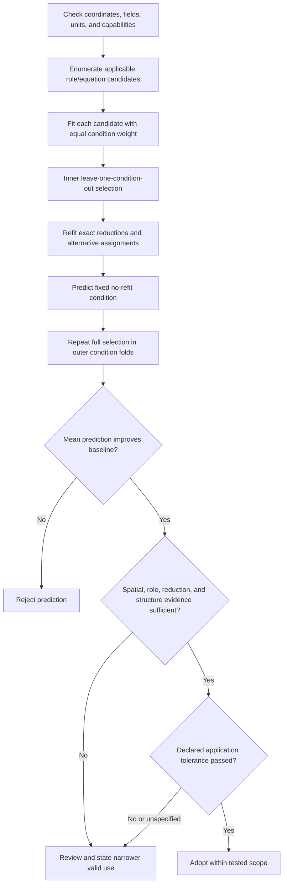

# Reaction-role assimilation for CVD and ALD film-map interpretation

**Technical report — revised 7 September 2026**

## Abstract

This work develops a reduced modeling and model-selection procedure that assigns
anonymous Fluent species fields to reaction roles and tests those assignments against
measured film maps. The implementation separates steady observable equations, dynamic
surface states, reference-plane-to-wall transport, and net-film accounting. Candidate
roles and exact equation reductions are fitted under condition-balanced loss, selected
by leave-one-condition-out error, and assessed with a fixed no-refit condition, spatially
blocked diagnostics, and outer model-selection folds.

The current five-condition CVD dataset contains 245 aligned concentration/rate
observations. A sequential AIB quasi-steady response gives 0.001049 nm s\(^{-1}\) RMSE
on the fixed condition-3 holdout, or 0.729% of its mean, and reduces error by 96.2%
relative to the training-condition mean. The chemical response alone does not reproduce
the wafer pattern: centered \(R^2=-0.0148\), spatial correlation is 0.172, and predicted
range is 34.6% of the observed range. A separate mean-preserving \(\rho^2+\rho^4\)
residual response raises condition-3 centered \(R^2\) to 0.845 and remains positive on
all five outer heldout folds. Equation-family and influential A/B assignments remain
unstable, while the fitted inhibitor direction is predictively negligible over the
supplied range. The relation is retained for provisional condition-mean screening; the
spatial response requires an external wafer before operational adoption. The workflow
emits the measurements and perturbations needed to establish chemical roles, physical
wafer correction, absolute flux, and elementary kinetics.

## 1. Problem formulation and evidence levels

Fluent supplies gas-phase fields identified by raw column names. Film measurements
supply deposition rate or thickness at corresponding wafer locations. The inferential
task is to find a low-dimensional role map

\[
\pi:\{s_0,s_1,\ldots\}\rightarrow\{A,B,I,\varnothing\}
\]

and a model (M) such that

\[
\hat y_{q,n}=\mathcal H_M
\left(\mathbf C_{q,n},\mathbf z_{q,n},t_q;
\boldsymbol\phi_M,\pi\right)
\]

transfers to an unfit condition (q). Here \(\mathcal H_M\) includes the selected
concentration location, surface response, state evolution where applicable, and the
measurement operator.

Four claim levels are kept distinct:

1. **Descriptive:** input and film maps are aligned and their variation is quantified.
2. **Predictive:** a fixed candidate predicts a new condition more accurately than a
   declared baseline.
3. **Role-level:** removing a role or assigning another raw species consistently worsens
   condition transfer.
4. **Mechanistic:** observations specific to adsorption, coadsorption, inhibition, or a
   redox reservoir distinguish the physical mechanism.

The present data reach the second level for condition means. They do not reach the third
or fourth levels.

## 2. Implemented model hierarchy

### 2.1 Steady response families

All steady concentrations are normalized by their median in the identification set,
(u_j=C_j/C_{j,0}), and (R) is a nonnegative deposition-rate scale.

| Family | Implemented response | Physical use | Main benefit | Main evidence limit |
| --- | --- | --- | --- | --- |
| Single (A/AI) | (R u_A/[u_A+\lambda(1+\kappa u_I)]) | Smallest saturation/inhibition test | Tests whether one species-related response is sufficient | No required co-reactant; (I) needs independent perturbation |
| Total-concentration baseline | \(R(C_{\mathrm{tot}}/C_{\mathrm{tot},0})^n\) | Nuisance check for common dilution or pressure scaling | Prevents a total-concentration trend being credited to a species role | No role or mechanism interpretation |
| Sequential AIB | (R u_A b u_B/[u_A+(\delta+b u_B)(1+\kappa u_I)]) | Adsorbed (A) converted by gas (B), with optional blocking | Compact Langmuir-Rideal-type reduction and exact no-loss/no-(I) comparisons | Steady AB direction can be symmetric; groups are not elementary constants |
| Parallel A + AB | (R u_A(c+b u_B)/[u_A+(\delta+c+b u_B)(1+\kappa u_I)]) | Growth may persist without (B) and gain a (B)-assisted channel | Reports pathway fractions | Requires data near (B=0) to identify (c) separately |
| Langmuir-Hinshelwood | (R(a u_A)(b u_B)/(1+a u_A+b u_B+\kappa u_I)^2) | Both reactants adsorb and compete on one site pool | Tests a different adsorption denominator and surface-state allocation | A/B exchange symmetry; coadsorption requires independent evidence |

The detailed derivation, units, assumptions, limiting forms, use cases, advantages,
disadvantages, and literature are given in [THEORY.md](THEORY.md). The references trace
the adsorption basis to Langmuir, the gas/adsorbate event to Eley and Rideal, the redox
reservoir to Mars and van Krevelen, and the ALD state description to the reviews of
Puurunen and George.

### 2.2 Dynamic process states

The continuous CVD AIB model integrates an adsorbed-(A) coverage:

\[
\frac{d\theta_A}{dt}=
k_{\mathrm{ads}}C_{A,s}\theta_*^m-k_{\mathrm{des}}\theta_A
-\nu_A r_{\mathrm{event}},
\qquad
\frac{dh}{dt}=\alpha_h\Gamma_s r_{\mathrm{event}}.
\]

The MvK model integrates the oxidized fraction χ:

\[
\frac{d\chi}{dt}=k_{\mathrm{reg}}C_{B,s}(1-\chi)
-k_{\mathrm{red}}C_{A,s}\chi,
\qquad
\frac{dh}{dt}=\alpha_h\Gamma_s k_{\mathrm{red}}C_{A,s}\chi.
\]

At steady state its turnover is

\[
r=\frac{k_{\mathrm{red}}C_{A,s}\,k_{\mathrm{reg}}C_{B,s}}
{k_{\mathrm{red}}C_{A,s}+k_{\mathrm{reg}}C_{B,s}},
\]

which is observationally equivalent to the sequential AB no-loss response. The steady
census therefore does not double-count MvK. Time-resolved switching and an oxidation-
state observable are required to test its reservoir memory.

The ALD model integrates stored (A) and inhibitor coverage:

\[
\begin{aligned}
\dot\theta_A &= k_{\mathrm{store},A}C_{A,s}\theta_*
-k_{\mathrm{release},A}\theta_A-r_{\mathrm{conv}},\\
\dot\theta_I &= k_{\mathrm{store},I}C_{I,s}\theta_*
-k_{\mathrm{release},I}\theta_I,\\
\theta_* &= 1-\theta_A-\theta_I.
\end{aligned}
\]

The conversion term is (k_{\mathrm{convert},A}\theta_A) without (B), or
(k_{\mathrm{convert},AB}C_{B,s}\theta_A) with (B). This supports dose/purge/cycle
role evaluation without embedding a named species-first mechanism.

Coverage rates are converted to molar surface flux with the site density:

\[
J_{A,s}=\Gamma_s(r_{\mathrm{store},A}-r_{\mathrm{release},A}),
\qquad J_{B,s}=\Gamma_s\nu_Br_{\mathrm{conv}}.
\]

The ALD film closures balance these fluxes against
\(k_m(C_{\mathrm{ref}}-C_s)\). Thus \(\alpha_h\) is nanometres per unit coverage
converted and \(\Gamma_s\) supplies the kmol m\(^{-2}\) scale required for an absolute
transport flux.

### 2.3 Transport boundary

The local film relation is

\[
J_j=k_{m,j}(C_{j,\mathrm{ref}}-C_{j,s}).
\]

The runtime accepts a supplied wall concentration, a fitted/supplied scalar or field
(k_m), or a CFD transport-capacity flux converted through

\[
k_{m,\mathrm{CFD}}=
\frac{J_{\mathrm{cap}}}{C_{\mathrm{ref}}-C_{\mathrm{boundary}}},
\qquad k_m=\gamma k_{m,\mathrm{CFD}}.
\]

The current CSV dataset supplies only reference-plane concentration. Its steady fit uses
`bulk_as_surface`; it does not transform Fluent results into an independently validated
wall concentration or absolute wall flux. Full Stefan-flow and Maxwell-Stefan coupling
are not implemented.

## 3. Estimation and decision method

The executable decision path is shown below; the complete definition and metric
equations are in [EVALUATION_WORKFLOW.md](EVALUATION_WORKFLOW.md).



For fixed shape parameters φ, the amplitude is profiled exactly:

\[
R^*(\boldsymbol\phi)=\max\left(0,
\frac{\sum_nw_nf_nv_n}{\sum_nw_nf_n^2}\right).
\]

Positive shape parameters are searched reproducibly in log space. Each candidate is
ranked by condition-refit error. Exact reductions and alternative species assignments
are independently refitted; a coefficient near zero is not substituted for that
comparison.

Nested condition evaluation prevents the selected test condition from influencing the
model choice. Spatially centered metrics distinguish correct condition scale from
correct wafer pattern. Angular-group bootstrap estimates conditional coefficient
variation, while the range of structures selected across outer folds measures model-
selection sensitivity.

Five numerical views separate predictive relevance from mechanism identification. Their
full definitions are given in [THEORY.md](THEORY.md).

| View | Quantity | Decision supported |
| --- | --- | --- |
| Role importance | \(S_j=[K^{-1}\sum_kN_k^{-1}\sum_{i\in k}(\hat y_i-\hat y_i^{(-j)})^2]^{1/2}\) | Prediction change after replacing one role input by its identification reference |
| Importance relative to error | \(Q_j=S_j/E_{\mathrm{holdout}}\) | Distinguishes harmless assignment instability from influential unresolved assignment |
| Family prediction separation | \(D_m=[N^{-1}\sum_i(\hat y_{m,i}-\hat y_{\star,i})^2]^{1/2}\) | Shows whether mechanism ambiguity changes the tested prediction |
| Local parameter information | \(g_{ij}=\partial\ln\hat y_i/\partial\ln p_j\) and correlations of \(g_{·j}\) | Finds inactive or coupled fitted directions |
| Partial Loss slice | \(\widetilde L_j(p)=\min_{R\ge0}L\{Rf(\mathbf u;p,\hat{\boldsymbol\phi}_{-j})\}\) | Shows flatness when one ratio changes and only rate scale is reprofiled |

The optional spatial response is fitted after chemical selection to centered logarithmic
residuals. It multiplies the frozen chemical prediction and is rescaled to preserve its
condition mean. This prevents a shared radial basis from entering chemical-role or
equation selection.

## 4. Software implementation

The code separates model meaning from fitting and presentation:

| Component | Responsibility |
| --- | --- |
| `aib_reductions.py` | Pure steady equations, reductions, symmetry, and evidence requirements |
| `surface_fit.py` | Whole-wafer weighting, positive parameter search, amplitude profiling, and sensitivity design |
| `losses.py`, `metrics.py` | Fitted residual loss and reporting metrics as separate numerical concepts |
| `parameter_space.py`, `samplers.py` | Active-variable compilation; random/TPE/CMA-ES and OptunaHub DE/PSO/Lévy/CMA-MAE search, budgets, seeds, stopping, and traces |
| `surface_optimization_benchmark.py` | Frozen-equation Loss-by-sampler comparison without fixed-test selection leakage |
| `parameter_fit.py`, `fit_conditions.py` | Candidate-level fit orchestration and one train/holdout simulator-observation adapter |
| `evidence_requirements.py` | Target-use readiness and reusable experimental requirements for unresolved evidence |
| `cvd_analysis_io.py` | Format-level CSV reading, coordinate matching, and artifact serialization |
| `cvd_conditions.py` | Condition-file interpretation, alignment, quality facts, and role-field assembly |
| `cvd_multicond_analysis.py` | Candidate census, nested validation, evidence calculation, and artifact orchestration |
| `class_compare.py` | Ranking, role evidence, stability, and adopt/review/reject logic |
| `aib_ode.py`, `mvk_state.py`, `ald_role_state.py` | Dynamic process states and local surface balances |
| `transport_provider.py` | Concentration-location and (k_m) source semantics |
| `pipeline.py` | Configured composition of Fluent input, transport, process, measurement, and output |
| `cvd_multicond_report.py` | Tables, notebook text, and plots from computed results without changing selection |

Registries permit a new equation family to supply its response, reductions, symmetry,
required inputs, and evidence conditions without adding a parallel optimization
framework. CVD and ALD share the role-evidence layer but retain their own state physics.
The architecture and extension rules are specified in [ARCHITECTURE.md](ARCHITECTURE.md).

For transient state models the nonlinear search backend is selected independently of
the loss. The active dimension determines a bounded trial budget, and every candidate
records its trial history and repeated-seed best-score spread. A requested optional
backend fails if its dependency is unavailable; it is not replaced by random search.
MSE, Huber, and L1 are strict named state-observation losses. The steady map path also
provides wafer-normalized MSE, wafer-normalized MAE, and symmetric normalized MSE while
retaining ordinary nm/s condition-CV metrics for selection. Supplied uncertainty
produces dimensionless standardized residuals, and all active conditions must use the
same scale.
Heuristic role, pathway, spatial, and complexity penalties were removed from selection;
such quantities require measurements or remain diagnostics.

## 5. Current-data results

### 5.1 Predictive result

The fixed split trained on conditions 1, 2, 4, and 5 and held out condition 3. The
numerical prediction winner was

```text
cvd:aib_qss:AIB:full:bulk_as_surface:A=idn_2,I=n2,B=adn_2
```

| Quantity | Result |
| --- | ---: |
| Training-condition CV RMSE | 0.000894084 nm s\(^{-1}\) |
| Conservative angular/radial blocked-CV RMSE | 0.00178286 nm s\(^{-1}\) |
| Condition-3 RMSE | 0.00104863 nm s\(^{-1}\) |
| Condition-3 relative RMSE | 0.729% |
| Condition-3 relative mean bias | +0.300% |
| Improvement from constant training mean | 96.2% |
| Centered spatial (R^2) | −0.0148 |
| Spatial correlation | 0.172 |
| Predicted/observed map range | 34.6% |


The low relative RMSE is driven by correct condition scale. The spatial residual remains
structured, and the model predicts less than half of the observed range. This is a
negative result for wafer-map prediction even though the condition mean is accurate.


The condition-mean figure shows the narrower capability directly: the selected response
tracks the operating-condition scale, including the frozen condition 3, while the map
comparison above shows that this agreement does not extend to the in-plane pattern.

The post-selection radial response changes the fixed-holdout RMSE from 0.00104863 to
0.000570306 nm s\(^{-1}\) and centered \(R^2\) from −0.0148 to 0.8452. Across the five
outer folds, corrected centered \(R^2\) ranges from 0.695 to 0.845 and is positive in
every case.


The result establishes an internally transferable radial residual pattern for this
five-condition campaign. It does not establish its physical origin. The basis contains
no temperature, multicomponent transport, reactor-flow, or surface-state field, and all
five folds reuse the same coordinate design.

All generated figures, including the optimization, reaction-role, parameter,
prediction, and spatial-response views not reproduced in this report, are documented in
[VISUALIZATION_GUIDE.md](VISUALIZATION_GUIDE.md). That guide defines the axes and source
tables and gives the current-data interpretation without using a plot as independent
mechanism evidence.

### 5.2 Model and role uncertainty

| Equation family | Condition-CV RMSE (nm s\(^{-1}\)) | Relative gap | Outer selection frequency |
| --- | ---: | ---: | ---: |
| Sequential AIB | 0.000894084 | 0% | 60% |
| Parallel A + AB | 0.000903338 | 1.04% | 0% |
| Langmuir-Hinshelwood | 0.000925961 | 3.57% | 40% |


Sequential AIB and Langmuir-Hinshelwood win outer splits, while the selected reduction
and role assignment also change within the sequential family. The resulting structure
envelope has a mean width of 0.000429302 nm s\(^{-1}\), 0.298% of the condition-3 mean.
The selected equation structure is therefore not stable across plausible identification
sets.

| Family | Heldout RMSE (nm s\(^{-1}\)) | RMS difference from selected (nm s\(^{-1}\)) | Difference / selected RMSE |
| --- | ---: | ---: | ---: |
| Sequential AIB | 0.00104863 | 0 | 0 |
| Parallel A + AB | 0.00184890 | 0.00115630 | 1.103 |
| Langmuir-Hinshelwood | 0.000958571 | 0.000434995 | 0.415 |


The Langmuir-Hinshelwood interpretation changes the condition-3 prediction by less than
half the selected-model RMSE. The parallel interpretation changes it by slightly more
than one RMSE. Hence some mechanism ambiguity is prediction-insensitive on this holdout,
while another surviving family is materially different; no mechanism probability is
implied.

Removing the inhibitor term changes CV RMSE from 0.000894084 to 0.000900285 nm
s\(^{-1}\), about 0.69%, with mixed foldwise benefit. The assignment of `n2` to (I)
is unsupported. Removing the finite-loss group worsens RMSE by roughly a factor of 20.6;
the data require an effective nonproductive-loss term within this family,
but do not identify it as physical desorption.

`idn_2` and `n2` have pooled correlation 0.980, and only `adn_2` receives a strong
independent condition perturbation. Condition 3 is also outside the training range at
every point for total concentration, `idn_2`, and `n2`. The accurate mean transfer is
one out-of-range success, not a general extrapolation validation.


| Selected role | Raw species | Outer selection | RMS prediction change (nm s\(^{-1}\)) | Change / heldout RMSE | Assessment |
| --- | --- | ---: | ---: | ---: | --- |
| A | `idn_2` | 40% | 0.0087144 | 8.31 | Influential but unresolved |
| B | `adn_2` | 40% | 0.0526467 | 50.2 | Influential but unresolved |
| I | `n2` | 40% | 0.0000044616 | 0.00425 | Unstable and predictively negligible in the observed range |


This joint view prevents two incorrect conclusions. A/B instability cannot be dismissed,
because their prediction changes are much larger than the heldout error. The inhibitor
label cannot be accepted mechanistically, but its instability has negligible consequence
for the current fitted rate range.

The selected equation's RMS log-rate sensitivities are 0.5669 for the finite-loss ratio,
0.9529 for the B-conversion ratio, and 0.0003008 for the inhibition ratio. Finite-loss
and inhibition sensitivities correlate at −0.912. The nearly inactive inhibition
direction and its flat partial Loss slice agree with the exact no-inhibitor reduction.


## 6. Interpretation, limits, and intended use

The following conclusions are supported:

- concentration-dependent reduced surface responses transfer the condition mean much
  better than a constant-rate baseline;
- the selected sequential family requires a finite effective loss group;
- the current workflow detects that mean prediction and wafer-pattern prediction give
  different conclusions;
- a separate mean-preserving radial residual response transfers within the five supplied
  outer folds without altering chemical selection.

The following conclusions are not supported:

- `idn_2`, `adn_2`, or `n2` has a uniquely identified chemical role;
- Langmuir-Rideal, Langmuir-Hinshelwood, or Mars-van Krevelen is the true mechanism;
- fitted dimensionless groups are elementary adsorption, desorption, or reaction
  constants;
- the model gives absolute reactive wall flux;
- the radial residual is caused by a particular temperature, transport, or surface
  mechanism, or transfers to an external reactor campaign.

The practical status remains `review`. The chemical relation can support ranking or
preliminary screening of condition-mean deposition rates in the same physical regime.
The radial response is a promising predictive correction within the supplied campaign,
but production adoption requires a declared spatial tolerance and a new frozen wafer.
Any physical attribution, surface-flux use, or chemistry decision needs additional
observations.

## 7. Measurements that establish each target use

The executable assessment does not terminate at an unsupported-use label. It writes one
row per needed measurement to `data_requirements.csv`, using the following general
criteria for any dataset:

| Target use | Measurements and designed variation | Evidence required before use |
| --- | --- | --- |
| Wafer spatial correction | New coordinate-registered wafer campaigns with replicate uncertainty; co-located temperature and wall or near-wall species/transport fields when physical attribution is required | Positive centered spatial prediction and declared tolerance on every external holdout; acceptably unstructured residuals; causal field required before naming the correction mechanism |
| Anonymous-species role assignment | Independent A/B/I candidate perturbations including off/low levels and low-coverage-to-saturation conditions; a surface-state or outlet-species observable where possible | Full-rank condition contrast, consistent effect necessity against exact reductions, and stable assignment across independent condition refits |
| Elementary kinetic parameters | Time-resolved uptake/thickness/state observations; several calibrated temperatures; site density and absolute wall concentration or reacting-wall flux; replicate uncertainty | Absolute surface balance, resolved sensitivity directions, finite uncertainty intervals, Arrhenius consistency, and external dynamic prediction |


The next experiment should maximize separation among the surviving model predictions,
rather than add more wafer points at nearly the same composition.

1. Vary `idn_2` and `n2` independently while controlling total concentration and
   `adn_2`.
2. Add low-(B) and (B=0) conditions to separate sequential and parallel pathways.
3. Traverse low-coverage and saturation regimes for both (A) and (B).
4. Add a targeted inhibitor sweep from negligible to strong suppression.
5. Supply wall concentration or CFD transport-capacity flux with coordinate unit,
   temperature, pressure, boundary condition, sign, and units.
6. Add replicate deposition maps and pointwise or map-level measurement uncertainty.
7. Test MvK with A/B step or pulse sequences and a surface/lattice oxidation-state
   measurement where available.
8. Keep one new condition frozen until the role and family have been selected.

The distinction between code and data responsibilities is explicit. The code must fit
all applicable families fairly, preserve exact reductions, expose transport semantics,
and keep test data out of selection. The experiment must independently excite the roles,
measure the quantities required by the intended physical claim, and state the acceptable
process error.

## 8. Reproducibility

The current analysis is reproduced with:

```powershell
uv run python scripts/analyze_cvd_multicond_case.py `
  --data-dir data `
  --train-cases 1 2 4 5 `
  --test-case 3 `
  --response-model surface_compare `
  --reaction-input bulk_concentration `
  --models all `
  --loss mse `
  --sampler pattern `
  --bootstrap-samples 100 `
  --spatial-response radial_quartic `
  --seed 123 `
  --output results/current_cvd_separated
```

The generated directory contains source hashes, all 59 candidates, fold-level scores,
coefficient percentiles, prediction rows, structure sensitivity, plots, and an artifact
manifest. Its `data_requirements.csv` is the machine-readable experimental plan for the
three target uses. A detailed audit of the result is maintained in
[CURRENT_DATA_EVALUATION.md](CURRENT_DATA_EVALUATION.md). Input semantics and known
limitations are maintained in [inputs_fluent.md](inputs_fluent.md),
[transport_km.md](transport_km.md), and [GAPS.md](GAPS.md). Figure construction and
interpretation are maintained in [VISUALIZATION_GUIDE.md](VISUALIZATION_GUIDE.md).

## 9. Reference basis

The complete equation-by-equation bibliography is maintained in
[THEORY.md](THEORY.md). The central sources are:

1. I. Langmuir, “The Adsorption of Gases on Plane Surfaces of Glass, Mica and
   Platinum,” *J. Am. Chem. Soc.* **40** (1918) 1361–1403.
   [doi:10.1021/ja02242a004](https://doi.org/10.1021/ja02242a004).
2. D. D. Eley and E. K. Rideal, “The Catalysis of the Parahydrogen Conversion by
   Tungsten,” *Proc. R. Soc. A* **178** (1941) 429–451.
   [doi:10.1098/rspa.1941.0066](https://doi.org/10.1098/rspa.1941.0066).
3. P. Mars and D. W. van Krevelen, “Oxidations Carried Out by Means of Vanadium
   Oxide Catalysts,” *Chem. Eng. Sci.*, Special Supplement **3** (1954) 41–59.
   [doi:10.1016/S0009-2509(54)80005-4](https://doi.org/10.1016/S0009-2509(54)80005-4).
4. R. L. Puurunen, “Surface Chemistry of Atomic Layer Deposition: A Case Study for
   the Trimethylaluminum/Water Process,” *J. Appl. Phys.* **97** (2005) 121301.
   [doi:10.1063/1.1940727](https://doi.org/10.1063/1.1940727).
5. S. M. George, “Atomic Layer Deposition: An Overview,” *Chem. Rev.* **110**
   (2010) 111–131. [doi:10.1021/cr900056b](https://doi.org/10.1021/cr900056b).
6. A. Raue et al., “Structural and Practical Identifiability Analysis of Partially
   Observed Dynamical Models by Exploiting the Profile Likelihood,” *Bioinformatics*
   **25** (2009) 1923–1929.
   [doi:10.1093/bioinformatics/btp358](https://doi.org/10.1093/bioinformatics/btp358).
7. M. C. Kennedy and A. O'Hagan, “Bayesian Calibration of Computer Models,”
   *J. R. Stat. Soc. B* **63** (2001) 425–464.
   [doi:10.1111/1467-9868.00294](https://doi.org/10.1111/1467-9868.00294).
6. R. Krishna and J. A. Wesselingh, “The Maxwell-Stefan Approach to Mass Transfer,”
   *Chem. Eng. Sci.* **52** (1997) 861–911.
   [doi:10.1016/S0009-2509(96)00458-7](https://doi.org/10.1016/S0009-2509(96)00458-7).
7. S. Varma and R. Simon, “Bias in Error Estimation When Using Cross-Validation for
   Model Selection,” *BMC Bioinformatics* **7** (2006) 91.
   [doi:10.1186/1471-2105-7-91](https://doi.org/10.1186/1471-2105-7-91).
8. G. Franceschini and S. Macchietto, “Model-Based Design of Experiments for
   Parameter Precision: State of the Art,” *Chem. Eng. Sci.* **63** (2008)
   4846–4872. [doi:10.1016/j.ces.2007.11.034](https://doi.org/10.1016/j.ces.2007.11.034).
