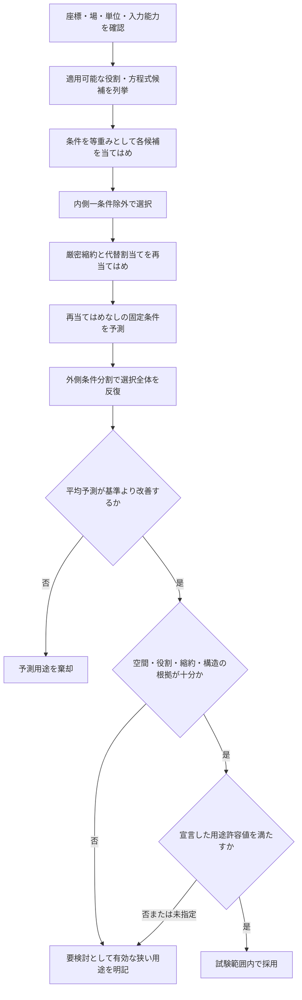

# CVD・ALD膜分布解釈のための反応役割同化

**技術報告書 — 2026年9月7日改訂**

## 要旨

本研究では、匿名化されたFluent化学種場を反応役割へ割り当て、その割当てを実測膜分布で検証する縮約モデリング・モデル選択法を構築した。実装では、定常の観測可能方程式、動的表面状態、参照面から壁面までの輸送、正味膜成長収支を分離している。反応役割候補と方程式の厳密縮約を、条件均衡損失関数の下で当てはめ、一条件除外誤差で選択する。選択後は、再当てはめを行わない固定条件、空間ブロック診断、外側モデル選択分割で評価する。

現在の5条件CVDデータは、整列済みの濃度・成膜速度245点からなる。逐次AIB準定常応答は、固定した条件3に対してRMSE 0.001049 nm s\(^{-1}\)、条件平均比0.729%を与え、学習条件平均を用いる基準から誤差を96.2%減らした。一方、化学応答だけではウェハー分布を再現しない。面内中心化 \(R^2=-0.0148\)、空間相関0.172、予測範囲は観測範囲の34.6%である。独立した平均保存型 \(\rho^2+\rho^4\) 残差応答を加えると、条件3の面内中心化 \(R^2\) は0.845まで上がり、5つの外側ホールドアウトすべてで正となった。方程式系と、予測に影響するA/B割当ては依然不安定である。阻害方向は、与えた範囲では予測への影響が無視できる。現段階では、条件平均の暫定スクリーニングに化学式を残し、空間応答の運用採用には外部ウェハーを要求する。ワークフローは、化学役割、物理的ウェハー補正、絶対フラックス、素反応速度論を確立するために必要な測定と摂動も出力する。

## 1. 問題設定と根拠の段階

Fluentは、生の列名で識別した気相場を与える。膜測定は、対応するウェハー位置で成膜速度または膜厚を与える。推論課題は、低次元の役割写像

\[
\pi:\{s_0,s_1,\ldots\}\rightarrow\{A,B,I,\varnothing\}
\]

と、当てはめに使わない条件 \(q\) へ転移するモデル \(M\)

\[
\hat y_{q,n}=\mathcal H_M
\left(\mathbf C_{q,n},\mathbf z_{q,n},t_q;
\boldsymbol\phi_M,\pi\right)
\]

を求めることである。\(\mathcal H_M\) は、選択した濃度位置、表面応答、必要に応じた状態発展、測定演算子を含む。

主張の水準を四つに分ける。

1. **記述:** 入力場と膜分布が整列し、変動量が定量化されている。
2. **予測:** 固定した候補が、新しい条件を宣言済み基準より正確に予測する。
3. **役割:** 役割を除く、または別の生の化学種を割り当てると、条件間転移が一貫して悪化する。
4. **機構:** 吸着、共吸着、阻害、酸化還元リザーバーに固有の観測量によって物理機構を識別する。

現在のデータが到達するのは条件平均に関する第2水準であり、第3、第4水準には達していない。

## 2. 実装したモデル階層

### 2.1 定常応答方程式系

定常濃度はすべて同定集合の中央値で \(u_j=C_j/C_{j,0}\) と正規化し、\(R\) を非負の成膜速度尺度とする。

| 方程式系 | 実装応答 | 物理的用途 | 主な利点 | 主な根拠上の限界 |
| --- | --- | --- | --- | --- |
| 単一 \(A/AI\) | \(R u_A/[u_A+\lambda(1+\kappa u_I)]\) | 最小の飽和・阻害試験 | 一化学種に関係する応答だけで十分かを試す | 必須共反応物を持たない。\(I\) には独立摂動が必要 |
| 全濃度基準 | \(R(C_{\mathrm{tot}}/C_{\mathrm{tot},0})^n\) | 共通の希釈または圧力尺度に対する補助検査 | 全濃度傾向を化学種役割へ誤帰属することを防ぐ | 役割・機構の解釈を持たない |
| 逐次AIB | \(R u_A b u_B/[u_A+(\delta+b u_B)(1+\kappa u_I)]\) | 吸着 \(A\) を気相 \(B\) が変換し、任意に阻害される | 小さなLangmuir–Rideal型縮約で、無損失・阻害なしを厳密比較できる | 定常ABの向きに対称性があり得る。無次元群は素反応定数ではない |
| 並列A + AB | \(R u_A(c+b u_B)/[u_A+(\delta+c+b u_B)(1+\kappa u_I)]\) | \(B\) なしの成膜に \(B\) 補助経路が加わる | 経路分率を出力する | \(c\) を分けるには \(B=0\) 近傍のデータが必要 |
| Langmuir–Hinshelwood | \(R(a u_A)(b u_B)/(1+a u_A+b u_B+\kappa u_I)^2\) | 両反応物が一サイトプールへ吸着・競争する | 異なる吸着分母と表面状態配分を試す | A/B交換対称。共吸着には独立根拠が必要 |

各式の導出、単位、仮定、極限形、利用場面、利点・欠点、文献は [THEORY.md](THEORY.md) に示す。吸着の基礎はLangmuir、気相・吸着種間反応はEleyとRideal、酸化還元リザーバーはMarsとvan Krevelen、ALD状態記述はPuurunenとGeorgeの総説に基づく。

### 2.2 動的プロセス状態

連続CVD AIBモデルは、吸着 \(A\) 被覆率を積分する。

\[
\frac{d\theta_A}{dt}=
k_{\mathrm{ads}}C_{A,s}\theta_*^m-k_{\mathrm{des}}\theta_A
-\nu_A r_{\mathrm{event}},
\qquad
\frac{dh}{dt}=\alpha_h\Gamma_s r_{\mathrm{event}}.
\]

MvKモデルは、酸化状態率 \(\chi\) を積分する。

\[
\frac{d\chi}{dt}=k_{\mathrm{reg}}C_{B,s}(1-\chi)
-k_{\mathrm{red}}C_{A,s}\chi,
\qquad
\frac{dh}{dt}=\alpha_h\Gamma_s k_{\mathrm{red}}C_{A,s}\chi.
\]

定常反応速度は

\[
r=\frac{k_{\mathrm{red}}C_{A,s}\,k_{\mathrm{reg}}C_{B,s}}
{k_{\mathrm{red}}C_{A,s}+k_{\mathrm{reg}}C_{B,s}}
\]

で、逐次AB無損失応答と観測上同値になる。このため、定常網羅比較でMvKを重複計上しない。リザーバー履歴を試験するには、時間分解した切替えと酸化状態の観測が必要である。

ALDモデルは、貯蔵 \(A\) と阻害種の被覆率を積分する。

\[
\begin{aligned}
\dot\theta_A &= k_{\mathrm{store},A}C_{A,s}\theta_*
-k_{\mathrm{release},A}\theta_A-r_{\mathrm{conv}},\\
\dot\theta_I &= k_{\mathrm{store},I}C_{I,s}\theta_*
-k_{\mathrm{release},I}\theta_I,\\
\theta_* &= 1-\theta_A-\theta_I.
\end{aligned}
\]

\(B\) がなければ変換項は \(k_{\mathrm{convert},A}\theta_A\)、あれば \(k_{\mathrm{convert},AB}C_{B,s}\theta_A\) である。固有名を持つ化学種優先の機構を埋め込まず、ドーズ・パージ・サイクルを通した役割を評価できる。

被覆率速度は、サイト密度を用いてモル表面フラックスへ変換する。

\[
J_{A,s}=\Gamma_s(r_{\mathrm{store},A}-r_{\mathrm{release},A}),
\qquad J_{B,s}=\Gamma_s\nu_Br_{\mathrm{conv}}.
\]

ALD膜閉包は、これらのフラックスを \(k_m(C_{\mathrm{ref}}-C_s)\) と均衡させる。したがって、\(\alpha_h\) は変換被覆率当たりのnm、\(\Gamma_s\) は絶対輸送フラックスに必要なkmol m\(^{-2}\) 尺度を与える。

### 2.3 輸送境界

局所膜関係は

\[
J_j=k_{m,j}(C_{j,\mathrm{ref}}-C_{j,s})
\]

である。実行時には、与えた壁面濃度、当てはめまたは入力したスカラー・場 \(k_m\)、CFD輸送容量フラックスから

\[
k_{m,\mathrm{CFD}}=
\frac{J_{\mathrm{cap}}}{C_{\mathrm{ref}}-C_{\mathrm{boundary}}},
\qquad k_m=\gamma k_{m,\mathrm{CFD}}
\]

で変換した値を選べる。

現在のCSVデータが持つのは参照面濃度だけである。定常当てはめは `bulk_as_surface` を使用し、Fluent結果を独立に検証した壁面濃度や絶対壁面フラックスへ変換していない。完全なStefan流・Maxwell–Stefan連成は未実装である。

## 3. 推定と判定方法

実行する判定経路を次に示す。完全な定義と指標式は [EVALUATION_WORKFLOW.md](EVALUATION_WORKFLOW.md) に記載する。



形状パラメータ \(\boldsymbol\phi\) を固定したとき、振幅を厳密にプロファイル消去する。

\[
R^*(\boldsymbol\phi)=\max\left(0,
\frac{\sum_nw_nf_nv_n}{\sum_nw_nf_n^2}\right).
\]

正の形状パラメータを対数空間で再現可能に探索する。各候補は条件再当てはめ誤差で順位づける。厳密縮約と代替化学種割当ては独立に再当てはめし、ゼロに近い係数で代用しない。

入れ子条件評価により、選択したテスト条件がモデル選択へ影響することを防ぐ。面内中心化指標によって、正しい条件尺度と正しいウェハー分布を分ける。角度群ブートストラップは条件付き係数変動を推定し、外側分割で選択された構造の範囲はモデル選択感度を表す。

予測上の重要性と機構同定を分ける五つの数値表示を用いる。完全な定義は [THEORY.md](THEORY.md) に示す。

| 表示 | 量 | 支持する判断 |
| --- | --- | --- |
| 役割重要度 | \(S_j=[K^{-1}\sum_kN_k^{-1}\sum_{i\in k}(\hat y_i-\hat y_i^{(-j)})^2]^{1/2}\) | 一つの役割入力を同定基準へ置き換えたときの予測変化 |
| 誤差に対する重要度 | \(Q_j=S_j/E_{\mathrm{holdout}}\) | 影響の小さい割当て不安定性と、影響が大きい未解決割当ての区別 |
| 方程式系の予測分離 | \(D_m=[N^{-1}\sum_i(\hat y_{m,i}-\hat y_{\star,i})^2]^{1/2}\) | 機構の曖昧さが試験予測を変えるか |
| 局所パラメータ情報 | \(g_{ij}=\partial\ln\hat y_i/\partial\ln p_j\) と \(g_{\cdot j}\) の相関 | 不活性または連成した当てはめ方向 |
| 部分損失関数断面 | \(\widetilde L_j(p)=\min_{R\ge0}L\{Rf(\mathbf u;p,\hat{\boldsymbol\phi}_{-j})\}\) | 一つの比を変え、速度尺度だけを再プロファイルしたときの平坦性 |

任意の空間応答は、化学選択後に中心化対数残差へ当てはめる。固定した化学予測へ乗算し、その条件平均を保存するよう再尺度化する。これにより、共通の半径基底が化学役割や方程式選択へ入り込むことを防ぐ。

## 4. ソフトウェア実装

コードは、モデルの意味、当てはめ、表示を分離する。

| 構成要素 | 責務 |
| --- | --- |
| `aib_reductions.py` | 純粋な定常方程式、縮約、対称性、必要根拠 |
| `surface_fit.py` | ウェハー全体の重みづけ、正のパラメータ探索、振幅のプロファイル消去、感度設計 |
| `losses.py`、`metrics.py` | 当てはめ残差損失関数と報告指標を別の数値概念として実装 |
| `parameter_space.py`、`samplers.py` | 有効変数のコンパイル、ランダム/TPE/CMA-ESおよびOptunaHub DE/PSO/Lévy/CMA-MAE探索、予算、乱数種、停止、履歴 |
| `surface_optimization_benchmark.py` | 固定テストを選択へ漏らさず、固定方程式上で損失関数とサンプラーを比較 |
| `parameter_fit.py`、`fit_conditions.py` | 候補単位の当てはめ制御と、学習・ホールドアウト一組のシミュレーター・観測変換部 |
| `evidence_requirements.py` | 対象用途の準備状況と、未解決根拠に対する再利用可能な実験要件 |
| `cvd_analysis_io.py` | 形式単位のCSV読込み、座標照合、成果物直列化 |
| `cvd_conditions.py` | 条件ファイルの解釈、整列、品質情報、役割場の組立て |
| `cvd_multicond_analysis.py` | 候補網羅比較、入れ子検証、根拠計算、成果物制御 |
| `class_compare.py` | 順位、役割根拠、安定性、採用・要検討・棄却判定 |
| `aib_ode.py`、`mvk_state.py`、`ald_role_state.py` | 動的プロセス状態と局所表面収支 |
| `transport_provider.py` | 濃度位置と \(k_m\) 出典の意味 |
| `pipeline.py` | Fluent入力、輸送、プロセス、測定、出力を設定から合成 |
| `cvd_multicond_report.py` | 選択を変えず、計算結果から表、ノートブック本文、図を生成 |

登録表により、新しい方程式系は、応答、縮約、対称性、必要入力、根拠条件を提供すれば追加できる。並列した別の最適化枠組みを作る必要はない。CVDとALDは役割根拠層を共有し、それぞれ固有の状態物理を保つ。アーキテクチャと拡張規則は [ARCHITECTURE.md](ARCHITECTURE.md) に示す。

過渡状態モデルでは、非線形探索実装方式を損失関数と独立に選択する。有効次元から有界試行予算を決め、各候補は試行履歴と反復乱数種の最良得点幅を記録する。指定した任意実装方式の依存関係がなければ失敗を返し、ランダム探索へ置き換えない。MSE、Huber、L1は、厳密に名前づけた状態観測損失関数である。定常マップ経路は、通常のnm/s条件交差検証指標を選択に保ちながら、ウェハー正規化MSE、ウェハー正規化MAE、対称正規化MSEも提供する。与えた不確かさから無次元の標準化残差を作り、すべての有効条件で同じ尺度を使う。役割、経路、空間、複雑さに関する経験的罰則項は選択から除いた。これらの量は測定するか、診断量として残す。

## 5. 現在のデータによる結果

### 5.1 予測結果

固定分割では、条件1、2、4、5で学習し、条件3をホールドアウトした。数値上の最良予測候補は

```text
cvd:aib_qss:AIB:full:bulk_as_surface:A=idn_2,I=n2,B=adn_2
```

であった。

| 指標 | 結果 |
| --- | ---: |
| 学習条件交差検証RMSE | 0.000894084 nm s\(^{-1}\) |
| 保守的な角度・半径ブロック交差検証RMSE | 0.00178286 nm s\(^{-1}\) |
| 条件3 RMSE | 0.00104863 nm s\(^{-1}\) |
| 条件3 相対RMSE | 0.729% |
| 条件3 相対平均偏り | +0.300% |
| 学習条件平均を用いる定数基準からの改善 | 96.2% |
| 面内中心化 \(R^2\) | −0.0148 |
| 空間相関 | 0.172 |
| 予測・観測マップ範囲比 | 34.6% |


小さい相対RMSEは、条件尺度が正しく予測されたためである。空間残差には構造が残り、観測範囲の半分未満しか予測していない。条件平均が正確でも、ウェハー分布予測としては否定的な結果である。


条件平均図は、より狭い有効範囲を直接示す。選択応答は、固定した条件3を含め、操作条件ごとの尺度を追従する。しかし上のマップ比較が示すように、この一致は面内分布へは及ばない。

選択後の半径応答により、固定ホールドアウトRMSEは0.00104863から0.000570306 nm s\(^{-1}\) へ、面内中心化 \(R^2\) は−0.0148から0.8452へ変化した。5つの外側分割では、補正後の面内中心化 \(R^2\) が0.695～0.845となり、すべて正であった。


この結果は、5条件の試験試験群内で内部転移する半径残差分布を確立するが、その物理原因は確立しない。基底には温度、多成分輸送、反応器流れ、表面状態場を含まず、5 分割はいずれも同じ座標設計を再利用している。

本報告へ転載していない最適化、反応役割、パラメータ、予測、空間応答の全生成図は [VISUALIZATION_GUIDE.md](VISUALIZATION_GUIDE.md) で説明する。同ガイドは各軸と出典表を定義し、図を独立な機構根拠として扱わずに現在データを解釈する。

### 5.2 モデルと役割の不確かさ

| 方程式系 | 条件交差検証RMSE (nm s\(^{-1}\)) | 相対差 | 外側選択頻度 |
| --- | ---: | ---: | ---: |
| 逐次AIB | 0.000894084 | 0% | 60% |
| 並列A + AB | 0.000903338 | 1.04% | 0% |
| Langmuir–Hinshelwood | 0.000925961 | 3.57% | 40% |


外側分割では逐次AIBとLangmuir–Hinshelwoodの両方が選ばれ、逐次系内でも縮約と役割割当てが変化した。構造予測包絡の平均幅は0.000429302 nm s\(^{-1}\)、条件3平均の0.298%である。選択方程式構造は、妥当な同定集合の変更に対して安定していない。

| 方程式系 | ホールドアウトRMSE (nm s\(^{-1}\)) | 選択モデルとの差のRMS (nm s\(^{-1}\)) | 差 / 選択モデルRMSE |
| --- | ---: | ---: | ---: |
| 逐次AIB | 0.00104863 | 0 | 0 |
| 並列A + AB | 0.00184890 | 0.00115630 | 1.103 |
| Langmuir–Hinshelwood | 0.000958571 | 0.000434995 | 0.415 |


Langmuir–Hinshelwood解釈に変えると、条件3予測は選択モデルRMSEの半分未満だけ変化する。並列解釈では、一RMSEをわずかに超えて変化する。したがって、一部の機構曖昧さはこのホールドアウト予測へほぼ影響しないが、別の残存方程式系は実質的に異なる。ここから機構確率は導けない。

阻害項を除くと交差検証RMSEは0.000894084から0.000900285 nm s\(^{-1}\) へ約0.69%変化し、分割ごとの効果は `mixed` であった。\(I\) への `n2` 割当ては支持されない。有限損失群を除くとRMSEは約20.6倍悪化する。この方程式系の中では有効な非生産損失項が必要だが、物理的な脱離とは同定できない。

`idn_2` と `n2` の全点相関は0.980で、強い独立条件摂動を受けるのは `adn_2` だけである。条件3は、全濃度、`idn_2`、`n2` の全点で学習範囲外にある。正確な平均転移は、一回の範囲外成功であり、一般的な外挿検証ではない。


| 選択役割 | 生の化学種 | 外側選択頻度 | 予測変化RMS (nm s\(^{-1}\)) | 変化 / ホールドアウトRMSE | 判定 |
| --- | --- | ---: | ---: | ---: | --- |
| A | `idn_2` | 40% | 0.0087144 | 8.31 | 影響が大きいが未解決 |
| B | `adn_2` | 40% | 0.0526467 | 50.2 | 影響が大きいが未解決 |
| I | `n2` | 40% | 0.0000044616 | 0.00425 | 不安定だが観測範囲では予測上無視できる |


この組合せ表示により、二つの誤った判断を避けられる。A/Bの割当て不安定性は、予測変化がホールドアウト誤差よりはるかに大きいため軽視できない。阻害種表記を機構として採用することはできないが、その不安定性は現在の当てはめ速度範囲にはほぼ影響しない。

選択式の対数速度RMS感度は、有限損失比0.5669、B変換比0.9529、阻害比0.0003008であった。有限損失感度と阻害感度の相関は−0.912である。ほぼ不活性な阻害方向と平坦な部分損失関数断面は、阻害なし厳密縮約の結果と一致する。


## 6. 解釈、限界、想定用途

次の結論は支持される。

- 濃度依存の縮約表面応答は、定数速度基準より条件平均を大幅によく転移する。
- 選択した逐次系は、有限な有効損失群を必要とする。
- 現在のワークフローは、平均予測とウェハー分布予測が異なる結論を与えることを検出できる。
- 平均を保存する独立な半径残差応答は、化学選択を変えずに、与えた5つの外側分割内で転移する。

次の結論は支持されない。

- `idn_2`、`adn_2`、`n2` に一意な化学的役割が同定された。
- Langmuir–Rideal、Langmuir–Hinshelwood、Mars–van Krevelenのいずれかが真の機構である。
- 当てはめた無次元群が、吸着、脱離、反応の素反応定数である。
- モデルが絶対反応壁面フラックスを与える。
- 半径残差が特定の温度、輸送、表面機構に起因する、または外部反応器試験群へ転移する。

実務上の状態は `review` である。化学関係式は、同じ物理領域における条件平均成膜速度の順位づけや予備スクリーニングに利用できる。半径応答は、与えた試験群内で有望な予測補正であるが、運用採用には宣言した空間許容値と新しい固定ウェハーが必要である。物理的原因の帰属、表面フラックス利用、化学判断には追加観測が必要となる。

## 7. 各用途を確立するための測定

実行評価は、用途を支持できないという表記だけで終了しない。`data_requirements.csv` に必要な測定を一行ずつ出力する。どのデータ集合にも適用する一般基準は次のとおりである。

| 対象用途 | 測定と設計した変動 | 利用前に必要な根拠 |
| --- | --- | --- |
| ウェハー面内分布補正 | 座標を整合した新規ウェハー試験群と反復不確かさ。物理原因を求める場合は、同位置の温度、壁面・壁面近傍化学種場または輸送場 | すべての外部ホールドアウトで正の面内中心化予測と宣言許容値、十分に無構造な残差。補正機構の命名には原因場が必要 |
| 匿名化学種の役割割当て | A/B/I候補を独立に変え、停止・低水準と低被覆率から飽和までを含む条件。可能なら表面状態または出口化学種観測 | フルランクの条件変動、厳密縮約に対する一貫した効果必要性、独立条件再当てはめにおける安定割当て |
| 素反応パラメータ | 時間分解した取込み・膜厚・状態観測、複数の較正温度、サイト密度、絶対壁面濃度または反応壁面フラックス、反復不確かさ | 絶対表面収支、分離した感度方向、有限不確かさ区間、Arrhenius整合、外部動的予測 |


次の実験は、ほぼ同じ組成でウェハー点数を増やすより、残存モデル間の予測差を最大化するよう設計する。

1. 全濃度と `adn_2` を制御しながら、`idn_2` と `n2` を独立に変える。
2. 逐次・並列経路を分けるため、低 \(B\) と \(B=0\) 条件を加える。
3. \(A\)、\(B\) の両方について低被覆率から飽和域まで横断する。
4. 無視できる阻害から強い抑制までを含む阻害種掃引を加える。
5. 座標単位、温度、圧力、境界条件、符号、単位を明記した壁面濃度またはCFD輸送容量フラックスを与える。
6. 反復成膜マップと、点単位またはマップ単位の測定不確かさを加える。
7. A/Bのステップ・パルス系列と、可能なら表面・格子酸化状態測定でMvKを試験する。
8. 役割と方程式系を選び終えるまで、新しい一条件を固定して保持する。

コードとデータの責務を分ける。コードは、適用可能な全方程式系を公平に当てはめ、厳密縮約を保ち、輸送の意味を明示し、テストデータを選択から隔離する。実験は、役割を独立に励起し、意図する物理主張に必要な量を測定し、許容可能なプロセス誤差を定義する。

## 8. 再現性

現在の解析は次のコマンドで再現できる。

```powershell
uv run python scripts/analyze_cvd_multicond_case.py `
  --data-dir data `
  --train-cases 1 2 4 5 `
  --test-case 3 `
  --response-model surface_compare `
  --reaction-input bulk_concentration `
  --models all `
  --loss mse `
  --sampler pattern `
  --bootstrap-samples 100 `
  --spatial-response radial_quartic `
  --seed 123 `
  --output results/current_cvd_separated
```

生成ディレクトリには、入力ハッシュ、59候補すべて、分割単位の得点、係数百分位点、予測行、構造感度、図、成果物成果物目録を含む。`data_requirements.csv` は、三つの用途に対する機械可読な実験計画である。結果の詳細監査は [CURRENT_DATA_EVALUATION.md](CURRENT_DATA_EVALUATION.md) に記録する。入力の意味と既知の限界は [inputs_fluent.md](inputs_fluent.md)、[transport_km.md](transport_km.md)、[GAPS.md](GAPS.md) に、図の作成法と解釈は [VISUALIZATION_GUIDE.md](VISUALIZATION_GUIDE.md) に記録する。

## 9. 参考文献の基礎

方程式ごとの完全な文献一覧は [THEORY.md](THEORY.md) に記載する。中心となる文献は次のとおりである。

1. I. Langmuir, “The Adsorption of Gases on Plane Surfaces of Glass, Mica and Platinum,” *J. Am. Chem. Soc.* **40** (1918) 1361–1403. [doi:10.1021/ja02242a004](https://doi.org/10.1021/ja02242a004).
2. D. D. Eley and E. K. Rideal, “The Catalysis of the Parahydrogen Conversion by Tungsten,” *Proc. R. Soc. A* **178** (1941) 429–451. [doi:10.1098/rspa.1941.0066](https://doi.org/10.1098/rspa.1941.0066).
3. P. Mars and D. W. van Krevelen, “Oxidations Carried Out by Means of Vanadium Oxide Catalysts,” *Chem. Eng. Sci.*, Special Supplement **3** (1954) 41–59. [doi:10.1016/S0009-2509(54)80005-4](https://doi.org/10.1016/S0009-2509(54)80005-4).
4. R. L. Puurunen, “Surface Chemistry of Atomic Layer Deposition: A Case Study for the Trimethylaluminum/Water Process,” *J. Appl. Phys.* **97** (2005) 121301. [doi:10.1063/1.1940727](https://doi.org/10.1063/1.1940727).
5. S. M. George, “Atomic Layer Deposition: An Overview,” *Chem. Rev.* **110** (2010) 111–131. [doi:10.1021/cr900056b](https://doi.org/10.1021/cr900056b).
6. A. Raue et al., “Structural and Practical Identifiability Analysis of Partially Observed Dynamical Models by Exploiting the Profile Likelihood,” *Bioinformatics* **25** (2009) 1923–1929. [doi:10.1093/bioinformatics/btp358](https://doi.org/10.1093/bioinformatics/btp358).
7. M. C. Kennedy and A. O'Hagan, “Bayesian Calibration of Computer Models,” *J. R. Stat. Soc. B* **63** (2001) 425–464. [doi:10.1111/1467-9868.00294](https://doi.org/10.1111/1467-9868.00294).
8. R. Krishna and J. A. Wesselingh, “The Maxwell-Stefan Approach to Mass Transfer,” *Chem. Eng. Sci.* **52** (1997) 861–911. [doi:10.1016/S0009-2509(96)00458-7](https://doi.org/10.1016/S0009-2509(96)00458-7).
9. S. Varma and R. Simon, “Bias in Error Estimation When Using Cross-Validation for Model Selection,” *BMC Bioinformatics* **7** (2006) 91. [doi:10.1186/1471-2105-7-91](https://doi.org/10.1186/1471-2105-7-91).
10. G. Franceschini and S. Macchietto, “Model-Based Design of Experiments for Parameter Precision: State of the Art,” *Chem. Eng. Sci.* **63** (2008) 4846–4872. [doi:10.1016/j.ces.2007.11.034](https://doi.org/10.1016/j.ces.2007.11.034).
