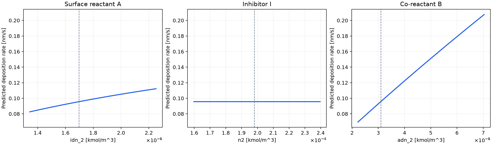
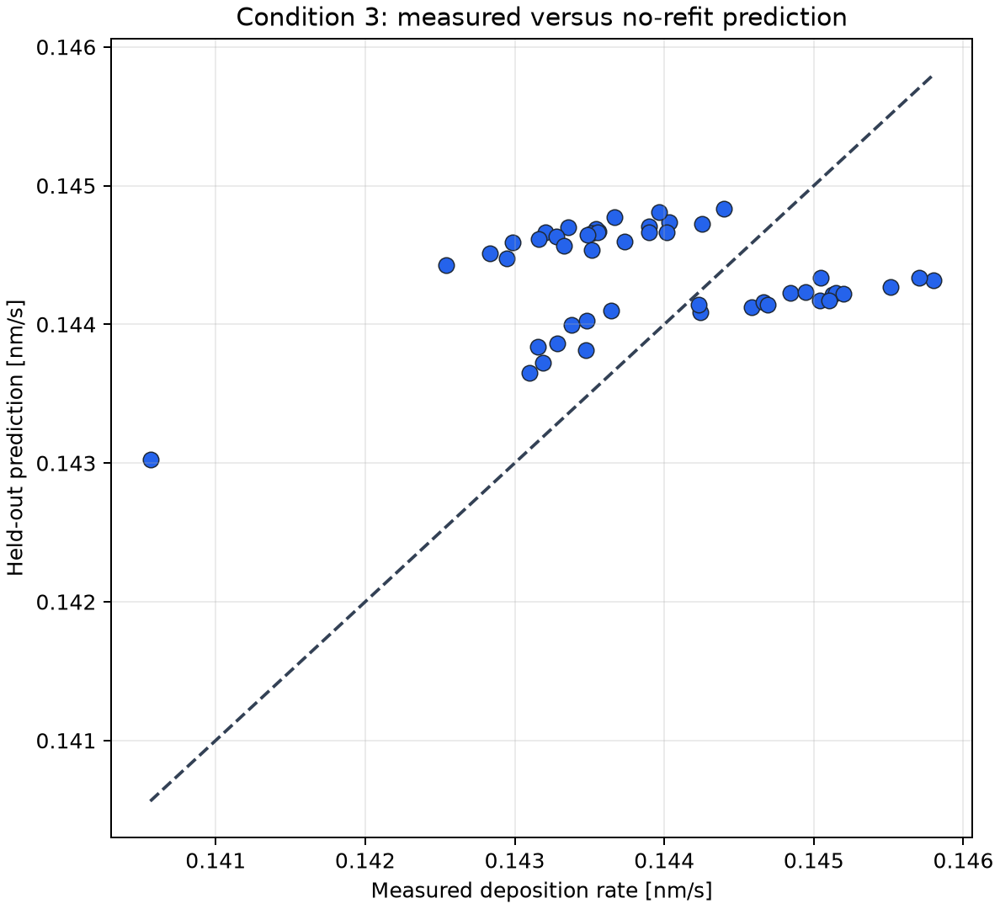

# Visualization guide for steady CVD role analysis

This guide defines how to read every scientific figure produced by the steady
multi-condition CVD workflow. The figures shown here are the unedited outputs of the
five-condition reference run documented in
[CURRENT_DATA_EVALUATION.md](CURRENT_DATA_EVALUATION.md). They illustrate the reading
method; conclusions for another dataset must be derived from that run's CSV files and
provenance rather than copied from this example.

The current example uses reference-plane Fluent concentrations as proxies for local
surface inputs, with conditions 1, 2, 4, and 5 for identification and condition 3 as a
fixed no-refit evaluation condition. The selected numerical candidate is the sequential
A + B equation with `idn_2` assigned to A, `adn_2` to B, and `n2` to I. These are
anonymous statistical roles, not established chemical identities.

## Quantities and reading order

For condition \(q\) and wafer position \(n\), \(v_{qn}\) is measured deposition rate,
\(\hat v^{\mathrm{chem}}_{qn}\) is the frozen chemical-model prediction, and
\(\hat v^{\mathrm{corr}}_{qn}\) includes the optional post-selection spatial response.
The signed residual used in the maps is

\[
e_{qn}=\hat v_{qn}-v_{qn}.
\]

Coordinates are divided by the wafer radius \(R\): \(x/R\), \(y/R\), and
\(\rho=r/R=\sqrt{x^2+y^2}/R\). A centered map subtracts its own condition mean. It
therefore tests within-wafer shape while excluding the condition mean:

\[
v'_{qn}=v_{qn}-\bar v_q,
\qquad
R^2_{\mathrm{centered}}
=1-\frac{\sum_n(\hat v'_{qn}-v'_{qn})^2}
{\sum_n(v'_{qn})^2}.
\]

A negative centered \(R^2\) means that predicting a uniform wafer at the measured mean
would describe the measured pattern better than the evaluated model. It does not imply
that the condition mean or absolute rate is predicted poorly.

Read the figures in the following order. This prevents a visually attractive wafer map
from being used to support a chemical claim that the input contrasts or model-selection
evidence do not resolve.

| Evidence stage | Figures | Decision supported |
| --- | --- | --- |
| Input contrast | `condition_reaction_input_contrast`, `reaction_input_correlation` | Whether the supplied conditions vary candidate inputs independently enough to separate roles |
| Numerical search | `optimization_convergence`, `parameter_loss_slices` | Whether the reported solution is numerically plausible and which fitted directions are locally weak |
| Equation selection | `training_candidate_ranking`, `equation_family_comparison` | Which candidate transfers best across identification conditions and whether that choice is stable |
| Reaction interpretation | `best_model_role_assignments`, `reaction_pathway_models`, `reaction_model_prediction_agreement`, `role_selection_stability`, `role_input_sensitivity`, `role_importance_and_stability`, `role_response_curves`, `reaction_state_summary`, `selected_surface_state_maps`, `kinetic_parameter_sensitivity` | Which observable roles and effects matter, and which mechanisms or parameters remain indistinguishable |
| Prediction | `condition_mean_transfer`, `test_measured_vs_predicted`, `test_spatial_maps`, `test_radial_profile`, `model_structure_prediction_spread` | Transfer of absolute rate, wafer pattern, and the consequence of model-selection ambiguity |
| Spatial residual response | `test_spatial_response`, `spatial_residuals`, `spatial_correction_profile`, `spatial_correction_performance` | Whether a separately fitted, mean-preserving residual shape transfers across conditions |

## Input contrast

### Condition reaction-input contrast

This heat map compares the condition mean of every available reaction input with its
geometric mean over all conditions. For input \(X_j\), the plotted value is

\[
c_{qj}=\log_{10}\!\left(
\frac{\overline{X}_{qj}}
{\exp\langle\ln\overline{X}_{qj}\rangle_q}
\right).
\]

| Element | Meaning |
| --- | --- |
| Horizontal axis | Raw Fluent species available for role assignment |
| Vertical axis | Process condition identifier; it is categorical, not a continuous operating variable |
| Colour | Base-10 logarithm of the condition mean divided by the across-condition geometric mean; red is above and blue is below the reference |
| Zero colour | The condition mean equals the geometric mean |

A colour value of +0.30 corresponds to approximately twice the geometric mean, and
−0.30 to approximately half. Rows with similar colours for two species indicate that
the experiment changes those inputs together. Distinct column patterns are needed to
separate their reaction roles.

In the example, `adn_2` has a distinct high value in condition 5 and a low value in
condition 4. The `idn_2` and `n2` columns move almost together, especially between
conditions 2 and 3. This provides useful contrast for `adn_2`, but weak contrast for
deciding whether an observed effect belongs to `idn_2` or `n2`. The plot shows
experimental contrast; it cannot establish reaction direction or causality because an
unplotted operating variable may drive both concentration and growth.

Source: `condition_means.csv`; detailed field ranges are in `condition_quality.csv`.

### Correlation of condition-mean reaction inputs

This matrix quantifies whether condition means change independently. Each cell is the
Pearson correlation between the condition-mean inputs of the row and column species.

| Element | Meaning |
| --- | --- |
| Horizontal and vertical axes | Raw Fluent species |
| Cell value and colour | Pearson correlation across process conditions, from −1 to +1 |
| Diagonal | Self-correlation and therefore one, when the input varies |

Values close to +1 or −1 indicate that two roles will be difficult to distinguish from
condition means alone. A value near zero is useful only when the individual species
also spans a meaningful range; low correlation does not compensate for a nearly
constant input.

For the five example conditions, the correlation between `idn_2` and `n2` is 0.99996,
whereas `adn_2` correlates with them at about 0.30. The selected A and I assignments
therefore lie on an almost collinear input pair. This directly explains why the
inhibitor identity is unstable and why an independent inhibitor perturbation is
required. The estimate itself is based on only five condition means and should be read
as a design diagnostic, not as a population correlation.

Source: `condition_mean_input_correlations.csv`.

## Numerical search and candidate selection

### Optimization convergence

Each curve records the best fitting error found so far for the best candidate within an
equation family. Because the value is best-so-far, it can only decrease or remain
constant.

| Element | Meaning |
| --- | --- |
| Horizontal axis | Cumulative objective evaluations for that candidate search |
| Vertical axis | Best training RMSE in nm/s for the current MSE run; logarithmic scale |
| Colour | Reaction-equation family |

The useful question is whether substantial improvements continue at the final budget.
A long terminal plateau supports numerical convergence at the resolution of the chosen
sampler. Agreement of terminal errors across repeat seeds is still required when the
sampler is stochastic.

Here the sequential, parallel, and Langmuir–Hinshelwood curves finish near
8.86–8.94 × 10⁻⁴ nm/s after their major decreases have stopped. This supports the
adequacy of the deterministic search for the reported minima. It does not show that
parameters are unique: a flat best-so-far trace can coexist with a broad parameter
valley, which must be checked with sensitivity and Loss-slice figures.

Source: `optimization_history.csv`.

### Training-condition candidate ranking

This plot shows the eight candidates with the lowest leave-one-identification-condition-
out error. Every candidate has a fixed equation family, exact reduction, and raw-species
assignment.

| Element | Meaning |
| --- | --- |
| Horizontal axis | Leave-one-condition-out RMSE in deposition-rate units [nm/s]; smaller is better |
| Vertical axis | Candidate equation, reduction, and assigned species |
| Blue bar | Candidate selected by the predefined ranking rule |
| Grey bar | Other near-leading candidates |

The bar spacing matters more than the rank number. Nearly equal bars indicate that the
available conditions do not strongly separate those candidates. In the example, the
winner has 8.9408 × 10⁻⁴ nm/s, while the swapped sequential assignment has
9.0025 × 10⁻⁴ nm/s and the no-inhibitor sequential candidate has
9.0029 × 10⁻⁴ nm/s. These differences are below one percent of the winning score.
Consequently, the ranking identifies a numerical winner but provides weak evidence for
the A/B direction and the inhibitor term.

This is the primary candidate-selection plot. The fixed test condition is absent from
its score and must remain absent from model selection.

Source: `role_ranking.csv`.

### Equation-family comparison

The left panel compares the best condition-CV score in each equation family. The right
panel repeats the complete selection procedure while leaving out each condition in
turn, then counts the selected family.

| Panel | Horizontal axis | Vertical axis |
| --- | --- | --- |
| Prediction error | Leave-one-condition-out RMSE [nm/s]; smaller is better | Reaction-equation family |
| Outer condition refits | Fraction of outer refits selecting that family, between 0 and 1 | Reaction-equation family |

The sequential family is the numerical winner at 8.9408 × 10⁻⁴ nm/s, followed by the
parallel family at 9.0334 × 10⁻⁴ nm/s and Langmuir–Hinshelwood at
9.2596 × 10⁻⁴ nm/s. Across five outer refits, sequential is selected 60%,
Langmuir–Hinshelwood 40%, and parallel 0%. The small error gaps and 60/40 selection split
show that the current data support a transferable nonlinear response but do not select
one microscopic reaction family robustly.

The right panel is a stability frequency, not a posterior model probability. It also
cannot compensate for omitted equation families or insufficient experimental contrast.

Source: `analysis_summary.json` and `split_sensitivity.csv`.

## Reaction roles and mechanism discrimination

### Best species assignment in each reaction model

This matrix states the lowest condition-CV raw-species assignment within each equation
family.

| Element | Meaning |
| --- | --- |
| Horizontal axis | Model role: surface reactant A, inhibitor I, or co-reactant B |
| Vertical axis | Reaction-equation family |
| Cell text | Raw Fluent species assigned to that role; an em dash means the role is absent |
| Cell colour | Repeated visual code for the raw species; colour has no quantitative scale |

The sequential winner assigns A=`idn_2`, I=`n2`, and B=`adn_2`; the parallel and
Langmuir–Hinshelwood winners assign A=`adn_2` and B=`idn_2`, with no inhibitor. The
change of A/B direction across families is evidence that the assignment depends on the
assumed equation. Chemical naming should therefore wait for independent perturbations
or surface measurements.

Source: `best_model_role_assignments.csv`.

### Reaction steps represented by each fitted equation

This is a compact equation diagram rather than a measured reaction-network graph. It
shows which state and rate terms occur in each fitted observable equation.

| Element | Meaning |
| --- | --- |
| Panels | Sequential A + B, parallel A and A + B, and Langmuir–Hinshelwood families |
| Boxes | Model states or site pools; numbers are fitted mean fractions where available |
| Arrows | Terms in the candidate equation |
| Arrow labels | Anonymous raw-species assignment or model-conditional pathway fraction |

The sequential panel represents adsorption of A, desorption, optional blocking by I,
and B-assisted conversion. The parallel panel adds an A-only route beside the A+B
route. The Langmuir–Hinshelwood panel represents A and B coadsorption on a shared site
pool followed by adsorbate reaction.

The diagram is useful for verifying that the compared equations answer different
physical questions. An arrow does not establish an elementary reaction, an
intermediate, stoichiometry, or direction. Those claims require independent transient,
spectroscopic, isotopic, or product evidence.

Source: `best_model_role_assignments.csv` and `reaction_model_states.csv`.

### Held-out predictions from alternative reaction models

This plot separates agreement with measurement from agreement between models.

| Element | Meaning |
| --- | --- |
| Horizontal axis | Rate difference [nm/s] |
| Vertical axis | Reaction-equation family |
| Blue bar | RMSE between that family's frozen prediction and the fixed held-out measurement |
| Orange bar | RMS difference between that prediction and the selected sequential model |

Langmuir–Hinshelwood has a held-out RMSE of 9.59 × 10⁻⁴ nm/s and differs from the
selected prediction by 4.35 × 10⁻⁴ nm/s, 0.415 times the selected model's held-out
RMSE. The parallel family has an RMSE of 1.85 × 10⁻³ nm/s and differs from the selected
prediction by 1.16 × 10⁻³ nm/s, 1.10 times that RMSE. The first comparison indicates
practical prediction agreement despite different state interpretations; the second
shows a more consequential model choice.

A lower blue bar for an alternative on the fixed audit condition does not permit
post-hoc reselection. Orange bars quantify prediction consequence and are not
probabilities that a mechanism is correct.

Source: `reaction_model_predictions.csv`.

### Species assignment across held-out conditions

The complete family-and-role selection is repeated with each condition held out. This
matrix counts which species occupies each reaction role in those outer refits.

| Element | Meaning |
| --- | --- |
| Horizontal axis | Assigned raw species, including `none` when a role is absent |
| Vertical axis | Reaction role |
| Cell colour and text | Fraction of outer condition refits with that assignment |

In the example, A is `adn_2` in 60% and `idn_2` in 40% of refits; B shows the reverse.
The inhibitor is absent in 60% and assigned to `n2` in 40%. No selected role reaches a
high stability fraction. This confirms that A/B direction and inhibitor inclusion are
condition-dependent under the current design.

The frequency combines changes in family and assignment. It should be read with the
importance plot: an unstable role may be harmless for prediction or may be an
influential unresolved ambiguity.

Source: `split_sensitivity.csv` and `role_stability.csv`.

### Sensitivity to observed reaction-input variation

For each selected role, the workflow compares the prediction at every supplied local
input vector with a counterfactual in which only that species is replaced by its fitted
reference value. The other species retain their observed local values. The bar is the
condition-balanced RMS of that prediction difference.

| Element | Meaning |
| --- | --- |
| Horizontal axis | RMS change in predicted deposition rate [nm/s] |
| Vertical axis | Selected model role and assigned raw species |
| Bar length | Magnitude of the model-conditional prediction change when that input alone is reset to its reference |

The selected model gives 5.26 × 10⁻² nm/s for B=`adn_2`, 8.71 × 10⁻³ nm/s for
A=`idn_2`, and 4.46 × 10⁻⁶ nm/s for I=`n2`. Thus B and A have substantial predictive
effects over the supplied range, while the fitted inhibitor is effectively inactive.

The bars are not additive reaction contributions and need not sum to the predicted
rate. They also mix fitted nonlinearity with the amount of observed input variation;
a small bar may reflect either weak kinetics or insufficient perturbation.

Source: `role_input_sensitivity.csv`.

### Prediction importance and assignment stability

This plot combines how often a selected assignment survives condition changes with the
consequence of varying that input.

| Element | Meaning |
| --- | --- |
| Horizontal axis | Selection frequency across outer held-out-condition refits |
| Vertical axis | RMS prediction change divided by the selected model's held-out RMSE; logarithmic scale |
| Dashed horizontal line | Prediction change equal to held-out RMSE |
| Point label | Selected role and raw species |

Points above one are influential at a scale larger than the observed holdout error.
Points below one have less predictive consequence over the tested range. Stable and
influential roles would appear toward the upper right; influential but unstable roles
appear in the upper left.

All three selected assignments have frequency 0.40 in this example. A=`idn_2` and
B=`adn_2` have ratios 8.31 and 50.2, respectively: they matter for prediction but their
assignment is unresolved. I=`n2` has a ratio of 0.00425: its instability is harmless
for the present prediction range and it should not be given a chemical interpretation.
This distinction answers whether ambiguity is inconsequential or scientifically
important.

Source: `role_importance_and_stability.csv`.

### Role response curves

Each panel varies one selected raw-species input through its observed range with all
other inputs held at their reference values.

| Element | Meaning |
| --- | --- |
| Horizontal axis | Selected species concentration [kmol/m³] in the current run; a flux run would use kmol/(m² s) |
| Vertical axis | Predicted deposition rate [nm/s] |
| Panel | Model role being perturbed |
| Dashed vertical line | Reference input at which the other one-at-a-time comparisons are anchored |

Across the example range, the A curve rises from 0.0826 to 0.112 nm/s, the B curve from
0.0695 to 0.208 nm/s, and the I curve changes by only about 1.2 × 10⁻⁵ nm/s. The curve
shape makes saturation, inhibition, or near-linearity visible without assigning a
chemical name to a raw species.

These are conditional model response curves rather than partial dependence estimated
from independent data. They should not be extended beyond the plotted range, and the
effect of changing multiple correlated species simultaneously cannot be obtained by
adding the curves.

Source: `role_response_curves.csv`.

### Mean surface-state and reaction-path fractions

This figure summarizes the internal states of the selected equation over the fixed
held-out wafer.

| Element | Meaning |
| --- | --- |
| Horizontal axis | Dimensionless fraction from 0 to 1 |
| Vertical axis | Site-pool component or reaction path represented by the selected equation |
| Point | Mean over wafer positions |
| Horizontal error bar | Minimum-to-maximum range over wafer positions; it is not a confidence interval |

The sequential example gives mean fractions 0.557 vacant sites, 0.443 adsorbed A, and
3.46 × 10⁻⁴ sites blocked by I. Its only represented production path is A+B, so that
path fraction is exactly one by construction. The nearly zero blocked-site fraction is
consistent with the negligible inhibitor sensitivity.

The fractions are computed states conditional on the selected equation and fitted
parameters. They are not surface-coverage measurements and cannot validate the assumed
adsorbate or site balance by themselves.

Source: `reaction_state_summary.csv` and `reaction_model_states.csv`.

### Selected-equation surface-state maps

These maps show where the selected equation places its internal state variations on the
held-out wafer.

| Element | Meaning |
| --- | --- |
| Horizontal and vertical axes | Normalized wafer coordinates \(x/R\) and \(y/R\) |
| First colour scale | Adsorbed-state fraction \(\theta_A\), fixed to 0–1 |
| Second colour scale | Blocked-site fraction \(\theta_I\), fixed to 0–1 |
| Third colour scale | Dimensionless equation response before multiplication by the fitted rate scale |

For condition 3, \(\theta_A\) ranges from 0.435 to 0.464, \(\theta_I\) from
3.33 × 10⁻⁴ to 3.51 × 10⁻⁴, and the normalized response from 0.0566 to 0.0573.
The small blocked fraction and narrow normalized-response range show why the chemical
model predicts only a compressed wafer variation.

The spatial pattern is inherited from the selected Fluent input fields through the
equation. It is not direct evidence of adsorbate coverage. Comparison with spectroscopy
or another state-sensitive measurement is required before treating these maps as
physical surface states.

Source: `test_predictions.csv`.

### Local kinetic-parameter sensitivity

The left panel reports the RMS magnitude of each local logarithmic rate derivative,

\[
G_j=\sqrt{\frac{1}{N}\sum_i
\left(\frac{\partial\ln\hat v_i}{\partial\ln p_j}\right)^2}.
\]

The right panel correlates the derivative vectors across wafer points.

| Panel | Horizontal axis | Vertical axis or rows | Colour |
| --- | --- | --- | --- |
| Local sensitivity | RMS \(|\partial\ln(rate)/\partial\ln(parameter)|\) | Fitted dimensionless parameter | Bar length |
| Sensitivity correlation | Parameter | Parameter | Pearson correlation of centered local sensitivity vectors, −1 to +1 |

The conversion ratio is most active in the example (0.953), followed by the desorption
ratio (0.567); the inhibition ratio is nearly inactive (3.01 × 10⁻⁴). The desorption
and inhibition sensitivity patterns are strongly anticorrelated (−0.912), indicating a
weakly separable local direction even though their magnitudes differ greatly.

This is a local derivative diagnosis around one fitted solution. It does not give global
parameter uniqueness, confidence intervals, or elementary rate constants. The fitted
parameters are normalized observable groups under the current concentration proxy.

Source: `parameter_sensitivity_correlations.csv`.

### Loss when one kinetic parameter is varied

One shape parameter is multiplied by a factor while the other shape parameters remain
fixed and the separable nonnegative rate scale is reprofiled.

| Element | Meaning |
| --- | --- |
| Horizontal axis | Parameter value divided by its fitted value, from 10⁻³ to 10³; logarithmic scale |
| Vertical axis | Training RMSE [nm/s] after reprofiling the rate scale; logarithmic scale |
| Dashed vertical line | Fitted value, ratio one |
| Curve | Parameter named in the legend |

The conversion-ratio curve rises strongly away from the fit, the desorption-ratio curve
has a broader valley, and the inhibition-ratio curve remains nearly flat over much of
the range. Across the plotted factors, the minimum is about 8.86 × 10⁻⁴ nm/s; the
inhibition slice reaches only 1.60 × 10⁻³ nm/s at its largest deviation, whereas the
conversion slice reaches 4.91 × 10⁻² nm/s. This supports the conclusion that inhibitor
strength is weakly determined by these observations.

The figure is a partial Loss slice, not a profile likelihood: the other shape parameters
are not reoptimized and no measurement-noise distribution is assumed.

Source: `parameter_loss_slices.csv`.

## Predictive performance

### Condition-mean transfer

This figure tests transfer of the operating-condition rate scale. Each condition has a
measured and predicted mean at the same total reaction-input mean.

| Element | Meaning |
| --- | --- |
| Horizontal axis | Mean total reaction input; concentration [kmol/m³] in the current run |
| Vertical axis | Mean deposition rate [nm/s] |
| Circle | Measured condition mean |
| Cross | Frozen model prediction mean |
| Vertical segment | Signed mean prediction error for that condition |
| Blue/orange | Identification/fixed held-out condition |

For the fixed condition 3, the measured and predicted means are 0.143915 and
0.144346 nm/s, a +4.31 × 10⁻⁴ nm/s bias. Conditions 1, 4, and 5 have almost the same
total concentration but markedly different rates, showing why a total-concentration
baseline alone cannot represent the data and why composition-sensitive equations are
needed.

This plot tests condition means, not wafer shape. Close circle/cross agreement can occur
while centered \(R^2\) is negative, as it does here.

Source: `condition_means.csv`.

### Measured versus no-refit prediction

Every point is one wafer location in the fixed held-out condition. The model and
parameters were frozen before these predictions were made.

| Element | Meaning |
| --- | --- |
| Horizontal axis | Measured deposition rate [nm/s] |
| Vertical axis | Held-out chemical-model prediction [nm/s] |
| Dashed line | Identity, \(\hat v=v\) |
| Distance from line | Signed prediction error at one wafer location |

Measured rates span 0.14056–0.14580 nm/s, while predictions span only
0.14302–0.14483 nm/s. The compressed vertical spread and nearly horizontal bands show
that the condition mean is reproduced more accurately than the wafer variation. This is
consistent with the fixed-holdout RMSE of 1.05 × 10⁻³ nm/s, range-capture fraction
0.346, and centered \(R^2=-0.0148\).

The plot reveals calibration, bias, and range compression. It does not show where an
error lies on the wafer; the spatial map is needed for that judgment.

Source: `test_predictions.csv` and `analysis_summary.json`.

### Measured, predicted, and residual wafer maps

The first two panels use one common deposition-rate colour scale. The residual panel
uses a diverging scale symmetric about zero.

| Panel | Colour quantity | Interpretation |
| --- | --- | --- |
| Measured rate | \(v\) [nm/s] | Observed wafer distribution |
| Held-out prediction | \(\hat v^{\mathrm{chem}}\) [nm/s] | Distribution generated from local Fluent inputs and the frozen chemical equation |
| Residual | \(\hat v^{\mathrm{chem}}-v\) [nm/s] | Red is overprediction; blue is underprediction |

All panels use \(x/R\) and \(y/R\) as axes and equal aspect ratio. The shared scale
prevents a narrow prediction range from appearing as strong as the measured variation.

In condition 3, the chemical prediction misses the low center and the stronger
mid-radius measured band. The residual alternates systematically with radius instead of
forming spatially unstructured noise. This pattern motivates a separate radial residual
test, but it does not identify temperature, diffusion, or another physical cause.

Source: `test_predictions.csv`.

### Radial mean profile

Wafer points are grouped into radial shells to expose the radial component of the
pattern.

| Element | Meaning |
| --- | --- |
| Horizontal axis | Normalized radius \(r/R\), from center 0 to edge 1 |
| Vertical axis | Shell-mean deposition rate [nm/s] |
| Filled circles | Measured shell means |
| Open squares | Chemical-model shell means |
| Error bars | Standard deviation of wafer points inside each shell; not measurement uncertainty or a confidence interval |

The measured example rises from 0.14056 nm/s at the center to 0.14499 nm/s near
\(r/R=0.665\), then falls to 0.14353 nm/s at the edge. The chemical prediction is
0.14302, 0.14421, and 0.14465 nm/s at the corresponding shells and therefore misses the
center-to-mid-radius amplitude and the edge decrease. Error bars reveal azimuthal
variation hidden by the shell mean.

This plot is appropriate for a radial discrepancy. A good radial curve does not prove
azimuthal agreement; the two-dimensional residual map remains necessary.

Source: `test_predictions.csv`; radial shells are constructed by the report writer.

### Prediction spread across selected equations

At each held-out wafer position, the workflow collects predictions from the structures
selected in the outer condition refits and plots their maximum minus minimum.

| Element | Meaning |
| --- | --- |
| Horizontal and vertical axes | Normalized wafer coordinates \(x/R\) and \(y/R\) |
| Colour | Prediction envelope width [nm/s] across outer-selected model structures |

The example width ranges from 3.23 × 10⁻⁴ to 7.71 × 10⁻⁴ nm/s, with mean
4.29 × 10⁻⁴ nm/s. Larger values near parts of the interior show where family and role
selection has the greatest predictive consequence. Comparing this scale with the
1.05 × 10⁻³ nm/s held-out RMSE shows that structural choice accounts for a material,
but not complete, part of prediction uncertainty.

The range is a sensitivity envelope over selected discrete structures. It is not a
calibrated posterior interval and excludes unregistered mechanisms, input uncertainty,
measurement noise, and parameter uncertainty within each structure.

Source: `model_structure_uncertainty.csv`.

## Post-selection spatial residual response

The following figures appear only when a spatial response is enabled. The response is
fitted after the chemical model is frozen. For the quartic option,

\[
g_q(\rho)=\gamma_2(\rho^2-\langle\rho^2\rangle_q)
+\gamma_4(\rho^4-\langle\rho^4\rangle_q),
\]

and the positive corrected prediction is renormalized to retain each chemical
condition mean. It cannot alter equation-family or role selection.

### Centered wafer pattern before and after spatial response

Each panel subtracts its own condition mean and uses the same symmetric colour scale.

| Panel | Colour quantity |
| --- | --- |
| Measured | \(v-\bar v\) [nm/s] |
| Chemical model | \(\hat v^{\mathrm{chem}}-\overline{\hat v^{\mathrm{chem}}}\) [nm/s] |
| Chemical + spatial response | \(\hat v^{\mathrm{corr}}-\overline{\hat v^{\mathrm{corr}}}\) [nm/s] |

All map axes are \(x/R\) and \(y/R\). Centering makes shape visible without allowing
the condition mean to dominate the colour range. In condition 3, the chemical map has
centered \(R^2=-0.0148\), whereas the corrected map reaches 0.845. The corrected panel
reproduces the dominant low-center and mid-radius-high structure much more closely.

Because each mean has been removed, this figure says nothing about mean-rate transfer.
The spatial basis is an empirical residual shape and does not identify its physical
cause.

Source: `test_predictions.csv` and `spatial_response_summary.csv`.

### Residual maps before and after spatial correction

Both panels show predicted minus measured rate with a common, zero-centered colour
scale.

| Element | Meaning |
| --- | --- |
| Horizontal and vertical axes | Normalized wafer coordinates \(x/R\) and \(y/R\) |
| Left colour | \(\hat v^{\mathrm{chem}}-v\) [nm/s] |
| Right colour | \(\hat v^{\mathrm{corr}}-v\) [nm/s] |
| Red/blue | Overprediction/underprediction |

The strong radial residual before correction is greatly reduced afterward. The fixed-
holdout RMSE falls from 1.049 × 10⁻³ to 5.70 × 10⁻⁴ nm/s. Remaining local or
azimuthal structure identifies what the radial basis still does not explain.

Residual reduction on one condition is insufficient by itself because a flexible
surface could overfit. The across-condition performance plot provides the required
transfer check.

Source: `test_predictions.csv` and `spatial_response_summary.csv`.

### Spatial correction versus wafer radius

This plot shows the amount added to or removed from the frozen chemical prediction by
the mean-preserving spatial response.

| Element | Meaning |
| --- | --- |
| Horizontal axis | Normalized wafer radius \(r/R\) |
| Vertical axis | \(\hat v^{\mathrm{corr}}-\hat v^{\mathrm{chem}}\) [nm/s] |
| Grey points | Correction at individual wafer positions |
| Blue points and line | Radial-shell mean correction |
| Error bars | Within-shell standard deviation, not parameter uncertainty |
| Horizontal zero line | No change from the chemical prediction |

The fitted example has \(\gamma_2=0.0596\) and \(\gamma_4=-0.0570\) in centered log-
response space. In rate units it lowers the center, raises the mid-radius region, and
slightly lowers the edge while preserving the chemical mean. This is the radial shape
needed to repair the systematic residual seen in condition 3.

The coefficients and curve describe discrepancy response, not temperature or mass-
transfer coefficients. Assigning a cause requires a spatially resolved temperature,
near-wall concentration, transport-capacity flux, or other corresponding physical
field.

Source: `spatial_response_coefficients.csv` and `test_predictions.csv`.

### Spatial-response transfer across held-out conditions

For every condition, the full workflow is refitted on the other conditions and applied
without refitting to that held-out wafer. Grey and blue points are joined so the
direction and magnitude of the change are explicit.

| Panel | Horizontal axis | Vertical axis |
| --- | --- | --- |
| Wafer-pattern prediction | Centered within-wafer \(R^2\); farther right is better | Held-out condition |
| Rate prediction error | RMSE [nm/s]; farther left is better | Held-out condition |
| Grey/blue points | Chemical model / chemical model plus spatial response | Same held-out fold |

Chemical centered \(R^2\) ranges from −0.199 to 0.037 across the five folds. With the
radial quartic response it ranges from 0.695 to 0.845 and is positive for every held-out
condition. RMSE also falls in every fold; for condition 3 it decreases from
1.049 × 10⁻³ to 5.70 × 10⁻⁴ nm/s. This is evidence that a common radial residual shape
transfers among the five supplied wafer conditions.

The figure supports use of the empirical correction only for conditions and geometries
represented by this validation. It does not make the spatial term chemical evidence,
and it does not establish the cause of the shared radial residual.

Source: `spatial_response_summary.csv` and `split_sensitivity.csv`.

## Reporting decisions from the complete figure set

The figures support separate conclusions rather than one combined verdict:

| Claim | Evidence in this example | Decision |
| --- | --- | --- |
| Transfer of condition mean and absolute rate | Close condition means; fixed-holdout relative RMSE 0.729% | Useful within the observed operating envelope, subject to the documented extrapolation of `idn_2`, `n2`, and total concentration in condition 3 |
| Chemical-model wafer-pattern prediction | Compressed measured-versus-predicted range; centered \(R^2=-0.0148\) | Chemical input fields alone do not explain the held-out wafer pattern |
| Empirical radial wafer correction | Centered \(R^2\) positive in all five outer folds and 0.845 for condition 3 | Transferable radial residual response is supported for the supplied geometry and conditions |
| A/B roles | Large prediction consequence but only 40% stability for the selected assignments | Influential and unresolved; perform independent A and B perturbations, including low-B and saturation regimes |
| Inhibitor role | 40% stability, prediction-change/RMSE ratio 0.00425, nearly zero fitted blocked fraction | No useful inhibitor effect is established over the current range; vary the inhibitor candidate independently before interpreting it |
| Microscopic family | Sequential 60% and Langmuir–Hinshelwood 40% outer selection; similar held-out predictions | No unique elementary mechanism is identified; transient switching, coadsorbate evidence, or state-sensitive measurements are needed |
| Elementary kinetic constants | Coupled and inactive normalized parameters under a bulk-as-surface proxy | Do not report elementary constants; use wall or near-wall inputs, absolute flux and stoichiometry, multiple temperatures, uncertainty, and mechanism-specific observations |

For a new dataset, replace the numerical statements above with values from
`analysis_summary.json`, `role_summary.csv`, `condition_scores.csv`, and
`data_requirements.csv`. A figure may support a claim only when its source artifact,
input location, unit, split, model identifier, Loss, sampler, and seed are recorded in
the run manifest.
