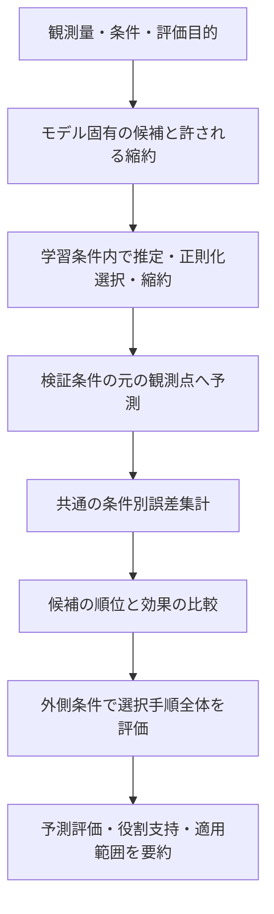

# 推定・役割選択の再設計

2026-09-03 追補：条件間・面内応答の分離と、役割支持への比較根拠の接続を実装。

適用判断：dataで分離構造を選択候補に加えると外側MSEが39.2%悪化したため、標準は `shared` を継続する。役割支持の改善は標準に適用する。`response_structure="select"`（CLIでは `--response-structure select`）で両構造を明示的に比較でき、`within_between` で分離構造に固定できる。外側結果に合わせた係数・閾値の調整は行っていない。分離を標準化するには、その必要性を支持する独立条件での評価が必要である。

検証：関連57テスト中56成功、1件は任意依存の未導入でスキップ。既知の条件間・面内応答を持つ合成データで分離構造の選択と未知条件予測を確認し、共通応答を持つデータでは共通構造を選ぶことを確認した。入力だけによる面内中心化、予測バッチ・条件内点数への整合性、検証観測の変更に対する選択・係数の不変性、数値発散した設定の扱い、縮約・別割当の比較不足や優劣逆転も検証した。

[標準設定のdata評価](../results/data_evaluation_20260903_role_evidence/evaluation_ja.md)では245点の予測値が先行版と完全一致した。主分割のAB項は総濃度だけに対する内側CVで一貫した改善を持つが、raw speciesへの割当は区別できず、支持を未特定とした。[応答分離を含む比較](../results/data_evaluation_20260903_within_between/evaluation_ja.md)では条件1・4・5の中心化R²が正になった一方、条件4・5の平均水準の誤差が悪化した。分離モデルを強制指定した場合の係数・寄与・レポート出力も実行確認した。

- 経験モデルは共通係数モデルと条件間・面内の係数を分けるモデルを、役割・正則化と一緒に学習条件内で選択する。分離モデルには係数差の罰則を加え、共通係数の場合は従来と同じ罰則になる。条件平均はFluent入力だけから計算し、未知条件の実測平均や条件別の自由な補正量を使わない。
- `reduced_model_comparisons` に条件ごとの全体MSE・平均ずれの二乗・中心化MSEの差を保持する。`role_evidence` は効果の必要性とspecies割当の区別を別々に評価し、支持判定と採否へ接続する。比較がない場合や条件によって優劣が逆転する場合は未特定とする。
- 「一貫した改善」は2条件以上、数値丸めの範囲を超える悪化がなく、少なくとも1条件で改善することを意味する。統計的有意性・支持確率ではない。内側CVで調整した後の比較という範囲を明記し、固定モデルや外側の独立評価と区別する。
- 条件間・面内の分離は今回検証した経験モデルの推定層に限定する。CVD/ALD状態モデルは既存の反応・状態結合を保ち、共通の役割比較・支持判定を使用する。設定で比較できない縮約や別割当は未評価として残す。
- 変更責務は経験モデルの設計・推定、既存の小規模制約付き最小二乗、`objective.py` の誤差分解、`class_compare.py` の比較・支持判定に分ける。実行・出力側には判定を追加しない。新しい依存パッケージやディレクトリ構造は不要。

式・出力列の詳細は [CVD解析の説明](cvd_spatial_case_analysis.md) を参照。以下は先行改修の設計記録であり、本追補が最新の挙動を示す。

2026-09-03。状態：以下の中心設計を実装済み。モデル固有の効果定義、縮約候補の独立した再推定、条件評価・順位・安定性・採否を既存ファイル内で共通化した。

実装上の範囲：経験モデルはAB積の交換対称性と厳密にゼロの係数を反映し、Aを特定できない抑制応答を `I_response` として比較する。CVD/ALD状態モデルはA/Bの区別を保ち、設定で有効な既存A/AI/AB/AIB候補の間でI/B省略モデルを比較する。一つの速度係数が0であることから、状態や輸送を介した役割全体の消失は推測しない（`effect_basis=declared_state_model_roles`）。物理モデルの候補制限は自動で緩めない。

`effect_groups` は有効な項の構造を表す。同じ項でも係数や予測が同じとは限らず、数値同点とも別の情報である。`reduced_model_comparisons` は縮約候補自身の条件CV誤差との差で、統計的有意性や化学機構の証明ではない。順位関数は入力を変更しない。

採用基準は既存の `opt.selection.application`（経験モデルのPython APIでは `application` 引数）へ任意に渡す。`conditions` に評価済みの用途条件名、`max_relative_rmse` に許容相対RMSE、`require_spatial` に面内形状の要否（既定true）を指定する。基準未指定なら最良候補は返すが自動採用しない。外側CVで選択手順が良好でも、それだけで固定モデルを採用しない。

出力は既存の4表を継続する。`condition_scores.csv` の `evaluation_scope` で学習内選択・固定モデル検証・選択手順の外側検証を区別する。共通誤差列は `mse` / `rmse` などで、`quantity` / `unit` を併記する。速度評価に膜厚単位の列名を使わない。`role_stability.csv` は再推定ごとの効果を集計し、対称なAB対は `slot=AB` に置く。従来の外側分割別結果は `split_sensitivity.csv` に残る。

**改良の中心は「実際に働く効果を比較単位にすること」と「評価の根拠から採否までの処理を共通化すること」の二つとする。** 反応式や判定フラグを増やすことを目的にしない。

## 1. 現在地と今回の設計範囲

[実データの再評価](../results/data_evaluation_20260903_regularized/evaluation_ja.md)では、条件2の相対RMSEは21.42%から1.69%へ改善したが、条件5の63.45%は残った。全体RMSEの改善は約0.8%で、中心化R²は全5条件で負。これはCVD経験モデルの成膜速度評価であり、CVD ODEやALDの実測性能を表すものではない。

既に実装済みなのは、経験モデルの条件重み付き正則化・強度選択、数値同点規則、診断スイッチから独立した条件CV、同じ選択手順による再選択、有効役割の表示である。これらを再び新規提案とは扱わない。

今回の確実な改善対象は、候補表現・評価対象・責務の不整合である。精度向上は別に検証し、設計整理だけで大きな誤差が消えるとは主張しない。

| 現行コードの課題 | 改良する設計上の単位 | 期待する実務上の効果 |
| --- | --- | --- |
| 名目上のA/AI/AB/AIBと、適合後の有効効果が混在 | 候補の式、適合した応答、支持される役割を区別 | 係数0の役割や同じ応答の重複を、別の証拠として数えない |
| 有効役割は表示に反映されるが、比較・縮約・安定性の全経路では統一されていない | モデル固有の意味に基づく効果の識別 | 比較単位と説明単位を一致させる |
| 経験モデルとシミュレータで再推定・指標集計・採否の処理が分かれている | 共通の条件評価手順と一つの要約関数 | 同じ検証結果から異なる結論が出ることを防ぎ、重複処理を削減 |
| 主分割の良好な結果と、全条件での選択手順の失敗が併存 | 評価対象と検証範囲を明示した集計 | 一条件の成功を適用範囲全体の成功へ広げない |

根拠となる現行箇所：[経験モデルの候補・適合結果](../src/deposim_opt/cvd_multicond_analysis.py)、[順位・安定性・採否](../src/deposim_opt/class_compare.py)、[共通再推定](../src/deposim_opt/fit_roles.py)、[実行と出力](../src/deposim_opt/run_fit.py)。

## 2. 第一の改良：有効な効果を中心に候補を扱う

### 2.1 三つの意味を混ぜない

| 対象 | 意味 | 例 |
| --- | --- | --- |
| 候補の式 | 適合前に定めたモデル構造と役割割当 | AIとしてA項とI項を持つ |
| 適合した応答 | 学習した係数で実際に動作する式 | A係数が0で、I項だけが寄与する |
| 支持される役割 | 検証結果から説明できる役割の範囲 | Iに相当する応答があるが、Aは未特定 |

候補名は由来として残す。比較・安定性・説明には、必要な場面で適切な対象を使う。単にAIという名前が選ばれた回数を、AとIの役割が支持された回数に変換しない。

### 2.2 同一性はモデルの式から判定する

「同じ」を次の三つに分ける。

1. **式としての厳密な同一性。** 経験モデルのAB積のA/B交換など。モデル側で代表表現を定め、重複候補を整理する。
2. **ある適合結果での同一性。** AIのA係数が0となり、その適合ではAの有無が応答に影響しない場合。他の学習条件でも0になるとは限らない。
3. **観測点上で似ていること。** データから区別しにくいという情報。式が同じ、または未知条件でも同じ、とは扱わない。

経験モデルのAB積では、同じ式と観測量を使う限りA/Bの向きは分からない。これはデータを増やすだけで解消する問題ではない。対称な組合せとして説明する。

CVD/ALDのODEにはこの交換規則を一律に適用しない。状態・反応・輸送の結合を含めて意味が同じかは、そのモデルの実装が決める。ODEでは一つの係数が0でも、当該speciesが別の経路に寄与している可能性がある。

### 2.3 効果を除く場合は、推定と検証まで行う

効果を除いた式を比較対象にする場合の処理は次のとおり。

1. モデルが許す効果の削除を定義する。
2. 学習条件内で残るパラメータを再推定する。正則化の選択も同じ学習・検証方針に従う。
3. 元モデルと同じ条件分割・同じ観測点で予測を比較する。
4. どの効果を除くと、どの条件の誤差がどれだけ変わるかを既存の条件別結果へ残す。

厳密な恒等式として整理できるだけなら再計算は不要だが、モデルや制約が変わる場合は元のスコアを流用しない。

**全学習データで0だった項を先に落とし、その結果を全CV分割に固定してはいけない。** データに基づく縮約は各分割の学習部分で実施する。縮約を含む手順全体を外側で評価する。

ゼロではない小さな係数を、固定の5%閾値などで自動削除しない。まず既存候補や最終候補の縮約で必要性を比較する。削除・追加を際限なく探索する枠組みは作らない。

Aが消えた経験的応答は、A未特定の予測式として残せる。一方、それをAIの役割同定成功には数えない。Aを必要とする物理モデルへ、新しいI単独反応機構を自動追加する提案でもない。

### 2.4 表示用文字列をモデルの意味の判定に使わない

現在の経験モデルは効果名の文字列を分解して有効役割を作る。次の実装では、効果と係数・役割の対応をモデル側の小さな関数や既存データクラスで保持し、表示名はそこから生成する。

必要なのは、モデル固有の「どの効果か」「どの役割へ関係するか」「どの削除・交換が許されるか」という情報である。汎用の数式処理器や大きなクラス階層は導入しない。

## 3. 第二の改良：推定から実務判定までの根拠を揃える

### 3.1 共通化するのは評価手順

CVD・ALD・経験モデルの反応式や推定器は分けたまま、以下を共通化する。



上図は論理的な順序である。実際には各外側分割の内側で候補選択を行い、外側の観測値を推定・縮約・再選択へ戻さない。

共通処理には、候補、条件集合、モデル固有のfit/predict関数を渡す程度でよい。経験モデルをSimSpecへ無理に変換したり、CVDとALDを同じ反応式へ揃えたりしない。

### 3.2 評価する対象を明示する

| 評価 | 答えられること | 避ける解釈 |
| --- | --- | --- |
| 学習誤差 | 与えた条件に適合できたか | 未知条件でも予測できる |
| 内側の条件CV | 候補・正則化・縮約をどう選ぶか | 選択後の性能を偏りなく検証済み |
| 外側の条件評価 | 選択・推定手順が別条件でどの程度働くか | 一つの固定モデルが全条件で検証済み |
| 固定モデルの独立評価 | そのモデルを変えずにどの程度予測できるか | 試していない条件範囲でも保証できる |

現在の全5分割は、分割ごとに選択モデルが変わる。その集約は選択手順の評価であり、主分割のABモデルだけの性能ではない。この区別を要約の作成段階で維持する。

内側で調整し外側で手順全体を評価する考え方自体は維持する。[Nested CVの公式説明](https://scikit-learn.org/stable/auto_examples/model_selection/plot_nested_cross_validation_iris.html)

### 3.3 観測単位・推定目的・選択指標を揃えて伝える

観測量は膜厚か成膜速度か、単位は何か、測定誤差は与えられているかを入力側で明示する。必要な成膜時間がない速度データを、仮定で膜厚へ変換しない。

現行の共通選択用キー `mse_nm2` は、経験解析では速度の二乗誤差にも使われている。同じ数値演算を共有しても、物理量の意味を共有したことにはならない。内部指標は量・単位と対応させ、既存CSVの単位付き列名は出力時に対応付ける。

推定目的と選択指標を同じ式に強制する必要はない。例えば対数損失で相対的な変動を適合し、実単位の誤差で候補を選ぶ方針は可能である。ただし、その二つを同じ「score」として曖昧に扱わない。

平均と形状については、既存の分解を共通の観測指標として使う。

```text
通常のMSE = 平均バイアス² + 中心化した残差のMSE
```

これら三つを重複して目的関数へ足さない。形状の優先度や誤差の重みを変更するのは、測定精度・実務目的が定まってからとする。

### 3.4 順位、役割支持、実務上の採否を別に答える

- **順位：** 決められた条件・指標では、どの候補の予測誤差が小さいか。
- **役割支持：** どの効果が実際に寄与し、削除や別割当で何が変わるか。
- **実務上の採否：** 対象範囲と許容誤差に照らして使えるか。

数値順位の一位は残せるが、採用候補がないという結果も許す。許容誤差が未指定なら、誤差と基準予測との差までを報告し、実務上の採用を自動確定しない。

主分割が良好でも、対象に含めた別条件で大きな失敗があれば、その事実を範囲全体の要約へ反映する。失敗を見て外側の候補を選び直すことはしない。

係数が0であることは、その適合での寄与なしを示す。効果削除で検証誤差が増えることは、その差を示す。どちらも、それだけで化学的役割を証明したとは解釈しない。少数条件から支持の確率や有意性を機械的に付与しない。

## 4. 推定器について維持するもの・条件が必要なもの

既に導入した条件重み付き正則化と条件CVは維持する。今回、正則化なしが選ばれたこと自体を実装不良とは扱わない。選択した目的に対してその誤差が最小だったためである。

一方、次の責務は分ける。

| 項目 | 決める側 | コードの扱い |
| --- | --- | --- |
| 守るべき物理的範囲 | モデルの知見・工程側 | 与えられた範囲を全分割に適用し、CVで無効化しない |
| 正則化の候補と尺度 | 推定方法の設計 | 説明可能な尺度を用い、学習条件内でのみ選択 |
| 測定誤差に応じた損失 | 測定情報と解析目的 | 提供された誤差を使い、不明な精度を捏造しない |
| 最適化の未収束 | 推定器 | モデルの説明力不足と区別して返す。必要な候補だけ再探索 |

新しい物理的上限や、正則化を必ず正にする規則を、条件5の結果だけから追加しない。ODE推定器の大規模な変更や網羅的な不確かさ解析も、今回の経験モデルの結果だけでは必要性を判断しない。

## 5. ファイル責務

| 既存ファイル・領域 | 担当すること | 他へ移すこと |
| --- | --- | --- |
| モデル実装・候補定義 | 反応式、効果と役割の対応、正しい同一性・許される縮約 | 共通CVの分割、実務採否 |
| `measurement_adapter.py` / `fit_conditions.py` | 観測対応、量・単位・誤差、条件の準備 | 候補の優劣判定 |
| `objective.py` | 観測空間での損失と条件別誤差、平均・形状の集計 | モデルの意味や役割名の推測 |
| `fit_optuna.py` / 経験モデルの推定関数 | 固定した候補と学習集合での推定、観測点への予測 | 全候補の採否とレポート文章 |
| `fit_roles.py` | 候補・縮約・条件分割の実行、同じ推定の再利用 | 物理モデルの交換・削除規則 |
| `class_compare.py` | 検証結果から順位・効果比較・役割支持・採否の要約 | 再推定、入力読込、CSV出力 |
| `run_fit.py` / 経験解析の実行関数 | 設定を受け取り、処理を呼び、既存成果物へ出力 | 独自の採否規則 |

`cvd_multicond_analysis.py` は経験モデルの式と入出力を維持し、重複している条件評価・採否の部分を共通関数へ移す。共通化のためだけの新しいディレクトリ、契約オブジェクト群、汎用Model階層は作らない。

役割・効果の情報には既存の候補データクラスを使う。順位関数は入力の推定結果を破壊的に書き換えず、順位情報を付けた結果を返す。互換列名の変換は出力側へ寄せ、モデルの意味の判定に互換フラグを使わない。

## 6. 出力は既存の四種類へ集約する

| 出力 | 主に答える問い |
| --- | --- |
| `role_ranking.csv` | 同じ検証条件で、どの応答がどの程度よいか |
| `condition_scores.csv` | どの条件で、平均・形状のどちらが合わないか |
| `role_stability.csv` | 同じ選択手順を繰り返して、有効効果・割当がどう変わるか |
| `role_summary.csv` | 支持される役割、未特定の役割、予測の評価範囲と採否 |

現在ある `effective_roles`、`prediction_status`、`role_support` などを整理して使う。新しい警告一覧を増やすより、同じ問いへの重複した列・文章を減らす。

再選択時の有効効果は、その分割の推定結果から取得する。全学習データの有効効果を全分割へ使い回さない。異なる係数や名目クラスでも同じ効果の解釈にまとまる場合と、効果自体が入れ替わる場合を区別する。

## 7. データ・工程要件との責務分担

| 解決したいこと | コード側の責務 | データ・工程側に必要なもの |
| --- | --- | --- |
| speciesの役割の区別 | 候補・縮約・別割当を同じ条件で比較し、未特定を残す | 候補の応答が異なる独立した条件変化 |
| 小さい面内変動の説明 | 平均と形状を分解し、既知の観測誤差を反映 | 測定精度、反復測定 |
| 使用範囲での予測 | 範囲を明示し、観測された外側誤差を正しく集約 | 使用範囲に対応する検証条件 |
| 物理的制約の適用 | 入力された制約を推定・再推定で一貫して守る | 制約値の物理的根拠 |
| 実務採用 | 要件に従って判定し、基準不足を明示 | 利用者が定める許容誤差・用途・適用範囲 |

点数を増やすことと、独立な運転条件の情報を増やすことは同じではない。正則化で一つの解を得ることと、役割を観測から特定することも同じではない。

AB積の向きのような式の対称性はモデル表現の制限であり、単にデータ側の責務としない。方向を区別する必要があるなら、その違いが現れるモデルと観測の組合せを別途検討する。

## 8. 実装順序と完了条件

| 順序 | 作業 | 完了条件 |
| --- | --- | --- |
| 1 | モデル固有の効果の対応・同一性を定義 | 名目クラス、有効効果、支持される役割を取り違えない |
| 2 | 許される縮約を推定・検証の経路に入れる | 縮約の再推定と比較が各分割の学習部分で完結する |
| 3 | 条件評価・採否の重複を共通化 | 同じ検証結果から経験モデルとシミュレータで同じ評価上の結論になる |
| 4 | 既存出力と互換処理を整理 | 四つの主要出力から同じ根拠を追え、診断の有無が選択を変えない |

共通化だけの段階では、固定した候補・係数の予測や指標が変わらないことを確認する。縮約や選択の意味を変更した段階では、その差を分離して検証する。

必須の検証は、今回のdataでよい候補が選ばれるかだけにしない。

- 名目上の重複候補を増やしても、役割支持や安定性が増えない。
- AB交換は対称な経験モデルでのみ同一視され、非対称なODEには適用されない。
- 全学習で0、分割内では非ゼロになる例で、縮約情報が検証側から漏れない。
- 固定モデルの独立評価と、選択手順の外側評価を混ぜて採否を出さない。
- 単位を整合的に換算しても、同じ物理的誤差と判定になる。
- 平均が合い形状が違う例、全候補が用途の精度を満たさない例で、根拠に合う結論を返す。
- species名、候補の並び順、シミュレーション格子密度を変えても、同じ観測証拠の結論が変わらない。

期待する成果は、誤った役割説明と不適切な実務採用を減らし、推定・比較の手順を簡潔に追えるようにすること。予測精度と外挿性能の向上は、設計を固定した後の独立データで別に評価する。
