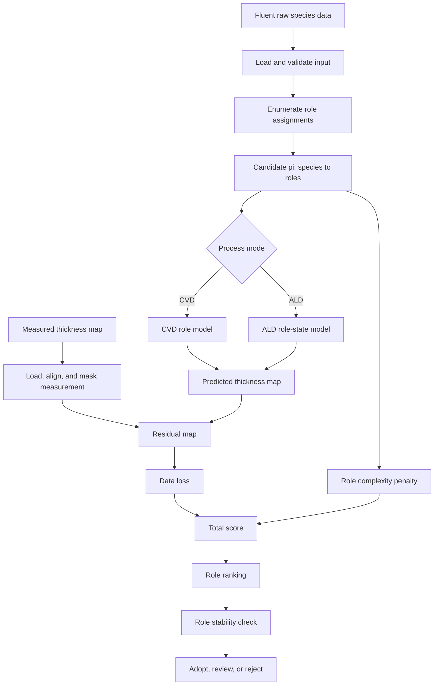
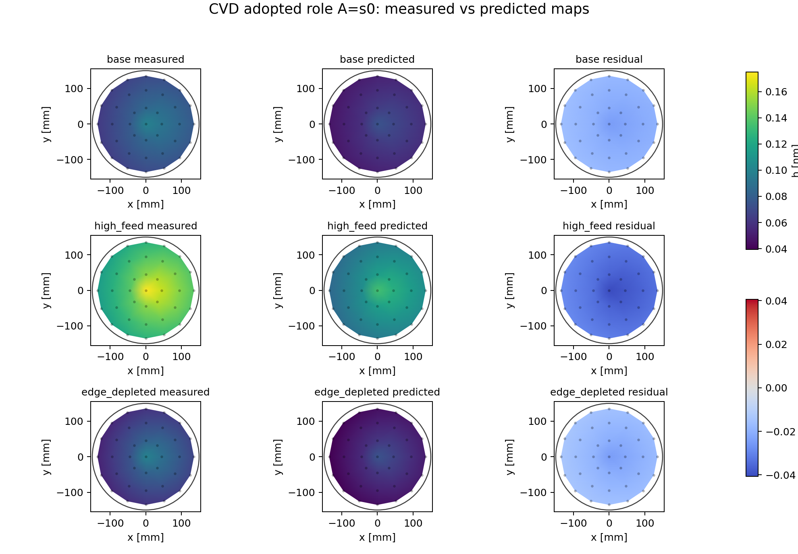
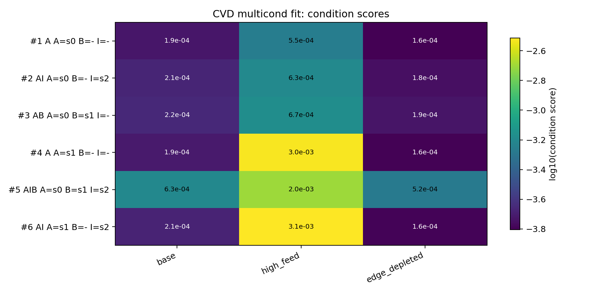
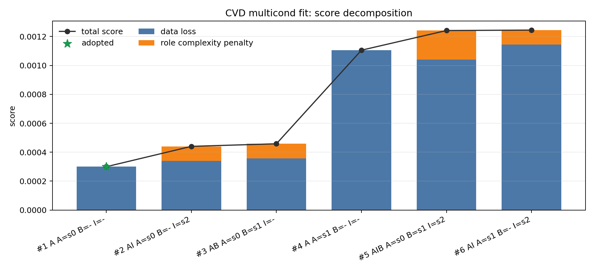
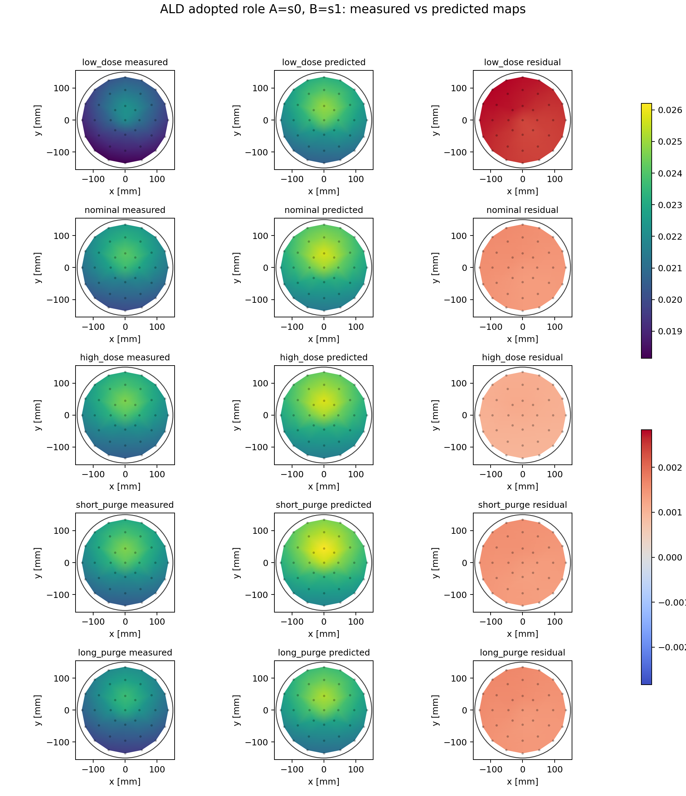
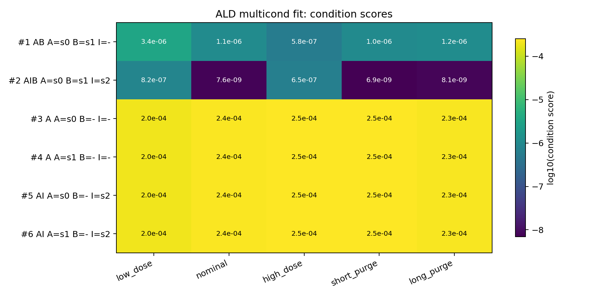
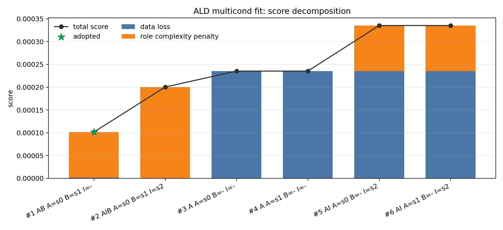
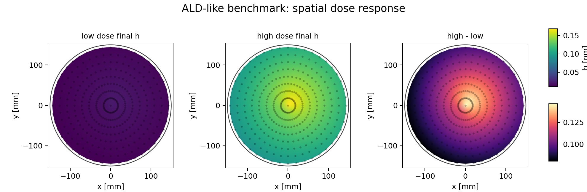
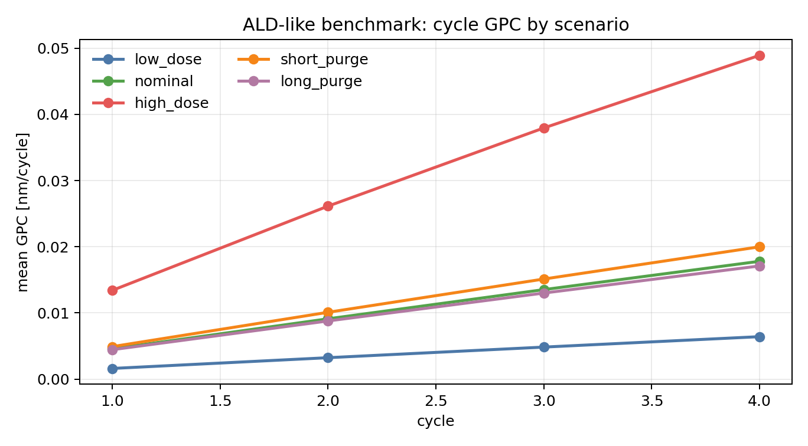

# CVD/ALD 膜厚分布予測のための反応役割同化モデルに関するベンチマーク報告

## 要旨

本コードは、Fluent から得られる raw species、例えば `s0`, `s1`, `s2` の濃度またはフラックス分布を、直接的な化学種名として固定せず、膜成長に対する反応役割へ割り当てることで、実測膜厚分布を説明するための縮約モデルを構築することを目的とする。

半導体製造プロセスにおける CVD および ALD では、流体解析で得られる species 分布と、実際に測定される wafer 面内膜厚分布との間に大きな情報ギャップが存在する。詳細な素反応機構をすべて同定することは困難であり、一方で単なる数値フィッティングでは、物理的または化学的に解釈できないパラメータ組合せが生じやすい。

本手法では、raw species を `A`, `B`, `I` という少数の反応役割へ割り当て、CVD/ALD それぞれの膜厚 map に対してデータ同化を行う。さらに、膜厚誤差だけでなく、役割数の増加に対するペナルティと条件間での安定性を評価することで、数値的に合うだけでなく、第三者が解釈可能なモデル候補を選定する。

本報告では、CVD 複数条件ベンチマークおよび ALD 複数条件ベンチマークを用いて、役割割当、膜厚 map 再現性、複雑化抑制の観点から現状のコードを評価した。これらは生成データによる役割復元テストであり、実プロセスに対する最終的な物理予測妥当性の証明ではない。

## 本報告の主張範囲

本報告で主張することは、実プロセスに対する最終的な予測妥当性ではない。本報告の主張範囲は、実 Fluent と実測膜厚へ進む前段階として、本コードが以下の解析問題を扱えるかどうかである。

| 観点 | 本報告で確認すること | 本報告ではまだ主張しないこと |
|---|---|---|
| 入力 | Fluent species と膜厚 map を模擬した複数条件データを扱える | 実 Fluent mesh、実測座標、実測ばらつきまで完全に扱える |
| 役割探索 | `s0`, `s1`, `s2` を `A`, `B`, `I` の候補として比較できる | 採用された役割が真の素反応機構である |
| CVD/ALD 分離 | CVD と ALD を異なるモデル構造で評価できる | すべての CVD/ALD recipe に一般化できる |
| モデル選択 | raw loss だけでなく複雑性を含めて候補を選べる | 実測 holdout 条件で十分な予測精度を達成した |
| 出力 | 採用・棄却理由を `role_summary.csv` に整理できる | 実務レポートに必要な全図表が完成している |

したがって、本報告は「実測予測モデルの完成報告」ではなく、「実測予測へ進むための反応役割同化フレームワークとベンチマーク確認」の位置づけである。

### 本報告の読み方

本報告で扱う妥当性は、以下の三段階に分けて読む必要がある。

| 段階 | 問い | 本報告での扱い |
|---|---|---|
| 実装妥当性 | 役割候補を列挙し、複数条件の膜厚 map に対して ranking と採用・棄却理由を出せるか | 本報告の主対象 |
| 同化妥当性 | 実 Fluent と実測膜厚 map を用いて、同じ役割割当が fitting 条件と holdout 条件で保たれるか | 今後の本番評価対象 |
| 物理予測妥当性 | 未測定 recipe や装置変更に対して、膜厚分布を予測できるか | 本報告では主張しない |

特に第 5 章のベンチマークは、実測データではなく fixture data による確認である。fixture data では、生成時に意図した役割構造が入っているため、結果は「物理機構を発見した証明」ではなく、「既知の役割構造を、role enumeration と score 判定で復元できるか」の確認として解釈する。

また、本報告の `total score` はモデル選択のための指標であり、そのまま膜厚予測誤差 [nm] を表すものではない。実測評価では、`total score` に加えて、RMSE、MAE、最大残差、測定 repeat ばらつきとの比較を別途示す必要がある。

## 1. CVD/ALD におけるモデリング背景

### 1.1 関連技術調査から見た位置づけ

CVD/ALD の膜厚分布予測は、従来から「装置内輸送」と「表面反応」を結合して扱う問題として整理されてきた。CVD では、反応ガスの流れ、熱輸送、species 輸送、気相反応、表面反応が膜厚分布を決める。CVD reactor modeling の古典的レビューでは、低圧、常圧、cold-wall、hot-wall などの reactor 形態に対して、反応流れと表面反応を含めた数学モデルが必要であることが述べられている [Sherman, 1988](https://link.springer.com/article/10.1007/BF02652128)。

実際の CVD 数値解析では、質量、運動量、エネルギー、species 保存式を有限体積法などで解き、膜厚分布や deposition rate を評価する。低圧 CVD reactor の解析例では、流れ場、化学反応、物質移動速度を同時に計算し、流れと輸送現象が膜厚、均一性、純度に強く影響することが示されている [Arnab et al., 2004](https://www.sciencedirect.com/science/article/abs/pii/S0022024804004518)。

Fluent のような汎用 CFD ソフトウェアも、この枠組みに対応している。Ansys Fluent の公式ドキュメントでは、species transport、volumetric reaction、wall surface reaction を設定でき、壁面反応では surface reaction や mass deposition source を扱えることが説明されている [Ansys Fluent User's Guide](https://ansyshelp.ansys.com/public/Views/Secured/corp/v251/en/flu_ug/flu_ug_chp_finrate.html)。

一方で、Fluent が出す species 濃度やフラックスを、そのまま膜厚に変換することは簡単ではない。表面反応機構、律速段階、境界条件、実測膜厚との座標対応、未同定の副反応などが不確かだからである。CVD でも、詳細な反応ネットワークを含む高忠実度 CFD は計算コストが高く、反応経路の検討には多くの試行が必要となる。このため、CVD 分野では CFD snapshot を使った reduced-order model や data-driven model により、詳細 CFD と実験比較の負荷を下げる研究も行われている [Gkinis et al., 2019](https://www.sciencedirect.com/science/article/abs/pii/S0009250919300600)。

ALD では、CVD 以上に表面状態の履歴が重要である。ALD は、前駆体 dose と purge を交互に行う自己停止的な気固反応を基本とし、growth per cycle, saturation, purge 残り、表面被覆率が膜厚に影響する。ALD の概説では、原子層レベルの膜厚制御、conformal coating、self-limiting surface reaction が中心概念として整理されている [George, 2010](https://pubs.acs.org/doi/10.1021/cr900056b)。また、TMA/H2O ALD の表面化学レビューでは、自己停止反応、反応速度、chemisorption、saturation、GPC、基板依存性などが ALD 理解の重要項目として整理されている [Puurunen, 2005](https://www.citedrive.com/en/discovery/surface-chemistry-of-atomic-layer-deposition-a-case-study-for-the-trimethylaluminumwater-process/)。

ALD の膜厚分布を扱うモデルでは、拡散と表面反応を結合し、位置と時間に依存する表面被覆率を解く考え方が一般的である。microchannel 内の ALD conformality 解析では、reactant partial pressure、surface coverage、exposure time、pressure、GPC などを用いて、cycle ごとの膜厚増分を計算している [Yim et al., 2022](https://pubs.rsc.org/en/content/articlehtml/2022/cp/d1cp04758b)。

以上を踏まえると、本コードは詳細素反応モデルそのものを構築するものではなく、Fluent species 場と実測膜厚 map の間に置く「反応役割単位の縮約同化モデル」と位置づけられる。これは、複雑な CFD/反応モデルと実測データの間を直接つなぐ calibration 問題に近い。計算モデルの calibration では、未知パラメータを観測データから推定し、モデル不完全性や予測不確かさを意識する必要があることが古くから議論されている [Kennedy and O'Hagan, 2001](https://academic.oup.com/jrsssb/article/63/3/425/7083367)。

本コードの特徴は、未知の反応機構を詳細化するのではなく、raw species を `A`, `B`, `I` という少数の反応役割へ割り当て、実測膜厚 map を説明できるかを評価する点にある。これにより、詳細化しすぎて考察不能になることを避けながら、Fluent と実測膜厚の間に解釈可能なモデルを構築することを狙う。

### 1.2 半導体プロセスにおける膜厚分布予測

CVD および ALD では、wafer 面内の膜厚分布は、装置内の流れ、温度、圧力、反応種濃度、表面反応、パージ効率などの複合的な影響を受ける。装置設計やプロセス条件の最適化では、これらの因子が最終的な膜厚分布にどのように反映されるかを予測することが重要である。

Fluent などの CFD 解析は、反応種ごとの濃度分布やフラックス分布を与える。しかし、CFD が出力する species 分布と、実際の膜厚測定結果との間には、以下のような差がある。

| 観点 | Fluent 側 | 実測側 |
|---|---|---|
| データ | species 濃度、壁面フラックス、流速、温度など | 膜厚 map、面内均一性、GPC など |
| 解像度 | 計算格子または壁面 mesh | 測定点または補間 map |
| 意味 | 気相または壁面近傍の場 | 表面反応後の積算結果 |
| 課題 | どの species が成膜に効くか不明 | 反応経路や中間状態は直接見えにくい |

したがって、CFD 結果をそのまま膜厚へ変換するだけでは不十分であり、CFD species と膜厚測定値をつなぐ中間モデルが必要となる。

### 1.3 CVD と ALD の違い

CVD では、比較的 steady または quasi-steady な条件下で、反応種供給と表面反応が同時に進み、膜厚が連続的に増加する。一方、ALD では、dose、purge、反応、purge などの時間的に分離された区間を持ち、表面状態の履歴が膜厚に影響する。

| 項目 | CVD | ALD |
|---|---|---|
| 主な特徴 | 連続供給・連続成膜 | dose/purge/cycle による時間分離 |
| 重要な入力 | 定常または平均化された濃度・フラックス分布 | 時間依存する濃度・フラックス分布 |
| 重要な状態 | 反応有効性、抑制、輸送律速 | 表面被覆、履歴、飽和、パージ残り |
| 評価対象 | 膜厚 map、面内分布、条件依存性 | 膜厚 map、cycle 応答、dose/purge 依存性 |

この違いにより、CVD と ALD では同じ評価思想を共有しながらも、モデルの時間扱いを分ける必要がある。

## 2. 従来の課題

### 2.1 詳細反応モデルだけでは実務利用が難しい

CVD/ALD の厳密なモデリングでは、装置内輸送、気相反応、表面反応、熱輸送を同時に扱う必要がある。CVD reactor modeling の文献では、反応流れと表面反応を結合した数学モデルが必要であることが示されている [Sherman, 1988](https://link.springer.com/article/10.1007/BF02652128)。また、低圧 CVD reactor の解析例では、流れ、化学反応、物質移動を同時に解くことで膜厚や均一性を評価している [Arnab et al., 2004](https://www.sciencedirect.com/science/article/abs/pii/S0022024804004518)。

しかし、実務で問題になるのは、詳細モデルを作るために必要な情報が常に揃うわけではないことである。

| 課題 | 内容 |
|---|---|
| 表面反応機構の不確かさ | 実際にどの species が成膜、補助反応、抑制に効くか未確定なことが多い |
| 反応速度定数の不足 | 文献値が装置・温度・圧力・表面状態に合わない場合がある |
| 壁面境界条件の不確かさ | Fluent の壁面近傍値をどう表面反応量へ変換するかが一意でない |
| 計算コスト | 詳細反応 CFD を条件探索や fitting に何度も使うことは重い |
| 実測とのギャップ | CFD は気相・壁面近傍の場を出すが、実測は反応後の積算膜厚である |

このため、詳細素反応を完全に同定してから膜厚予測へ進む、という流れだけでは、実測膜厚 map を使った装置・プロセス評価に到達しにくい。

### 2.2 Fluent species をそのまま化学的役割に固定する問題

Ansys Fluent では species transport や wall surface reaction を扱うことができる [Ansys Fluent User's Guide](https://ansyshelp.ansys.com/public/Views/Secured/corp/v251/en/flu_ug/flu_ug_chp_finrate.html)。したがって、Fluent から species ごとの濃度やフラックスを出力すること自体は可能である。

しかし、Fluent の raw species 名を、そのまま膜成長の反応役割として固定することには注意が必要である。例えば `s0`, `s1`, `s2` という species があった場合、

```text
s0 = 成膜主役
s1 = 補助反応種
s2 = 抑制種
```

と最初から決め打ちすると、実測膜厚に対して誤った解釈を与える可能性がある。逆に、すべての species を自由にモデルへ入れると、数値的に合う組合せは増えるが、どの species が本質的に効いているのか判断しにくくなる。

本コードの有用性は、この中間にある。すなわち、raw species を直接化学種名として固定せず、`A`, `B`, `I` という少数の反応役割へ割り当てて比較する。これにより、Fluent species と実測膜厚の関係を、解釈可能な形で探索できる。

### 2.3 キャリブレーション問題としての不確かさ

Fluent 結果と実測膜厚 map を合わせる作業は、計算モデルの calibration 問題である。Kennedy and O'Hagan は、計算モデルを実測データに合わせる際には、未知パラメータだけでなく、モデルそのものの不完全性を考慮する必要があることを示した [Kennedy and O'Hagan, 2001](https://academic.oup.com/jrsssb/article/63/3/425/7083367)。

本コードに対応させると、以下の不確かさが存在する。

| 不確かさ | 本コードでの現れ方 |
|---|---|
| 役割不確かさ | `s0`, `s1`, `s2` のどれを `A`, `B`, `I` に割り当てるべきか不明 |
| パラメータ不確かさ | `k_rxn`, `K_I`, `k_store_A`, `k_convert_AB` などが未知 |
| モデル不完全性 | 縮約モデルが実際の素反応を完全には表していない |
| 測定不確かさ | 膜厚測定のばらつき、外れ値、座標ずれがある |
| 条件不確かさ | nominal 条件で合っても、dose、purge、供給量変更で外れる可能性がある |

したがって、単一条件の膜厚 map に対して誤差を小さくするだけでは、モデルが妥当とは言えない。複数条件での同時評価、holdout 評価、役割割当の安定性確認が必要になる。

### 2.4 数値的に合うが考察できないモデル

多変数 fitting では、膜厚誤差を小さくするだけなら多くの組合せが成立し得る。これは統計モデル選択でよく知られている問題であり、Akaike information criterion では、当てはまりの良さだけでなく、パラメータ数の増加を罰する考え方が導入されている [Akaike, 1974](https://doi.org/10.1109/TAC.1974.1100705)。

本コードでも同じ問題が起きる。例えば `AIB` モデルは `A` モデルや `AB` モデルより自由度が高いため、raw loss だけを見れば有利になりやすい。しかし、`I` を追加してわずかに誤差が下がったとしても、その `I` がプロセス上意味を持つか、別条件でも安定するかを確認しなければならない。

問題を整理すると以下である。

| 問題 | 内容 | 必要な対策 |
|---|---|---|
| 過剰な役割追加 | `A`, `B`, `I` を全部入れると誤差は下がりやすい | 役割数へのペナルティを入れる |
| 条件依存の入れ替わり | 条件ごとに最良の役割割当が変わる | 複数条件で同時 fitting する |
| 実測への過剰適合 | fitting 条件では合うが未知条件で外れる | holdout 条件で評価する |
| map の見かけ一致 | 平均膜厚は合うが中心・外周の誤差構造が残る | 残差 map と条件別 score を確認する |
| 解釈不能な組合せ | species の組合せが多く、考察できない | `role_summary.csv` で採用・棄却理由を明示する |

この観点から、本コードでは `role_summary.csv` に `adopt_candidate`, `reject_lower_score`, `reject_complexity_not_justified` などの判断を出す。これは、単なる順位表ではなく、モデル選択の理由を第三者が追えるようにするためである。

### 2.5 ALD で時間履歴を無視する問題

ALD では、dose と purge の時間履歴が表面状態に残る。ALD の概説では、自己停止的な表面反応、saturation、growth per cycle が重要概念として整理されている [George, 2010](https://pubs.acs.org/doi/10.1021/cr900056b)。TMA/H2O ALD の表面化学レビューでも、chemisorption、saturation、反応速度、GPC、基板依存性などが重要であることが示されている [Puurunen, 2005](https://www.citedrive.com/en/discovery/surface-chemistry-of-atomic-layer-deposition-a-case-study-for-the-trimethylaluminumwater-process/)。

したがって、ALD を最終膜厚だけの定常 fitting として扱うと、以下の情報を失う。

| 情報 | 意味 |
|---|---|
| dose 依存性 | 供給量を増やしたとき膜厚が飽和に向かうか |
| purge 依存性 | purge が短いと残留反応や未排出成分が膜厚に影響するか |
| cycle 依存性 | cycle ごとの成長量が安定しているか |
| 表面状態 | 反応可能な表面、吸着状態、抑制状態がどれだけ残っているか |

ALD conformality の反応拡散モデルでも、reactant partial pressure、surface coverage、exposure time、GPC などを時間・位置依存で扱う [Yim et al., 2022](https://pubs.rsc.org/en/content/articlehtml/2022/cp/d1cp04758b)。このため、本コードでも ALD では `role_ald_state` のように、最小限の表面状態と時間履歴を持つモデルが必要になる。

### 2.6 本コードが解くべき課題

以上の関連技術と従来課題を踏まえると、本コードが解くべき課題は以下に整理できる。

| 従来課題 | 本コードでの対応 |
|---|---|
| 詳細反応機構を完全には決められない | raw species を反応役割 `A`, `B`, `I` に割り当てて探索する |
| species 名だけでは膜厚への役割が不明 | 役割候補を列挙し、実測膜厚 map への説明力で比較する |
| 単一条件 fitting では過剰適合しやすい | 複数条件を同時に扱い、条件別 score を出す |
| 複雑なモデルほど誤差が下がりやすい | 役割数への complexity penalty を入れる |
| ALD では履歴効果が重要 | `role_ald_state` で表面状態と時間発展を扱う |
| 第三者が判断を追いにくい | `role_summary.csv` に採用・棄却理由を出す |

この整理から、本コードの有用性は「詳細反応モデルの代替」ではなく、「Fluent と実測膜厚の間で、解釈可能な反応役割を同定するためのデータ同化基盤」にある。

## 3. 本手法の目的

本手法の目的は、Fluent で得られる species 分布と実測膜厚 map の間に、実務上解釈可能な「反応役割単位の同化モデル」を構築することである。ここで目指すのは、詳細素反応を完全に同定することではない。また、膜厚誤差だけを最小化するブラックボックス fitting でもない。

本コードが解決しようとしている中心課題は、次の一点に集約される。

```text
Fluent raw species のどれが、実測膜厚分布を説明する上で
どの反応役割として有効なのかを、複数条件のデータから判定する。
```

### 3.1 解決対象とする課題

従来課題を踏まえると、本手法で扱う課題は以下である。

| 課題 | 従来の困難 | 本手法での解決方針 |
|---|---|---|
| species の役割が不明 | `s0`, `s1`, `s2` が成膜、補助、抑制のどれに相当するか決め打ちできない | raw species を `A`, `B`, `I` の役割候補へ割り当てて比較する |
| 詳細反応モデルが重い | 表面素反応や速度定数をすべて決めるには情報と計算コストが大きい | 反応役割単位の縮約モデルとして扱う |
| 数値的に合うだけのモデルが出やすい | 役割やパラメータを増やすほど fitting 条件では誤差が下がりやすい | 役割数へのペナルティと棄却理由を導入する |
| 単一条件では過剰適合しやすい | ある条件で合っても別条件で外れる可能性がある | 複数条件を同時に評価し、条件別 score を出す |
| ALD の履歴効果を無視できない | dose/purge/cycle による表面状態が膜厚に影響する | ALD では最小限の表面状態変数を持つ |
| 第三者が判断しにくい | 最終 loss だけではなぜ採用したか分からない | `role_summary.csv` に採用・棄却理由を出す |

### 3.2 本手法の到達目標

本手法の到達目標は、単に「膜厚をよく合わせること」ではなく、以下を同時に満たすモデル候補を選ぶことである。

1. 実測膜厚 map を定量的に説明できる。
2. CVD/ALD のプロセスモードに応じた最小限の状態表現を持つ。
3. 複数条件に対して同じ役割割当で説明できる。
4. raw species と反応役割の対応が第三者に説明できる。
5. 不要な役割追加を避け、考察可能なモデル複雑性に保つ。
6. 採用候補と棄却候補の違いを表として追跡できる。

この目標により、本コードは「最良 loss を出す最適化器」ではなく、「Fluent species と実測膜厚をつなぐ役割仮説を検証する解析基盤」として機能する。

### 3.3 反応役割としての `A`, `B`, `I`

本手法で用いる `A`, `B`, `I` は、固定された化学種名ではない。これらは、実測膜厚を説明するために raw species へ割り当てる反応役割である。

| 役割 | 意味 | 膜厚への期待効果 |
|---|---|---|
| `A` | 成膜を主に進める役割 | `A` が多い位置で膜厚が増えやすい |
| `B` | `A` と組み合わさって成膜を進める補助役割 | `A` だけでは説明できない条件差や分布を補う |
| `I` | 成膜を弱める、または有効サイトを減らす役割 | `I` が多い位置で成膜が抑制される |
| 未使用 | 膜厚説明に不要な raw species | モデルには入れない |

例えば `A=s0, B=s1, I=なし` という結果は、`s0` が成膜主役、`s1` が補助役割として膜厚 map の説明に有効であり、`s2` は現状のデータでは追加する必要がない、という解釈を与える。

### 3.4 期待される効果

本手法により期待される効果は以下である。

| 効果 | 内容 |
|---|---|
| 役割仮説の明確化 | どの Fluent species が成膜主役、補助、抑制として効く可能性が高いかを整理できる |
| 過剰適合の抑制 | raw loss だけで複雑な候補を選ばず、役割追加の必要性を評価できる |
| 条件横断の評価 | 複数条件で同じ役割が有効かを確認できる |
| CVD/ALD の分離運用 | CVD は steady map、ALD は時間履歴を持つ role-state model として扱える |
| 実測評価への接続 | Fluent と実測膜厚の座標合わせ、条件管理、holdout 評価へ進める |
| 説明可能性 | `role_summary.csv` により、採用・棄却理由を第三者が追える |

特に重要なのは、`AIB` のような複雑な候補が raw loss を下げた場合でも、その改善が役割追加に見合うかを評価できる点である。これにより、数値的には合うがプロセス考察に使えないモデルを避けられる。

### 3.5 本レポート内での位置づけ

本章で定義した目的は、次章以降の評価基準になる。第 4 章では、この目的を実装するためのワークフロー、スコア式、CVD/ALD モデルを説明する。第 5 章では、CVD と ALD のベンチマークにより、役割割当、複雑化抑制、条件別 score が期待どおり機能するかを確認する。第 6 章では、実 Fluent と実測膜厚を用いた本番評価へ進むための残課題を整理する。

## 4. 本手法の説明

### 4.1 本手法の独自性

本手法の独自性は、Fluent species を直接的な化学種名として固定せず、実測膜厚 map を説明するための「反応役割」へ割り当てて評価する点にある。従来の詳細反応モデルでは、反応機構、速度定数、境界条件をあらかじめ仮定する必要がある。一方、単純なブラックボックス fitting では、膜厚誤差は小さくても、どの species が何に効いたのかを説明しにくい。

本コードではこの中間を狙う。すなわち、raw species を `A`, `B`, `I` という少数の役割に写像し、複数条件の膜厚 map に対して「どの写像が最も少ない仮定で説明力を持つか」を評価する。

| 工夫 | 解決したい問題 | 実装上の対応 |
|---|---|---|
| 反応役割単位の species 割当 | raw species の意味を決め打ちできない | `role_enumeration` で `A`, `B`, `I` 候補を列挙 |
| CVD/ALD の分離 | steady 成膜と cycle 履歴を同じ式で無理に扱わない | CVD は map model、ALD は `role_ald_state` |
| 複数条件 fitting | 単一条件への過剰適合を避ける | `measurement.conditions` で条件別データを同時評価 |
| 複雑性ペナルティ | 役割を増やすほど有利になる問題を抑える | `complexity_penalty` を score に加える |
| 採用・棄却理由の明示 | 最小 loss だけでは第三者が判断できない | `role_summary.csv` を出力 |

### 4.2 記号定義

本章では以下の記号を用いる。

| 記号 | 意味 |
|---|---|
| `c` | 条件 index。例: `base`, `high_feed`, `low_dose` |
| `x` | wafer 面内位置 |
| `t` | 時刻。ALD transient で使用 |
| `s_j` | Fluent raw species。例: `s0`, `s1`, `s2` |
| `r` | 反応役割。`A`, `B`, `I` のいずれか |
| `pi` | raw species を役割へ割り当てる写像 |
| `C_j,c(x)` | 条件 `c` における raw species `s_j` の Fluent 分布 |
| `C_r,c(x)` | 役割 `r` に変換された分布 |
| `h_pred,c(x)` | 条件 `c` における予測膜厚 |
| `h_meas,c(x)` | 条件 `c` における実測またはベンチマーク正解膜厚 |
| `Theta` | fitting されるモデルパラメータ集合 |

役割割当 `pi` は、例えば以下のような写像である。

```text
pi(A) = s0
pi(B) = s1
pi(I) = none
```

このとき、役割濃度は以下で与えられる。

```text
C_A,c(x) = C_s0,c(x)
C_B,c(x) = C_s1,c(x)
C_I,c(x) = 0
```

`none` は、その役割を使わないことを意味する。未使用 species は膜厚説明に不要な候補として扱われる。

#### 4.2.1 数式モデルの近似仮定

本手法の数式は、装置全体の CFD と表面素反応を同時に解く第一原理モデルではない。Fluent で得られた場を入力として固定し、その場を膜厚 map へ写像するための低次元同化モデルである。主な近似仮定は以下である。

| 近似 | 内容 | 意味 |
|---|---|---|
| 局所表面セル近似 | wafer 面内位置 `x` ごとに、表面状態と膜厚を局所的に更新する | 面内結合は Fluent 入力場に含め、同化モデル側では lateral diffusion を解かない |
| Fluent 場固定 | fitting 中に `C_j,c(x)` や `C_j,c(t,x)` は変えない | 反応による流体場への feedback は縮約モデルに含めない |
| effective parameter | `k_rxn`, `k_store_A`, `km_A`, `alpha_h` などは素反応定数そのものではない | 輸送、表面反応、未モデル化効果をまとめた較正パラメータとして扱う |
| latent role | `A`, `B`, `I` は化学種名ではなく反応役割である | `A=s0` は `s0` が真の前駆体であるという意味ではなく、膜厚説明上の主役割である |
| CVD 準定常入力 | CVD では steady または quasi-steady な Fluent 分布を用いる | 時間依存は処理時間方向の積算として扱う |
| ALD 履歴状態 | ALD では `theta_A`, `theta_I`, `theta_free` を持つ | dose/purge/cycle の履歴を最小限の latent state で表す |

このため、本手法の数式から直接「真の反応機構」を読むことはできない。読み取れるのは、与えられた Fluent 場と膜厚 map の間で、どの raw species をどの役割として使うと、少ない仮定で説明しやすいかである。

#### 4.2.2 単位とスケーリング

実装では、入力濃度やフラックスは Fluent 出力または fixture data のスケールに依存する。そのため、本文の数式では厳密な SI 単位系を固定せず、以下のような次元整合を仮定する。

| 量 | 典型的な解釈 | 次元・スケーリング上の扱い |
|---|---|---|
| `C_A`, `C_B`, `C_I` | Fluent 由来の濃度または参照濃度 | 実データでは物理単位を保持し、fixture では正規化量として扱う |
| `Cs_A`, `Cs_B` | 表面で有効に働く濃度 | `C_A`, `C_B` と同じスケールの effective surface concentration |
| `theta_A`, `theta_I`, `theta_free`, `theta_star` | 表面状態または有効サイト割合 | 無次元、原則として 0 から 1 |
| `K_I C_I` | 抑制の無次元強度 | `K_I` は `C_I` の逆単位を含む effective coefficient |
| `R_event` | 成膜イベント率 | `alpha_h R_event`、または CVD では `alpha_h gamma_s R_event` が膜厚速度 [nm/s] になるようにスケールされる |
| `alpha_h` | 成膜イベントから膜厚への換算 | 実測膜厚スケールへ合わせる effective conversion factor |
| `delta` | Huber loss のしきい値 | 膜厚残差 `e` と同じ [nm] スケール |

したがって、`k_rxn` や `k_convert_AB` の数値を、文献の素反応速度定数と直接比較することは想定していない。実測データへ適用する場合は、Fluent 入力の単位、膜厚 [nm]、処理時間 [s]、cycle 数をそろえたうえで、同じスケーリングを全条件に適用する必要がある。

score の単位も、この段階で明確に分ける必要がある。Huber loss は膜厚残差 `e` [nm] から作るため、二次領域では `0.5 e^2` の平均となり、数値上は [nm^2] スケールを持つ。一方、`total_score` はこの `data_loss` と役割追加 penalty を足したモデル選択指標であり、物理単位付きの予測誤差ではない。厳密に無次元 score として扱う場合は、測定 repeat ばらつき `sigma_h` や工程許容幅で `e_tilde = e / sigma_h` を作り、無次元 Huber loss として評価する必要がある。本レポートの fixture 評価では、`lambda_role` を Huber loss と同じ数値スケール上の経験的正則化係数として扱う。

### 4.3 全体ワークフロー

本コードの処理は、入力、役割候補生成、モデル計算、スコア評価、採用判断の順に進む。



実装上は、設定ファイルで `sim.process` と `model.name` を切り替え、CVD では `role_cvd_aib`、ALD では `role_ald_state` を使う。role 候補は `configs/opt/*.yaml` の `role_enumeration` で指定される。

### 4.4 役割候補の生成

raw species 集合を以下のように置く。

```text
S = {s0, s1, s2, ...}
```

役割集合を以下とする。

```text
R = {A, B, I}
```

本コードでは、設定で許可された候補から写像 `pi: R -> S or none` を列挙する。ただし、同じ species を複数の役割に重複使用しない制約を置く。

```text
pi(A) != pi(B), pi(A) != pi(I), pi(B) != pi(I)
```

ただし、`B` と `I` は任意役割であり、`none` を許す。

```text
pi(A) must be species
pi(B) can be species or none
pi(I) can be species or none
```

この設計により、以下のような候補を同じ枠組みで比較できる。

| class | 例 | 意味 |
|---|---|---|
| `A` | `A=s0` | 成膜主役のみ |
| `AB` | `A=s0, B=s1` | 成膜主役と補助役割 |
| `AI` | `A=s0, I=s2` | 成膜主役と抑制役割 |
| `AIB` | `A=s0, B=s1, I=s2` | 3 役割すべてを使う |

### 4.5 CVD モデル

CVD では、Fluent から得られる steady または quasi-steady な species 分布を、役割分布へ変換して膜厚 map を計算する。

```text
C_A,c(x) = C_pi(A),c(x)
C_B,c(x) = C_pi(B),c(x)
C_I,c(x) = C_pi(I),c(x)
```

表面被覆 `theta_A` は、`A` の吸着、脱離、成膜イベントによる消費の釣り合いで更新される。概念的には以下の形である。

```text
dtheta_A,c(x)/dt =
    k_ads * Cs_A,c(x) * theta_star,c(x)^m
  - k_des * theta_A,c(x)
  - nu_A * R_c(x)
```

`I` が存在する場合、有効反応サイト割合 `theta_star` は以下で表される。

```text
theta_star,c(x) =
    (1 - theta_A,c(x)) / (1 + K_I * C_I,c(x))
```

| 変数 | 意味 |
|---|---|
| `theta_A,c(x)` | `A` 由来状態で覆われた表面割合 |
| `theta_star,c(x)` | 反応に使える有効サイト割合 |
| `K_I` | `I` による抑制の強さ |
| `C_I,c(x)` | 抑制役割 `I` の分布 |

この節で使う主な effective parameter は以下である。

| 記号 | 意味 |
|---|---|
| `k_ads`, `k_des` | `A` 由来状態の蓄積と緩和を表す effective coefficient |
| `k_rxn` | 成膜イベントの強さを表す effective reaction coefficient |
| `km_A`, `km_B` | Fluent 側の場から表面有効濃度へ変換する effective mass-transfer coefficient |
| `gamma_s` | 表面サイト密度や換算係数をまとめた係数 |
| `nu_A` | 成膜イベントに伴う `theta_A` 消費係数 |
| `m`, `p`, `q` | サイト依存性や反応次数を表す小さな整数 |
| `C_B_scale` | `B` 項を無次元化するための基準濃度 |
| `alpha_h` | 成膜イベントを膜厚増加へ換算する係数 |

`Cs_A` は、Fluent 側の参照濃度 `C_A` と表面反応需要の間をつなぐ有効表面濃度である。実装上は物質移動係数 `km_A` と表面反応係数を用いて、以下のような輸送抵抗と反応需要の釣り合いとして扱う。

```text
Cs_A,c(x) =
    (km_A * C_A,c(x) + gamma_s * k_des * theta_A,c(x))
  / (km_A + gamma_s * k_ads * theta_star,c(x)^m)
```

`B` を使う候補では、`B` 側にも同様に有効表面濃度 `Cs_B` を定義する。

```text
Cs_B,c(x) =
    km_B * C_B,c(x)
  / (km_B + gamma_s * k_rxn * theta_A,c(x)^p * theta_star,c(x)^q / C_B_scale)
```

成膜イベント量 `R_c(x)` は概念的に以下で表される。

```text
R_c(x) =
    k_rxn
  * theta_A,c(x)^p
  * theta_star,c(x)^q
  * B_term,c(x)
```

`B` を使わない候補では `B_term,c(x) = 1` とみなす。`B` を使う候補では、`B_term,c(x) = Cs_B,c(x) / C_B_scale` として、`C_B,c(x)` と輸送係数 `km_B` から得た表面有効濃度を成膜イベントに反映する。

膜厚は処理時間で積算する。

```text
dh_c(x)/dt = alpha_h * gamma_s * R_c(x)
h_pred,c(x) = h0(x) + integral_0^T alpha_h * gamma_s * R_c(x) dt
```

実装では、この局所方程式を各 wafer 点で時間方向に積分する。`theta_A` は 0 から 1 の範囲に収まるように扱い、陰的な更新で bracket が成立しない場合には安定化された fallback を用いる。したがって、本文の式は連続方程式としての考え方を示し、実際の計算では有界性と数値安定性を優先した離散化を行う。

ここで示した式は、詳細素反応を閉じた形で記述するための第一原理モデルではなく、実装で用いている `role_cvd_aib` の縮約形を説明するための概念式である。`theta_A`、`theta_star`、`Cs_A`、`Cs_B` は、Fluent から得られる濃度または壁面フラックスを、有効表面濃度と有効サイト割合へ変換した診断量として扱う。したがって、各パラメータは素反応速度定数そのものではなく、輸送、表面反応、未モデル化要因をまとめた effective parameter である。

この CVD モデルの役割は、詳細な素反応を主張することではなく、Fluent species 分布のどれが膜厚 map の主説明因子として効くかを比較可能にすることである。

### 4.6 ALD role-state モデル

ALD では、dose、purge、cycle による時間履歴が膜厚に影響する。そのため、CVD と同じ定常 map model だけでは不十分である。本コードでは `role_ald_state` として、最小限の表面状態を持つ縮約モデルを用いる。

役割濃度は時間依存である。

```text
C_A,c(t, x), C_B,c(t, x), C_I,c(t, x)
```

表面状態は以下で定義する。

```text
theta_free,c(t, x) =
    1 - theta_A,c(t, x) - theta_I,c(t, x)
```

| 変数 | 意味 |
|---|---|
| `theta_A` | `A` 由来状態で覆われた表面割合 |
| `theta_I` | `I` 由来状態で覆われた表面割合 |
| `theta_free` | 空き表面割合 |

時間依存入力 `C_A`, `C_B`, `C_I` は、そのまま表面反応速度に入るのではなく、表面で有効な濃度 `Cs_A`, `Cs_B` に変換される。概念的には、物質移動係数と表面側の需要を用いて以下のように表す。

```text
Cs_A =
    C_A * km_A
  / (km_A + demand_A)

demand_A =
    k_store_A * theta_free
  + k_release_A
  + k_convert_AB
```

`B` を使う候補では、`B` 側の表面有効濃度も同様に計算する。

```text
Cs_B =
    C_B * km_B
  / (km_B + demand_B)

demand_B =
    k_convert_AB * theta_A
```

`A` の蓄積、放出、`B` との変換は以下で表す。

```text
dtheta_A/dt =
    k_store_A * Cs_A * theta_free
  - k_release_A * theta_A
  - k_convert_AB * Cs_B * theta_A
```

`I` を使う候補では、抑制側状態も時間発展させる。

```text
dtheta_I/dt =
    k_store_I * C_I * theta_free
  - k_release_I * theta_I
```

膜厚は `A` と `B` の変換イベントから増加する。

```text
R_event =
    k_convert_AB * Cs_B * theta_A

dh/dt =
    alpha_h * R_event
```

この最小 ALD role-state model では、膜厚増加は `A` と `B` の変換イベントとして表現される。そのため `B` なし候補は、`A` 単独でどこまで説明できるかを見るための比較基準であり、全ての ALD 化学で単一前駆体成長が不可能であるという物理主張ではない。

これは査読上、明示しておくべき前提である。現在の `role_ald_state` では `dh/dt` が `Cs_B * theta_A` に比例するため、膜厚を増やす主成膜チャネルは構造的に `B` を必要とする。`B=none` の候補では `Cs_B` に相当する入力がなく、変換イベントは実質的に 0 となるため、`A` の蓄積履歴だけでは膜厚増加を直接作れない。したがって本結果で `A` 単独候補が弱いことは、「この最小二役割 ALD model では B なし成膜チャネルが未実装である」ことも含む。単一前駆体型、自己分解型、または `A` だけで成膜する ALD-like model を主張する場合は、`R_event = k_convert_A * theta_A` などの別チャネルを候補 class として追加してから比較する必要がある。

| 変数 | 意味 |
|---|---|
| `Cs_A`, `Cs_B` | 表面で有効に働く `A`, `B` の濃度 |
| `k_store_A` | `A` が表面に蓄積する強さ |
| `k_release_A` | `A` が表面から抜ける強さ |
| `k_convert_AB` | `A` と `B` の組合せが膜厚に変わる強さ |
| `k_store_I`, `k_release_I` | `I` の蓄積と緩和 |
| `alpha_h` | 反応イベントを膜厚へ換算する係数 |

このモデルでは、ALD の全素反応を再現するのではなく、実測膜厚を説明するのに必要な「履歴を持つ役割状態」を最小限導入している。これにより、dose/purge/cycle 条件が変化した場合でも、同じ役割割当で膜厚 map を説明できるかを確認できる。

理論的には、`theta_A`、`theta_I`、`theta_free` は 0 から 1 の範囲にある表面割合として解釈される。ただし本モデルでは、これらを実在の吸着種濃度そのものとして同定するのではなく、ALD 履歴を表す latent state として扱う。したがって、表面状態の有界性や飽和傾向は物理的 sanity check であり、単独で素反応機構の証明にはならない。

数値計算では、時間刻みを `dt_max_s` 以下の sub-step に分割し、更新後の `theta_A` と `theta_I` を 0 から 1 の範囲に制限する。さらに `theta_A + theta_I > 1` となった場合は、合計が 1 を超えないように再正規化する。これは数値的な有界性を保つための安定化であり、モデルが真の表面被覆率を厳密に予測したことを意味しない。実測評価では `bounded_violation_count` や `theta_free_min/max` を診断し、状態量が無理な挙動をしていないか確認する必要がある。

### 4.7 膜厚 map との比較

各条件 `c` について、予測膜厚と実測膜厚の残差を計算する。

```text
e_c(x) = h_pred,c(x) - h_meas,c(x)
```

測定点や Fluent 壁面点が完全には一致しない場合があるため、実装では測定 map の読み込み、座標合わせ、mask 適用を行う。評価対象は、mask 内の有限値を持つ点である。

単一条件ではなく複数条件を扱う場合、条件重み `w_c` を用いて data loss を集約する。

```text
data_loss(pi, Theta) =
    sum_c w_c * mean_x L_delta( e_c(x) )
```

ここで `L_delta` は Huber loss である。

```text
L_delta(e) =
    0.5 * e^2                  if |e| <= delta
    delta * (|e| - 0.5*delta)  if |e| > delta
```

| 変数 | 意味 |
|---|---|
| `e_c(x)` | 条件 `c`、位置 `x` における膜厚残差 |
| `w_c` | 条件 `c` の重み |
| `delta` | Huber loss のしきい値 |
| `mean_x` | 評価点に対する平均 |

膜厚を [nm] で扱う場合、`e_c(x)` と `delta` も [nm] である。`|e| <= delta` の領域では `L_delta(e)` は二乗誤差に相当するため、値のスケールは [nm^2] である。`|e| > delta` の領域では線形に近い増え方へ切り替わり、大きな外れ値が score を支配しすぎることを抑える。

Huber loss を使う理由は、局所的な外れ値や測定ノイズが score を過度に支配することを避けるためである。ただし、`data_loss` は条件重みと平均化を含む評価指標であり、RMSE [nm] や MAE [nm] そのものではない。実測評価では、`data_loss` と併せて RMSE、MAE、最大残差を出力する必要がある。

### 4.8 総合スコアとモデル選択

候補 `pi` とパラメータ `Theta` の総合スコアは以下で評価する。

```text
total_score(pi, Theta) =
    data_loss(pi, Theta)
  + penalty_complexity(pi)
  + penalty_solver
  + penalty_physics
  + penalty_prior
  + penalty_profile
```

現状のベンチマークで最も重要なのは、膜厚誤差 `data_loss` と役割複雑性 `penalty_complexity` である。

```text
penalty_complexity(pi) =
    lambda_role * [ I(pi(B) != none) + I(pi(I) != none) ]
```

| 項 | 意味 |
|---|---|
| `data_loss` | 膜厚 map の再現誤差 |
| `penalty_complexity` | `B` や `I` を追加することへのペナルティ |
| `penalty_solver` | 数値解法が不安定な場合のペナルティ |
| `penalty_physics` | 診断量が物理的期待から外れる場合のペナルティ |
| `penalty_prior` | 事前知識から外れるパラメータへのペナルティ |
| `penalty_profile` | CVD/ALD 固有の profile 診断ペナルティ |

`I(condition)` は、条件が真なら 1、偽なら 0 を返す指示関数である。この式により、`AIB` のように役割数が多い候補は、膜厚誤差を十分に改善しない限り採用されない。

ここで重要なのは、`total_score` が「物理誤差そのもの」ではなく、「候補を並べ替えるための設計指標」である点である。`data_loss` は Huber loss に基づく膜厚 map 残差であり、`penalty_complexity` は役割追加を抑えるための正則化項である。したがって、`total_score` が小さい候補は、同じ評価設定の中で有利であるとは言えるが、その数値だけから「膜厚誤差が何 nm 以内である」とは言えない。

本ベンチマークでは `lambda_role = 1.0e-4` を用いる。この値は、fixture data 上で「わずかな raw loss 改善のために役割を増やさない」挙動を確認するための設定であり、実測ノイズや AIC/BIC から導出した普遍定数ではない。

本ベンチマークの `huber_delta_nm = 10.0` は、採用候補の残差より十分大きい。したがって採用候補の範囲では、`data_loss` はほぼ `0.5 * RMSE^2` と読める。`lambda_role = 1.0e-4` は、同じ条件重みと平均化のもとで、役割を 1 つ足すには `data_loss` を少なくとも `1.0e-4` 程度改善する必要がある、という設計になる。二次領域だけで見ると、これは RMSE スケールで約 `sqrt(2.0e-4) = 1.4e-2 nm` の改善量に相当する。ただし、この値は測定ノイズで無次元化した統計的合格基準ではないため、実測評価へそのまま移植してはならない。

| 設定 | 本ベンチマークでの値 | 読み方 |
|---|---:|---|
| `huber_delta_nm` | 10.0 nm | 今回の残差はほぼ二次領域で評価される |
| `data_loss` | Huber loss 平均 | 採用候補では概ね [nm^2] スケール |
| `lambda_role` | 1.0e-4 | `B` または `I` を 1 つ足すときの正則化量 |
| `total_score` | `data_loss + penalty` | 候補選択用の設計指標であり、膜厚誤差 [nm] ではない |

実測評価で採用判断を行う場合は、少なくとも以下を確認する必要がある。

| 確認項目 | 目的 |
|---|---|
| `lambda_role` の感度 | penalty の取り方で採用候補が入れ替わらないか確認する |
| RMSE/MAE [nm] | `total_score` ではなく実膜厚スケールで誤差を見る |
| 測定 repeat ばらつき | モデル誤差が測定再現性に対して意味のある水準か確認する |
| holdout 条件 | fitting に使っていない条件で同じ役割が有効か確認する |

### 4.9 採用・棄却判定

最適化後、候補は total score に基づいて ranking される。ただし、本コードでは ranking だけでなく、採用または棄却の理由を `role_summary.csv` に明示する。

判定の基本方針は以下である。

| 判定 | 意味 |
|---|---|
| `adopt_candidate` | 最良 score で、近傍候補の役割割当も安定している |
| `review` | 最良候補と同等 score の候補があり、役割割当の安定性に注意が必要 |
| `reject_lower_score` | 最良候補より総合 score が悪い |
| `reject_complexity_not_justified` | raw loss は下がるが、役割追加の複雑性に見合わない |

特に重要なのは `reject_complexity_not_justified` である。これは、例えば `AIB` が `AB` より raw loss を下げたとしても、その改善量が `I` 追加の解釈コストを上回らなければ棄却する、という判断である。

### 4.10 コード上の実行単位

本手法は、主に以下の設定・処理単位で実行される。

| 役割 | 主なファイルまたは出力 |
|---|---|
| CVD 複数条件 fitting | `configs/opt/fit_cvd_multicond_min.yaml` |
| ALD 複数条件 fitting | `configs/opt/fit_ald_state_multicond_min.yaml` |
| 実行入口 | `scripts/commands.sh` |
| 候補 ranking と summary | `src/deposim_opt/run_fit.py` |
| 採用・棄却表の生成 | `src/deposim_opt/class_compare.py` |
| ALD role-state model | `src/deposim_sim/models/ald_role_state.py` |

通常の確認では、以下のコマンドを用いる。

```bash
bash scripts/commands.sh fit_cvd_multicond_role
bash scripts/commands.sh fit_ald_state_multicond_role
```

### 4.11 主な出力

本コードの主要出力は以下である。

| 出力 | 目的 |
|---|---|
| `role_summary.csv` | 採用候補、棄却理由、役割割当、score gap を確認する |
| `role_ranking.csv` | 全候補の順位と score を確認する |
| `role_stability.csv` | 上位候補で役割割当が安定しているか確認する |
| `condition_scores.csv` | 条件ごとの score を確認する |
| `ranking.csv` | 開発者向けの詳細 score を確認する |

ユーザーが最初に読むべき表は `role_summary.csv` である。その後、特定条件で score が悪い場合は `condition_scores.csv` を確認し、候補間の差が小さい場合は `role_stability.csv` を確認する。

## 5. 各種ベンチマーク

本章では、本手法が「Fluent species と膜厚 map の間で、解釈可能な反応役割を選ぶ」という目的に対して機能するかを、CVD と ALD の二つのベンチマークで確認する。各ベンチマークは実測データそのものではなく、実測評価へ進む前段階の fixture data を用いる。したがって、ここでの目的は実プロセスの妥当性を主張することではなく、コードが本来の判定問題を正しく扱えるかを確認することである。

fixture data の生成仮定は、結果解釈に直接関係する。CVD fixture では `A=s0` を成膜主役として膜厚 map を生成し、ALD fixture では `A=s0, B=s1` を用いて膜厚 map を生成している。`s2` は候補としては与えるが、生成時の主要な成膜役割としては使っていない。したがって、第 5 章で確認することは、未知の物理機構を発見できたかではなく、意図的に埋め込んだ役割構造を、制限された候補集合と score 判定から復元できるかである。

| ベンチマーク | 想定プロセス | 主な問い | 評価対象 |
|---|---|---|---|
| CVD 複数条件 | steady または quasi-steady CVD | 複数の供給・面内条件を同じ役割割当で説明できるか | 膜厚 map、条件別 score、不要役割の棄却 |
| ALD 複数条件 | transient ALD | dose/purge 条件差を同じ役割割当と表面状態で説明できるか | 膜厚 map、条件別 score、複雑モデルの棄却 |

### 5.1 CVD 複数条件ベンチマーク

#### 5.1.1 問題設定

このベンチマークでは、CVD において Fluent が出力する steady な species 分布から、実測膜厚 map を説明できる反応役割を選べるかを検証する。想定する実運用では、同一装置に対して供給量や面内濃度分布が異なる複数条件を用意し、それぞれで Fluent species と膜厚測定結果を対応させる。

ここで重要なのは、各条件を別々に fitting するのではなく、同じ役割割当と同じモデル構造で複数条件を同時に説明する点である。これにより、単一条件だけに合う偶然の species 組合せを避ける。

#### 5.1.2 想定入力と想定計測結果

本ベンチマークの入力と計測結果は以下を模擬する。

| 区分 | ベンチマークでの内容 | 実運用で対応するもの |
|---|---|---|
| Fluent 入力 | `cvd_base_fluent.npz`, `cvd_high_feed_fluent.npz`, `cvd_edge_depleted_fluent.npz` | 各 CVD 条件の species 濃度または壁面フラックス |
| raw species | `s0`, `s1`, `s2` | Fluent に含まれる反応種、ラジカル、代表 species |
| 条件 | `base`, `high_feed`, `edge_depleted` | nominal 条件、供給量変更、面内濃度分布変更 |
| 計測結果 | `*_meas.npz` の `h_nm` | 同条件で測定した wafer 面内膜厚 map |
| 座標 | `xy` | Fluent 壁面座標と膜厚測定座標 |

ベンチマークでは生成データを用いているが、構成としては実測膜厚 map を読み込む運用と同じである。

#### 5.1.3 ゴール設定

CVD ベンチマークのゴールは以下である。

| ゴール | 判定内容 |
|---|---|
| 主 species の同定 | 成膜を主に説明する raw species が `A` として採用される |
| 複数条件での一貫性 | `base`, `high_feed`, `edge_depleted` を同じ役割割当で説明できる |
| 不要役割の棄却 | `B` や `I` の追加が総合 score を改善しない場合、採用しない |
| 第三者説明性 | `role_summary.csv` から採用・棄却理由を追える |

#### 5.1.4 適用したモデル

CVD には、steady map を対象とする role-based model を適用した。各候補では raw species を以下のように役割へ写像する。

```text
C_A,c(x) = C_pi(A),c(x)
C_B,c(x) = C_pi(B),c(x)
C_I,c(x) = C_pi(I),c(x)
```

候補 class は以下である。

| class | 役割構造 | 解釈 |
|---|---|---|
| `A` | `A` のみ | 成膜主役だけで膜厚 map を説明する |
| `AI` | `A + I` | 成膜主役に抑制役割を追加する |
| `AB` | `A + B` | 成膜主役に補助役割を追加する |
| `AIB` | `A + I + B` | 全役割を使う複雑な候補 |

評価では、膜厚残差の Huber loss に加え、`B` または `I` を追加する場合に complexity penalty を与えた。したがって、追加役割は膜厚誤差を十分に改善する場合のみ採用される。

#### 5.1.5 結果

実行条件は以下である。

| 項目 | 内容 |
|---|---|
| 実行コマンド | `bash scripts/commands.sh fit_cvd_multicond_role` |
| 設定ファイル | `configs/opt/fit_cvd_multicond_min.yaml` |
| 条件数 | 3 |
| 条件名 | `base`, `high_feed`, `edge_depleted` |
| 役割候補 | `A: s0 or s1`, `B: none or s1`, `I: none or s2` |
| 出力 | `results/demo/runs/fit_cvd_multicond_min_20260416T032731001164Z/` |

`role_summary.csv` の主要結果を以下に示す。

| rank | 判定 | class | 役割割当 | total score | data loss | score gap |
|---:|---|---|---|---:|---:|---:|
| 1 | adopt_candidate | `A` | `A=s0` | 2.998e-4 | 2.998e-4 | 0 |
| 2 | reject_lower_score | `AI` | `A=s0, I=s2` | 4.404e-4 | 3.404e-4 | 1.406e-4 |
| 3 | reject_lower_score | `AB` | `A=s0, B=s1` | 4.582e-4 | 3.582e-4 | 1.584e-4 |

採用候補 `A=s0` の条件別 score は以下である。

| 条件 | score |
|---|---:|
| `base` | 1.880e-4 |
| `edge_depleted` | 1.567e-4 |
| `high_feed` | 5.547e-4 |

score だけでは膜厚誤差の大きさが読めないため、同じ採用候補を再計算した RMSE/MAE を併記する。今回の残差は `huber_delta_nm = 10.0` より十分小さいため、Huber data loss はほぼ `0.5 * RMSE^2` に一致する。

| 条件 | RMSE [nm] | MAE [nm] | max abs residual [nm] | Huber data loss [nm^2] |
|---|---:|---:|---:|---:|
| `base` | 1.939e-2 | 1.928e-2 | 2.479e-2 | 1.880e-4 |
| `edge_depleted` | 1.771e-2 | 1.751e-2 | 2.479e-2 | 1.567e-4 |
| `high_feed` | 3.331e-2 | 3.317e-2 | 4.071e-2 | 5.547e-4 |

この表で見ると、`high_feed` は score だけでなく RMSE/MAE の実膜厚スケールでも最も悪い条件である。したがって、CVD の次段階評価では供給量変化に対する外挿性または条件依存補正を重点的に確認すべきである。

採用候補 `A=s0` について、各条件の測定相当 map、予測 map、残差 map を以下に示す。`high_feed` 条件では測定相当 map の絶対膜厚が大きく、残差も他条件より目立つため、条件別 score が相対的に大きいことと対応している。



条件別 score を候補ごとに比較すると、`high_feed` が CVD fixture の弱点条件として見える。特に `A=s1` を主役とする候補は `high_feed` で大きく悪化しており、単一条件だけではなく複数条件で役割を評価する必要性を示している。



score の内訳を見ると、CVD では複雑性ペナルティだけで単純候補が選ばれたわけではない。

| 候補 | data loss | complexity penalty | total score | 解釈 |
|---|---:|---:|---:|---|
| `A=s0` | 2.998e-4 | 0 | 2.998e-4 | 最小 score |
| `A=s0, I=s2` | 3.404e-4 | 1.0e-4 | 4.404e-4 | `I` 追加で raw loss も改善しない |
| `A=s0, B=s1` | 3.582e-4 | 1.0e-4 | 4.582e-4 | `B` 追加で raw loss も改善しない |



このため、CVD fixture に対しては「`B` や `I` を入れると penalty のために負ける」というより、「data loss 自体も改善せず、役割追加の根拠がない」と解釈できる。

role stability 診断では、`score_epsilon = 1.0e-6` の同点近傍に入る候補は 1 件であり、安定性 warning は出ていない。一方、上位候補全体を見ると `A=s1` の候補も存在するため、実測評価では `A=s0` が holdout 条件でも維持されるかを別途確認する必要がある。

最適化安定性については、今回の設定を限定的な探索確認として読むべきである。CVD では `random` engine、`seed = 123`、`n_trials_per_candidate = 8`、`fidelity levels = [1, 3]` で探索しており、診断上の `tie_group_size` は 1、role stability warning は false であった。これは「現在の trial budget では同点近傍の揺らぎが見えない」ことを示すが、収束証明ではない。論文・実測評価では、複数 seed、trial 数の増加、fidelity sweep、holdout 条件で `A=s0` 採用が維持されるかを確認する必要がある。

#### 5.1.6 本手法の有用性に対する示唆

CVD ベンチマークでは、生成時に成膜主役として用いた `s0` を `A` とする単純な候補が採用された。`s2` を `I` として追加する候補、または `s1` を `B` として追加する候補は、膜厚説明に十分な改善を与えず、棄却された。

この結果から、本手法は以下の点で有用である。

| 観点 | 確認できたこと |
|---|---|
| 役割選択 | raw species の中から成膜主役として `s0` を選べた |
| 複雑化抑制 | `I` や `B` を追加しても有効でなければ採用しなかった |
| 複数条件評価 | 条件ごとの score を分離して確認できた |
| 実測運用への接続 | `high_feed` 条件の score が相対的に大きいなど、次に確認すべき弱点を示せた |

したがって、このベンチマークは、本コードが CVD の役割割当問題に対して「単純で説明可能な候補を優先する」挙動を持つことを示している。

### 5.2 ALD 複数条件ベンチマーク

#### 5.2.1 問題設定

このベンチマークでは、ALD において時間依存する Fluent species 入力から、dose/purge/cycle 条件が異なる膜厚 map を説明できる役割割当を選べるかを検証する。

ALD では最終膜厚 map だけでなく、dose と purge による表面状態の履歴が重要である。そのため、単なる steady map fitting ではなく、時間発展する表面状態を持つ `role_ald_state` モデルを適用する。

#### 5.2.2 想定入力と想定計測結果

本ベンチマークの入力と計測結果は以下を模擬する。

| 区分 | ベンチマークでの内容 | 実運用で対応するもの |
|---|---|---|
| Fluent 入力 | `ald_*_fluent.npz` | ALD transient Fluent で得た species 時系列 |
| raw species | `s0`, `s1`, `s2` | 前駆体、反応性 species、残留種、抑制的 species の候補 |
| 条件 | `low_dose`, `nominal`, `high_dose`, `short_purge`, `long_purge` | dose 量、purge 時間、cycle 条件の違い |
| 計測結果 | `ald_*_meas.npz` の `h_nm` | 各 ALD 条件後の wafer 面内膜厚 map |
| 時間軸 | transient 入力の `time` | 実レシピの dose/purge/cycle 時刻 |

実測運用では、最終膜厚 map に加えて、可能であれば cycle ごとの膜厚または GPC を用意すると、ALD らしい飽和性や purge 影響をより強く評価できる。

#### 5.2.3 ゴール設定

ALD ベンチマークのゴールは以下である。

| ゴール | 判定内容 |
|---|---|
| 主役割と補助役割の同定 | `A` と `B` の組合せで膜厚 map を説明できる |
| 時間履歴の利用 | dose/purge 条件差を表面状態の時間発展として扱える |
| 複数条件での一貫性 | dose や purge が変わっても同じ役割割当が有効である |
| 複雑化抑制 | `I` の追加による raw loss 改善が小さい場合、採用しない |
| 判断理由の明示 | `role_summary.csv` に採用・棄却理由が出る |

#### 5.2.4 適用したモデル

ALD には `role_ald_state` を適用した。これは、raw species を `A`, `B`, `I` に割り当てたうえで、表面状態を時間発展させる縮約モデルである。

```text
theta_free = 1 - theta_A - theta_I
```

```text
dtheta_A/dt =
    k_store_A * Cs_A * theta_free
  - k_release_A * theta_A
  - k_convert_AB * Cs_B * theta_A
```

```text
dtheta_I/dt =
    k_store_I * C_I * theta_free
  - k_release_I * theta_I
```

```text
R_event = k_convert_AB * Cs_B * theta_A
dh/dt = alpha_h * R_event
```

このモデルは、ALD の詳細素反応をすべて表すものではない。目的は、実測膜厚 map を説明するために、どの raw species を主役割、補助役割、抑制役割として扱うべきかを評価することである。

#### 5.2.5 結果

実行条件は以下である。

| 項目 | 内容 |
|---|---|
| 実行コマンド | `bash scripts/commands.sh fit_ald_state_multicond_role` |
| 設定ファイル | `configs/opt/fit_ald_state_multicond_min.yaml` |
| 条件数 | 5 |
| 条件名 | `low_dose`, `nominal`, `high_dose`, `short_purge`, `long_purge` |
| 役割候補 | `A: s0 or s1`, `B: none or s1`, `I: none or s2` |
| 出力 | `results/demo/runs/fit_ald_state_multicond_min_20260416T032731036564Z/` |

`role_summary.csv` の主要結果を以下に示す。

| rank | 判定 | class | 役割割当 | total score | data loss | score gap |
|---:|---|---|---|---:|---:|---:|
| 1 | adopt_candidate | `AB` | `A=s0, B=s1` | 1.014e-4 | 1.443e-6 | 0 |
| 2 | reject_complexity_not_justified | `AIB` | `A=s0, B=s1, I=s2` | 2.003e-4 | 3.001e-7 | 9.886e-5 |
| 3 | reject_lower_score | `A` | `A=s0` | 2.354e-4 | 2.354e-4 | 1.339e-4 |

採用候補 `A=s0, B=s1` の条件別 score は以下である。

| 条件 | score |
|---|---:|
| `high_dose` | 5.769e-7 |
| `long_purge` | 1.151e-6 |
| `low_dose` | 3.360e-6 |
| `nominal` | 1.091e-6 |
| `short_purge` | 1.038e-6 |

ALD についても、score と実膜厚スケールの誤差を分けて読むために RMSE/MAE を併記する。全条件で残差は `huber_delta_nm = 10.0` より十分小さく、Huber data loss は二次領域の値として解釈できる。

| 条件 | RMSE [nm] | MAE [nm] | max abs residual [nm] | Huber data loss [nm^2] |
|---|---:|---:|---:|---:|
| `low_dose` | 2.592e-3 | 2.589e-3 | 2.831e-3 | 3.360e-6 |
| `nominal` | 1.477e-3 | 1.475e-3 | 1.594e-3 | 1.091e-6 |
| `high_dose` | 1.074e-3 | 1.073e-3 | 1.169e-3 | 5.769e-7 |
| `short_purge` | 1.441e-3 | 1.439e-3 | 1.550e-3 | 1.038e-6 |
| `long_purge` | 1.517e-3 | 1.515e-3 | 1.640e-3 | 1.151e-6 |

この表では `low_dose` が RMSE/MAE ともに最も悪い。したがって、ALD の次段階評価では低 dose 領域での飽和性、初期被覆率、または `k_store_A` と `k_convert_AB` の同定性を重点的に確認する必要がある。

採用候補 `A=s0, B=s1` について、各 dose/purge 条件の測定相当 map、予測 map、残差 map を以下に示す。ALD fixture では CVD より条件数が多く、dose と purge の違いが最終膜厚 map にどう現れるかを、同じ役割割当で比較できる。



条件別 score を候補ごとに見ると、`AB` と `AIB` は単役割候補より大きく低い data loss を示す。一方、`AIB` は `nominal`, `short_purge`, `long_purge` で raw loss が非常に小さいが、後述するように追加した `I` の説明力向上は complexity penalty に見合わない。



score の内訳は以下である。

| 候補 | data loss | complexity penalty | total score | 解釈 |
|---|---:|---:|---:|---|
| `A=s0, B=s1` | 1.443e-6 | 1.0e-4 | 1.014e-4 | 生成時の二役割構造を復元 |
| `A=s0, B=s1, I=s2` | 3.001e-7 | 2.0e-4 | 2.003e-4 | raw loss は小さいが `I` 追加に見合わない |
| `A=s0` | 2.354e-4 | 0 | 2.354e-4 | `B` なしでは膜厚 map を説明しにくい |



`AIB` は `AB` に比べて data loss を約 1.14e-6 下げている。しかし、`I` を追加することによる complexity penalty の増分は 1.0e-4 であり、今回の選択基準では改善量が十分ではない。このため `reject_complexity_not_justified` は、`s2` が物理的に存在しないことの証明ではなく、「この fixture とこの penalty 設定では、`I` を採用するだけの説明力向上がない」という判定である。

role stability 診断では、CVD と同様に `score_epsilon = 1.0e-6` の同点近傍は 1 件であり、安定性 warning は出ていない。ただし、上位候補全体では `B=none` や `I=s2` を含む候補も存在するため、実測評価では penalty 感度と holdout 条件での役割維持を確認する必要がある。

最適化安定性について、ALD では `random` engine、`seed = 123`、`n_trials_per_candidate = 12`、`fidelity levels = [2, 5]` で探索している。診断上の `tie_group_size` は 1、role stability warning は false であり、少なくとも今回の探索設定内では `AB` が同点近傍で揺れていない。一方、`AIB` は raw loss をさらに下げているため、`lambda_role`、trial budget、seed を変えたときにも `I` 棄却が維持されるかを確認しなければ、論文レベルでの安定な結論とは言えない。

ALD の履歴性と dose 応答は、補助的に ALD-like reduced benchmark の cycle 診断でも確認した。以下の図では low/high dose の最終膜厚差と、cycle ごとの GPC 推移を示している。これらは role selection の主判定ではなく、ALD 条件の状況を第三者が理解するための診断図である。





#### 5.2.6 本手法の有用性に対する示唆

ALD ベンチマークでは、生成時に用いた `s0` を成膜主役 `A`、`s1` を補助役割 `B` とする `AB` が採用候補となった。これは、少なくともこの fixture では、ALD の膜厚 map を `A` 単独ではなく、`A` と `B` の組合せとして復元できたことを示す。

一方、`s2` を抑制役割 `I` として追加した `AIB` は、raw loss だけを見ると `AB` より小さい。しかし、役割追加による複雑性を含めた total score では `AB` より悪く、`reject_complexity_not_justified` と判定された。この判断は penalty 設定に依存するため、実測適用時には `lambda_role` 感度を確認すべきである。

この結果から、本手法は以下の点で有用である。

| 観点 | 確認できたこと |
|---|---|
| ALD 役割選択 | `A=s0, B=s1` という二役割の候補を選べた |
| 履歴モデルの適用 | dose/purge 条件を含む transient 入力に対して role-state model を適用できた |
| 過剰複雑化の抑制 | raw loss が小さい `AIB` を、複雑化に見合わないとして棄却できた |
| 条件別診断 | `low_dose` の score が相対的に大きいなど、弱点条件を抽出できた |
| 第三者説明性 | 採用候補と棄却候補の違いを `role_summary.csv` で説明できた |

したがって、このベンチマークは、本コードが ALD の時間履歴を含む役割同化問題に対して、膜厚再現性と解釈性を同時に評価できることを示している。

### 5.3 ベンチマーク全体からの結論

二つのベンチマークを比較すると、本手法の有用性は以下のように整理できる。

| 観点 | CVD | ALD | 本手法としての意味 |
|---|---|---|---|
| 採用候補 | `A=s0` | `A=s0, B=s1` | プロセスに応じて必要な役割数が変わることを表現できる |
| 不要役割 | `B`, `I` は不要 | `I=s2` は不要 | raw loss だけで複雑な候補を採用しない |
| 条件別評価 | `high_feed` が相対的に悪い | `low_dose` が相対的に悪い | 次に検証すべき条件を示せる |
| 誤差の物理単位 | RMSE/MAE で確認 | RMSE/MAE で確認 | `total_score` と膜厚誤差 [nm] を分けて読める |
| 探索安定性 | 単一 seed では warning なし | 単一 seed では warning なし | 収束証明ではなく seed/trial sweep が次段階で必要 |
| 出力の説明性 | 採用・棄却理由あり | 採用・棄却理由あり | 第三者が結果を追跡できる |

以上より、本ベンチマーク群は、本コードが単なる膜厚 fitting ではなく、Fluent species の反応役割仮説を比較し、生成時に埋め込まれた役割構造を復元するための基盤として機能することを示している。ただし、いずれも生成データによる確認であるため、実プロセスで妥当と判断するには、実 Fluent と実測膜厚 map を用いた複数条件 fitting、penalty 感度確認、holdout 評価が必要である。

### 5.4 ベンチマークの限界

本ベンチマークは、実測評価へ進むための前段階として有用である一方、以下の限界を持つ。

| 限界 | 内容 | 実測評価で必要な対応 |
|---|---|---|
| 生成データである | Fluent 入力と膜厚 map は実装確認用に生成されたものである | 実 Fluent 出力と実測膜厚 map で再評価する |
| 生成モデルと評価モデルが近い | fixture は本コード系のモデルで作られており、役割復元に有利である | 別モデル生成データ、実測データ、外部シミュレーションで確認する |
| 測定ばらつきが限定的 | 実測の repeat 誤差、装置ドリフト、測定外れ値を十分には含まない | repeat wafer と測定誤差を評価に入れる |
| 座標合わせが単純 | 実測点と Fluent 壁面点のずれを十分には検証していない | shift、rotation、mask、補間の妥当性を確認する |
| holdout 評価が未完 | 今回は生成複数条件での同時 fitting が中心である | 未学習条件で予測性能を確認する |
| penalty 設定に依存する | `AIB` 棄却などの判断は `lambda_role` の値に影響される | penalty sweep と実測ばらつきに基づく合格基準を用意する |
| 最適化安定性が限定的 | random sampler の単一 seed と限られた trial 数であり、完全な収束証明ではない | 複数 seed、trial budget sweep、fidelity sweep、holdout 評価で採用 role が維持されるか確認する |
| 実測合格基準が未設定 | 本報告では fixture の RMSE/MAE は示したが、実測 repeat ばらつきに対する合格基準は未定義である | RMSE、MAE、最大残差、残差 map を実測ばらつきや工程許容幅と比較する |
| 物理機構の同定ではない | `A`, `B`, `I` は役割名であり、真の素反応名ではない | 採用 role をプロセス知識、追加実験、感度解析で解釈する |

このため、第 5 章の結果は「本コードが目的の判定形式を実行できる」ことの確認であり、「実プロセスで妥当な膜厚予測が完成した」ことの証明ではない。

## 6. 今後の検討事項

第 5 章のベンチマークにより、本コードは生成データ上で、CVD と ALD の役割割当問題を分けて扱い、採用・棄却理由を出力できることを確認した。一方で、実プロセスでの有用性を主張するには、実 Fluent と実測膜厚 map を用いた評価へ進む必要がある。本章では、ベンチマークで確認できたことを踏まえ、今後必要となる検討事項を整理する。

### 6.1 ベンチマーク結果から見た残課題

各ベンチマークで確認できたことと、実測評価へ進むための残課題は以下である。

| ベンチマーク | 確認できたこと | 残課題 |
|---|---|---|
| CVD 複数条件 | fixture 上で `A=s0` が復元され、不要な `B` や `I` が棄却された | 実 Fluent で `high_feed` 相当の供給量変化を再現できるか、実測膜厚で確認する |
| ALD 複数条件 | fixture 上で `A=s0, B=s1` が復元され、`I=s2` は複雑化に見合わないとして棄却された | 実 ALD transient 入力で dose/purge 依存性を再現できるか、holdout 条件で確認する |
| 共通 | `role_summary.csv` に採用・棄却理由を出せた | 実測ばらつき、座標ずれ、条件管理を含めた本番評価系が必要 |

この整理から、次の段階では「モデルをさらに複雑にすること」よりも、実測評価の入力整備、条件設計、合格基準の明確化を優先すべきである。

### 6.2 実 Fluent と実測膜厚への接続

本番評価では、ベンチマークで模擬した入力と計測結果を、実データへ置き換える必要がある。

| 項目 | CVD で必要な情報 | ALD で必要な情報 |
|---|---|---|
| Fluent 入力 | steady または quasi-steady species 分布、壁面フラックス | transient species 分布、dose/purge/cycle 時間軸 |
| 実測膜厚 | CVD 条件後の wafer 面内膜厚 map | ALD 条件後の wafer 面内膜厚 map、可能なら cycle ごとの GPC |
| 条件情報 | 供給量、圧力、温度、処理時間 | dose 時間、purge 時間、cycle 数、前駆体条件 |
| 座標対応 | Fluent 壁面座標と膜厚測定点の対応 | 同左、加えて時間軸と recipe step の対応 |
| 単位管理 | 濃度、フラックス、膜厚、時間 | 濃度、フラックス、膜厚、時間、cycle |
| 測定ばらつき | 同一条件の repeat wafer または repeat measurement | 同左、可能なら cycle ごとのばらつき |

特に重要なのは、Fluent と実測膜厚が同じ装置、同じレシピ、同じ boundary condition に対応していることである。ここが崩れると、役割割当の良否ではなく、入力条件の不一致を fitting してしまう。

### 6.3 CVD 実測評価での検討事項

CVD fixture では、第 5 章のベンチマークで `A=s0` が採用された。実測評価では、この結論が実 Fluent と実測膜厚でも成立するかを確認する。

| 検討項目 | 内容 | 合格方向 |
|---|---|---|
| 主役割の再現性 | `s0` 相当 species が `A` として安定して選ばれるか | 複数条件で `A` が入れ替わらない |
| 供給量依存性 | `high_feed` 相当条件で膜厚 map を再現できるか | score が他条件から大きく悪化しない |
| 面内分布 | 中心、外周、局所偏差を説明できるか | 残差 map に系統的偏りが小さい |
| 不要役割の棄却 | `B` や `I` を足しても改善が小さい場合に棄却されるか | `reject_lower_score` または `reject_complexity_not_justified` になる |
| 実測ばらつきとの比較 | 予測誤差が測定再現性に対して意味のある水準か | モデル誤差が実測ばらつきと同程度または十分小さい |

CVD で本手法が有用と判断できるのは、単に `A=s0` が一度選ばれる場合ではない。複数条件と holdout 条件で同じ役割割当が維持され、膜厚 map の残差構造も説明できる場合である。

### 6.4 ALD 実測評価での検討事項

ALD fixture では、第 5 章のベンチマークで `A=s0, B=s1` が採用され、`I=s2` を含む `AIB` は複雑化に見合わないとして棄却された。実測評価では、この判断が dose/purge/cycle 条件を変えた場合にも保たれるかを確認する。

| 検討項目 | 内容 | 合格方向 |
|---|---|---|
| 主役割と補助役割 | `A=s0, B=s1` 相当の二役割構造が安定するか | 上位候補で `A`, `B` が大きく入れ替わらない |
| dose 依存性 | low/nominal/high dose の膜厚応答を再現できるか | GPC または膜厚 map の dose 応答が実測と整合する |
| purge 依存性 | short/long purge の違いを説明できるか | purge 変更時の膜厚差や残差傾向が再現される |
| 抑制役割の必要性 | `I` を追加する必要があるか | raw loss だけでなく total score で判断する |
| 表面状態の妥当性 | `theta_A`, `theta_I`, `theta_free` が非現実的な挙動を示さないか | bounded violation が小さく、状態量が 0 から 1 の範囲で安定する |

ALD では、最終膜厚 map だけではなく、可能であれば cycle ごとの膜厚、GPC、dose saturation、purge 影響を診断情報として用いるべきである。ただし、これらは本手法の主目的である役割割当の判断を補助するための指標であり、モデルを過度に複雑化させる口実にしてはならない。

### 6.5 holdout 評価と合格基準

実測評価では、すべての条件を fitting に使うだけでは不十分である。少なくとも一部条件を holdout として残し、学習していない条件で膜厚 map を予測できるかを確認する必要がある。

| 用途 | CVD 条件例 | ALD 条件例 |
|---|---|---|
| fitting | nominal, low feed, edge condition | nominal, low dose, high dose |
| holdout | high feed, changed pressure | short purge, long purge |

本手法を「妥当」とするための合格基準は以下である。

| 観点 | 合格方向 |
|---|---|
| 膜厚誤差 | fitting 条件だけでなく holdout 条件でも実測ばらつきと比較して十分小さい |
| 面内分布 | 中心、外周、局所偏差の傾向を再現する |
| 条件依存性 | CVD の供給量変化、ALD の dose/purge 変化に対する応答を再現する |
| 役割安定性 | 上位候補で `A`, `B`, `I` の割当が大きく入れ替わらない |
| 複雑性 | `AIB` など複雑な候補が raw loss だけで採用されない |
| penalty 頑健性 | `lambda_role` を変えても採用候補が不自然に入れ替わらない |
| 解釈性 | プロセスエンジニアが species 役割と膜厚分布の関係を説明できる |

### 6.6 出力とレポートの改善

本報告では、`results/report_figures/` に score 分解、条件別 score、測定相当 map、予測 map、残差 map、ALD cycle 診断を追加した。今後は、これらを手動生成ではなく `role_summary.csv` と `condition_scores.csv` から自動出力すると、実測評価で使いやすい。

| 出力 | 目的 |
|---|---|
| 予測膜厚 map | 実測膜厚 map との面内比較 |
| 残差 map | 中心、外周、局所的な外れを確認する |
| RMSE/MAE/最大残差 | score ではなく膜厚 [nm] の誤差水準を確認する |
| 条件別 score plot | 弱い条件や外挿失敗を確認する |
| role_summary table | 採用候補と棄却理由を確認する |
| holdout 予測表 | 未学習条件での予測性能を確認する |
| penalty sensitivity table | 複雑性ペナルティに対する採用候補の頑健性を確認する |
| ALD cycle diagnostics | GPC、dose saturation、purge 影響を補助的に確認する |

出力の中心はあくまで `role_summary.csv` と `condition_scores.csv` である。図表は、その判断を第三者が理解しやすくするための補助資料として位置づける。

### 6.7 モデル拡張の方針

今後のモデル拡張では、役割やパラメータをむやみに増やすべきではない。優先順位は以下である。

1. 実測膜厚 map との座標合わせを安定化する。
2. 複数条件 fitting と holdout 評価を標準フローにする。
3. RMSE、MAE、最大残差、測定 repeat ばらつきとの比較を標準出力にする。
4. `lambda_role` の感度を確認し、採用候補が penalty 設定だけで決まっていないことを示す。
5. CVD と ALD の設定・実行コマンドを本番運用で迷わない形に整理する。
6. `role_summary.csv` に採用理由、棄却理由、条件別弱点を明示する。
7. ALD の cycle 診断は、主目的ではなく役割判断の補助情報として使う。
8. 新しい役割を追加する場合は、実測改善と解釈性の両方が確認された場合に限定する。

## 7. 総論

本レポートでは、CVD/ALD における膜厚分布予測を、詳細素反応の完全同定ではなく、Fluent species と実測膜厚 map をつなぐ反応役割同化問題として整理した。

本コードが解こうとしている課題は、Fluent raw species のどれを、成膜主役 `A`、補助役割 `B`、抑制役割 `I` として扱うと、複数条件の膜厚 map を最も少ない仮定で説明できるかを判定することである。この問題設定により、単なる膜厚 fitting ではなく、プロセスエンジニアが解釈可能な species 役割仮説を得ることを狙う。

CVD 複数条件ベンチマークでは、steady 条件の Fluent species と膜厚 map を想定し、`base`, `high_feed`, `edge_depleted` の 3 条件を同時に評価した。その結果、fixture 生成時に成膜主役として用いた `A=s0` が採用候補となり、`B=s1` や `I=s2` の追加は棄却された。これは、CVD fixture では `s0` を成膜主役とする単純な役割構造を復元でき、不要な役割を採用しないことを示す。

ALD 複数条件ベンチマークでは、transient Fluent 入力と dose/purge 条件が異なる膜厚 map を想定し、`low_dose`, `nominal`, `high_dose`, `short_purge`, `long_purge` の 5 条件を同時に評価した。その結果、fixture 生成時に用いた `A=s0, B=s1` が採用候補となった。一方で、`I=s2` を追加した `AIB` は raw loss を下げたものの、今回の `lambda_role = 1.0e-4` では複雑化に見合わないとして棄却された。この結果は、本手法が ALD の時間履歴を含む役割同化問題に対して、膜厚再現性と解釈性を同時に評価する実装を持つことを示す。ただし、`I` の不要性を物理的に証明したものではない。

以上の結果から、本コードの有用性は以下にある。

| 観点 | 有用性 |
|---|---|
| 役割探索 | Fluent raw species を `A`, `B`, `I` の役割候補として比較できる |
| CVD/ALD 分離 | CVD は steady map、ALD は role-state model として扱える |
| 複数条件評価 | 単一条件 fitting ではなく、条件横断の説明力を評価できる |
| 過剰複雑化の抑制 | raw loss だけで複雑な `AIB` 候補を採用しない |
| 説明可能性 | `role_summary.csv` に採用・棄却理由を出せる |

ただし、現段階のベンチマークは生成データによる役割復元テストである。したがって、実プロセスに対してモデルを妥当と判断するには、実 Fluent と実測膜厚 map を用いた複数条件 fitting、holdout 評価、実測ばらつきとの比較、`lambda_role` 感度確認が必要である。

今後は、モデル式を複雑化させる前に、実測データ評価の入力仕様、座標合わせ、条件管理、holdout 検証、レポート出力を整備することが重要である。そのうえで、CVD/ALD それぞれについて、反応役割単位の縮約モデルがどの範囲で実測膜厚予測に使えるかを定量的に判断する必要がある。

## 8. 参考文献・参照資料

本レポートで参照した関連技術資料を以下に示す。

1. Sherman, A. "Mathematical modeling of chemical vapor deposition reactors." Journal of Crystal Growth, 1988. https://link.springer.com/article/10.1007/BF02652128
2. Arnab, P. et al. "Modelling of transport phenomena in a low-pressure CVD reactor." Journal of Crystal Growth, 2004. https://www.sciencedirect.com/science/article/abs/pii/S0022024804004518
3. Ansys Fluent User's Guide. Species transport and wall surface reactions. https://ansyshelp.ansys.com/public/Views/Secured/corp/v251/en/flu_ug/flu_ug_chp_finrate.html
4. Gkinis, P. et al. "Reduced order modeling of CVD reactors." Chemical Engineering Science, 2019. https://www.sciencedirect.com/science/article/abs/pii/S0009250919300600
5. George, S. M. "Atomic Layer Deposition: An Overview." Chemical Reviews, 2010. https://pubs.acs.org/doi/10.1021/cr900056b
6. Puurunen, R. L. "Surface chemistry of atomic layer deposition: A case study for the trimethylaluminum/water process." Journal of Applied Physics, 2005. https://www.citedrive.com/en/discovery/surface-chemistry-of-atomic-layer-deposition-a-case-study-for-the-trimethylaluminumwater-process/
7. Yim, S. et al. ALD conformality and diffusion-reaction modeling, 2022. https://pubs.rsc.org/en/content/articlehtml/2022/cp/d1cp04758b
8. Kennedy, M. C. and O'Hagan, A. "Bayesian calibration of computer models." Journal of the Royal Statistical Society: Series B, 2001. https://academic.oup.com/jrsssb/article/63/3/425/7083367
9. Akaike, H. "A new look at the statistical model identification." IEEE Transactions on Automatic Control, 1974. https://doi.org/10.1109/TAC.1974.1100705

## Appendix A. 第三者向けのコード資産・工数・費用評価

本 Appendix は、本コードを第三者が評価するために、何が作られているのか、どの規模のコード資産なのか、課題からレポート可能状態まで再現するにはどの専門性・工数・費用が必要かを整理する。ここで扱うのは人件費相当の開発・検証コストであり、計算機費用、ライセンス費用、装置費用、膜厚測定費用は含めない。

### A.1 評価の前提

本コードの価値は、単に Python ファイルが存在することではなく、CVD/ALD の膜厚分布評価を「Fluent raw species の反応役割同化問題」として定義し、実装・検証・説明資料まで落としている点にある。第三者評価では、以下を分けて読む必要がある。

| 区分 | 内容 | 第三者が確認できるもの | 評価上の意味 |
|---|---|---|---|
| 客観事実 | コード量、テスト量、設定、出力 artifact | `src/`, `scripts/`, `tests/`, `configs/`, `role_summary.csv` 等 | 実際に作成された成果物の範囲。 |
| 技術的判断 | raw species を固定化学種ではなく `A`, `B`, `I` の役割候補として扱う設計 | 本文 main path、role enumeration、CVD/ALD 別 model | 単なる fitting ではなく、解釈可能な評価方式であること。 |
| 検証可能性 | fixture、条件別 score、role stability、棄却理由の出力 | `condition_scores.csv`, `role_ranking.csv`, `role_stability.csv` | 数値的に合うだけの過剰モデルを避ける根拠。 |
| 工数・費用 | 課題理解からレポート化まで再現するための人件費 | A.6 の工数表 | 外注費または社内人材の稼働時間として発生するコスト。 |
| 権利的価値 | 問題設定、評価 protocol、role selection logic の再利用可能性 | コード化された判断基準と出力契約 | 人件費とは別に、技術資産・ノウハウとして評価すべき部分。 |

### A.2 本コードで作られている資産

| 資産 | 内容 | 第三者が見るべき根拠 | 論理的な意味づけ |
|---|---|---|---|
| 課題設定資産 | Fluent species `s0`, `s1`, `s2` を化学名に固定せず、成膜主役 `A`、補助役割 `B`、抑制役割 `I` として比較する問題設定 | 本文の main path、`enumerate_roles.py` | 実測膜厚 map と Fluent 出力をつなぐ評価問題を新たに定義している。 |
| 理論・方式設計 | CVD は steady map、ALD は dose/purge/cycle を含む transient role-state として分けつつ、role assimilation を共通概念にする | CVD/ALD 別 config、process model registry、参考文献 | CVD/ALD の差を無視せず、同じ評価思想で比較できる構成にしている。 |
| 実装資産 | role assignment、fitting、ranking、complexity penalty、artifact 出力を一連の pipeline として実装 | `src/deposim_sim`, `src/deposim_opt`, `run_fit.py` | 部分的な数式ではなく、実行可能な評価フローになっている。 |
| 検証資産 | fixture、unit/contract/benchmark、条件別 score、role stability を用意 | `tests/`, `condition_scores.csv`, `role_stability.csv` | 採用候補が偶然の fitting でないか確認する仕組みがある。 |
| 説明資産 | 採用・棄却理由を `role_summary.csv` 等で出力し、本文で限界と次段階を整理 | `role_summary.csv`, `report.html`, 本レポート | 技術者以外の第三者も判断過程を追える。 |

### A.3 コード構成と規模

2026-04-27 時点の作業ツリーで、生成物と cache を除いて概算した。行数は完成度の絶対評価ではなく、第三者がレビュー・再実装する対象規模の目安である。

| 区分 | ファイル数 | 行数 | 役割 |
|---|---:|---:|---|
| `src/deposim_sim` | 46 | 8,143 | simulation core、CVD/ALD process model、Fluent/measurement 入出力、run 管理。 |
| `src/deposim_opt` | 9 | 1,968 | role enumeration、candidate fitting、score/penalty、summary table 生成。 |
| `src/deposim_schema` | 2 | 832 | YAML config、schema、互換 alias。 |
| `src/deposim_report` | 6 | 791 | plot/report 補助。 |
| `scripts` | 8 | 2,955 | 実行コマンド、fixture 生成、検証 gate。 |
| **本体コード合計** | **73** | **14,719** | `src/` 非テスト + `scripts/`。非空行は約 12,691 行。 |
| テストコード | 41 | 4,194 | unit、contract、benchmark、fit diagnostics。 |

この規模に加えて、実際の評価では設定ファイル、生成入力、出力 artifact、レポート本文の整合性も確認対象になる。したがって、単純な行数以上に、モデル意味、入出力契約、検証条件を理解する負荷が大きい。

### A.4 単純外注が難しい理由

本件は「仕様書通りに画面や API を作る外注」ではない。最初に必要なのは、対象プロセスの状況を理解し、Fluent 出力と膜厚 map の関係を整理し、何をもって採用可能な反応役割仮説とするかを定義することである。この要件整理・理論理解・評価設計を飛ばすと、動くコードはできても、第三者が納得できる技術資産にはならない。

| 論点 | 必要な理解・判断 | 抜けた場合の問題 |
|---|---|---|
| 課題理解 | CVD/ALD、装置条件、Fluent species、実測膜厚、既存コード構成を把握する | 何を解くコードなのかが曖昧になり、単なる fitting 作業になる。 |
| 要件整理 | 主張範囲、採用・棄却基準、出力 artifact、受入基準を定義する | 外注先の納品物と評価者の期待がずれる。 |
| 理論理解 | 表面反応、輸送、ALD cycle、model calibration、過剰 fitting 抑制を理解する | もっともらしい数式や実装でも、プロセス判断に使えない。 |
| 解決策設計 | raw loss だけでなく、複雑性、role stability、条件横断性を評価する | 数値的に良いが解釈できない `AIB` などを採用してしまう。 |
| 実装統合 | role assignment、CVD/ALD model、fitting、artifact 出力を接続する | 部分実装はできても、評価フローとして再現できない。 |
| 検証設計 | fixture と実データ評価を分け、限界と次段階を明示する | fixture が通ることを実プロセス妥当性と誤認する。 |
| 第三者説明 | 採用理由、棄却理由、限界、必要な追加検証を文章と表で示す | 管理者・プロセス担当者が投資判断できない。 |

外注する場合、これは丸投げ開発ではなく、社内プロセス担当者、数値モデル担当者、実装担当者が共同で進める技術検証・共同研究型の契約になる。社内開発であっても同じ理解・調査・レビュー工数は発生するため、請求書がないことは開発コストがないことを意味しない。

### A.5 検証に必要な検討

| 検証項目 | 確認すること | 主な出力 |
|---|---|---|
| コード健全性 | import、config compose、unit tests、出力 artifact が壊れていないか | test log、`summary.json`, `manifest.json` |
| role 復元 | 生成 fixture で意図した `A`, `B`, `I` が復元され、不要な複雑化が棄却されるか | `role_summary.csv`, `role_ranking.csv` |
| 条件横断性 | CVD の供給量変化、ALD の dose/purge 変化に対して role が安定するか | `condition_scores.csv`, `role_stability.csv` |
| 実データ接続 | 実 Fluent と実測膜厚 map の座標、単位、条件対応が合うか | 入力変換ログ、残差 map、条件別 score |
| 採用判断 | loss、複雑性、role stability、実測ばらつきを総合して採用・棄却できるか | 採用候補、棄却理由、holdout 評価表 |

### A.6 課題からレポート可能状態までの工数・費用

費用は人件費のみの粗い目安である。外部参考として、BLS は 2024 年の software developer median を $133,080/year、software QA/tester median を $102,610/year としている。また BLS ECEC では private industry workers の賃金が employer cost の約 7 割であることが示されている。これらを踏まえ、本表では高度な数値・研究開発外注の計画単価として **10-20 万円/人日** を置く。

```text
人件費目安 = 目安工数 × 10-20 万円/人日
```

| 作業 | 第三者が確認できる成果 | 必要スキル | 目安工数 | 人件費目安 |
|---|---|---|---:|---:|
| 問題理解・状況把握 | 本文全体、既存 docs/config/code の整理 | CVD/ALD プロセス、Fluent 出力、実測膜厚、既存コード読解 | 8-15 人日 | 80-300 万円 |
| 要件整理・受入基準化 | main path、主張範囲、採用・棄却基準 | 研究開発要件定義、評価指標設計、stakeholder 調整 | 6-12 人日 | 60-240 万円 |
| 専門知識獲得・理論調査 | 参考文献整理、CVD/ALD の違い、model calibration の位置づけ | 表面反応、輸送、ALD cycle、model selection | 10-20 人日 | 100-400 万円 |
| 解決コンセプト設計 | raw species -> role assignment -> fit -> ranking の設計 | 研究開発課題設計、過剰 fitting 抑制、説明可能性設計 | 8-15 人日 | 80-300 万円 |
| アーキテクチャ・設定設計 | `configs/`, `scripts/commands.sh`, artifact layout | Python 設計、YAML/Hydra、出力契約 | 5-10 人日 | 50-200 万円 |
| 本体コード実装 | `src/deposim_sim`, `src/deposim_opt` | Python、数値計算、simulation pipeline、role-state model | 15-30 人日 | 150-600 万円 |
| fitting/ranking 実装 | `role_summary.csv`, `role_ranking.csv`, `role_stability.csv` | optimization、score 分解、complexity penalty、stability diagnosis | 10-20 人日 | 100-400 万円 |
| テストコード・fixture 作成 | 41 test files、生成入力 script、benchmark command | unit/contract/benchmark、回帰確認、fixture 設計 | 10-20 人日 | 100-400 万円 |
| レポート化・第三者説明 | 本レポート、限界、外注難度、工数表 | 技術文書、研究開発評価、管理者向け説明 | 5-10 人日 | 50-200 万円 |
| **課題からレポート可能状態まで** | 上記一式 | 複合スキル、丸投げ不可 | **77-152 人日** | **770-3,040 万円** |

この金額は、コード実装だけの費用ではない。課題を定義し、理論を整理し、解決策を設計し、検証可能なコードとテストを作り、第三者に説明できる状態まで到達するための人件費である。仕様が完全に固まった単純実装だけなら小さくできるが、その場合は本コードの中核である課題設定、方式検討、採用・棄却基準、第三者説明が委託範囲外になる。

### A.7 外注・社内開発・権利価値の読み替え

| 開発形態 | 発生するコスト | 第三者が見るべき点 |
|---|---|---|
| 外注 | 問題理解、要件整理、専門知識獲得、実装、テスト、説明資料化が委託費として見える | 見積書に実装費だけが載っている場合、方式検討・評価設計・説明責任が抜けていないか確認する。 |
| 社内開発 | 同じ作業が担当者の稼働時間、レビュー時間、機会費用として発生する | 請求書がなくても、専門人材の時間を消費しており、開発コストはゼロではない。 |
| 共同開発 | 外注先の実装力と社内のプロセス知識を組み合わせる | 丸投げより現実的だが、社内側の説明・レビュー・判断工数は残る。 |

人件費とは別に、以下は新規技術としての権利的・事業的価値を持ち得る。ここは費用見積に含めず、別枠で評価すべきである。

| 技術資産 | 確認できる形 | 権利的・事業的価値 |
|---|---|---|
| raw species を reaction role として同化する問題設定 | 本文 main path、role enumeration | 実 Fluent と実測膜厚をつなぐ独自の評価枠組み。 |
| `A/AI/AB/AIB` 候補比較と複雑性棄却 logic | `class_compare.py`, `role_summary.csv` | 数値的に合うだけの不可解なモデルを避ける選定基準。 |
| `role_summary.csv` 等の説明可能 artifact | `run_fit.py`, 出力 CSV | プロセスエンジニア、研究者、管理者が同じ結果を議論できる形式。 |
| CVD/ALD を分けつつ同じ role assimilation で扱う構成 | CVD/ALD 別 config、process model registry | 将来の実測評価、装置条件比較、横展開の土台。 |

### A.8 結論

本コードを第三者が評価する際は、単なるコード量や実装外注費だけで見てはいけない。評価対象は、課題理解、要件整理、理論調査、方式設計、実装、テスト、結果説明までを含む技術資産である。

完全に外部だけで進める場合、社内の Fluent 条件、測定ばらつき、装置・recipe の文脈を外注先が理解するための追加工数が発生する。そのため、単純な実装外注としては不向きであり、課題からレポート可能状態まで委託するなら **1,000-3,000 万円規模**を見込むのが妥当である。実データ評価、権利譲渡、特許性検討まで含める場合は、別途追加費用として扱うべきである。

参考:

1. U.S. BLS, Occupational Outlook Handbook, Software Developers, QA Analysts, and Testers. https://www.bls.gov/ooh/computer-and-information-technology/software-developers.htm
2. U.S. BLS, Employer Costs for Employee Compensation. https://www.bls.gov/news.release/pdf/ecec.pdf
3. NIST Planning Report 02-3, The Economic Impacts of Inadequate Infrastructure for Software Testing. https://www.nist.gov/system/files/documents/2021/03/24/econImpactSumm.v23.pdf
