# CVD multi-condition role evaluation

Training conditions: 1+2+4+5; fixed no-refit evaluation condition: 3.
Numerical prediction winner: `cvd:aib_qss:AIB:full:bulk_as_surface:A=idn_2,I=n2,B=adn_2`. Decision: `review`.
Adopted model/candidate: `none`.
Response model: `surface_compare`; parameters are observable dimensionless groups of the quasi-steady site balance.
Role evidence: `unresolved`.
Chemical-model spatial prediction: `not_supported`.
Post-selection spatial response: `improves_chemical_spatial_prediction`.

Selection uses condition refits in deposition-rate units; numerical loss ties prefer fewer effects and parameters.
The fixed evaluation condition does not select coefficients, roles, or thresholds within this run. Repeated development use requires a new external condition for a final unbiased test.

Decision evidence: outer_selection_procedure. prediction does not explain within-condition spatial variation; term removal has not shown consistent additional predictive benefit across conditions; alternative raw-species assignments are not distinguished across conditions; assigned species lack independent between-condition excitation; effective roles change across training-condition selections; selected equation family, reduction, or role structure changes across outer condition splits; application scope/error tolerance: not_specified
Outer condition refits evaluate the selection procedure, with a separately fitted model in each fold.

## Prediction

Test RMSE: 0.00104863 nm/s; centered R2: -0.0147996.
Test spatial correlation: 0.172068; predicted/observed range: 0.345675.
Condition-CV RMSE: 0.000894084 nm/s.

The outer-fold selected structures give a mean held-out prediction-envelope width of 0.000429302 nm/s (0.2983% of the test mean). This is model-selection sensitivity, not a confidence interval.

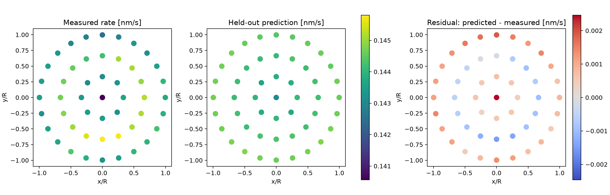

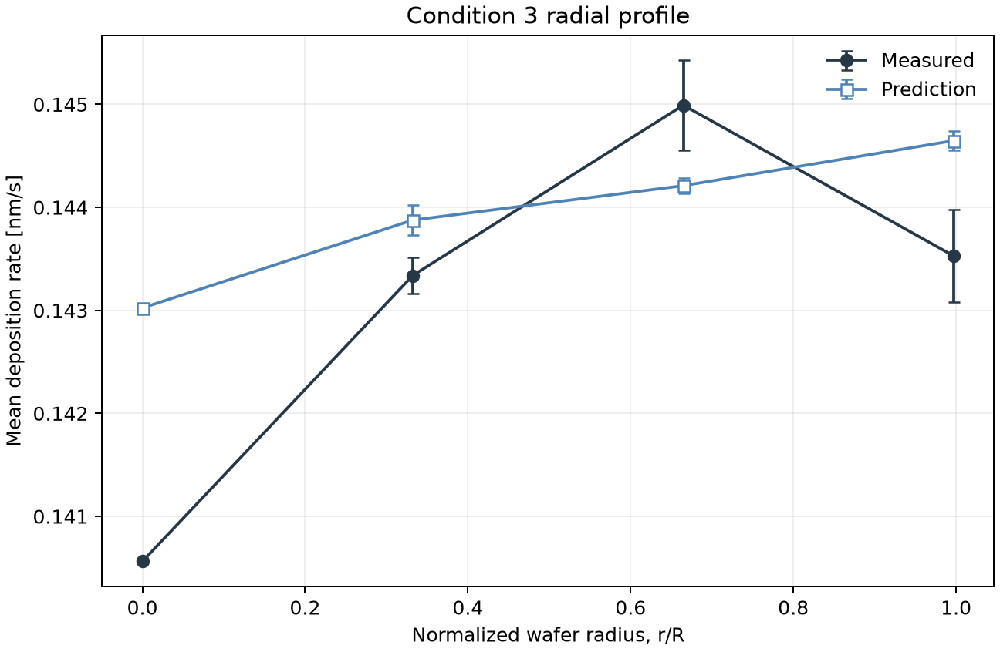

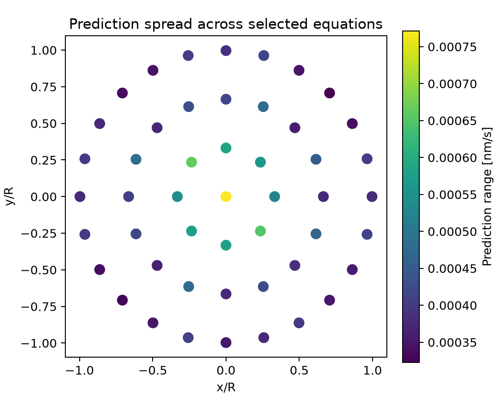

## Workflow scope

|Layer|Responsibility|Models|Current execution scope|Units|
|---|---|---|---|---|
|observation_baseline|test whether any supplied field is needed|constant_rate, empirical_power_compatibility|constant-rate baseline evaluated in the current analysis|output=nm/s|
|steady_surface_response|compare observable reaction forms and exact reductions|aib_qss, parallel_a_ab_qss, langmuir_hinshelwood_qss|enumerated and optimized in the current steady-map analysis|input=1; shape_parameter=1; rate_scale=nm/s|
|dynamic_surface_state|represent memory that steady maps cannot identify|role_cvd_aib, role_cvd_mvk, role_ald_state|registered process models; not dynamically fitted because the current analysis input has no time axis|state=1; mvk_kinetic_coefficient=m^3/(kmol s); time=s|
|transport_closure|map reference-plane concentration to surface concentration|bulk_as_surface_approximation, direct_surface, fit_scalar, from_cfd_flux_sink; supporting: stagnant_film, rotating_disk, bosanquet_diffusivity|current analysis mode is bulk_as_surface; direct_surface, fit_scalar, and from_cfd_flux_sink are simulation-pipeline inputs; supporting_models are registered km calculators and are not automatically dispatched|concentration=kmol/m^3; km=m/s; flux=kmol/(m^2 s)|
|spatial_residual_response|model transferable residual map shape after the chemical model is frozen|none, radial_quadratic, radial_quartic|current mode is radial_quartic; it does not participate in reaction-family or anonymous-role selection|not applicable|
|net_film_balance|compose deposition, etch, and loss with one sign convention|deposition_only, dep_etch_loss|registered rate-composition utilities; separate from reaction-role selection|input=nm/s; output=nm/s|
|selection_and_validation|separate numerical fit, role evidence, and mechanism evidence|inner_condition_cv, exact_reduction, outer_condition_cv, fixed_holdout|all four stages applied in the current analysis|not applicable|

Surface equations, dynamic states, transport closure, and net-film composition answer different questions and are evaluated in their own layers.

## Equation families

|Family|Use|Best condition-CV RMSE [nm/s]|Gap from best|Outer selection|Contrast|
|---|---|---:|---:|---:|---|
|aib_qss|production|0.000894084|0.000%|60.0%|limited|
|parallel_a_ab_qss|production|0.000903338|1.035%|0.0%|sufficient|
|langmuir_hinshelwood_qss|exploratory|0.000925961|3.565%|40.0%|sufficient|

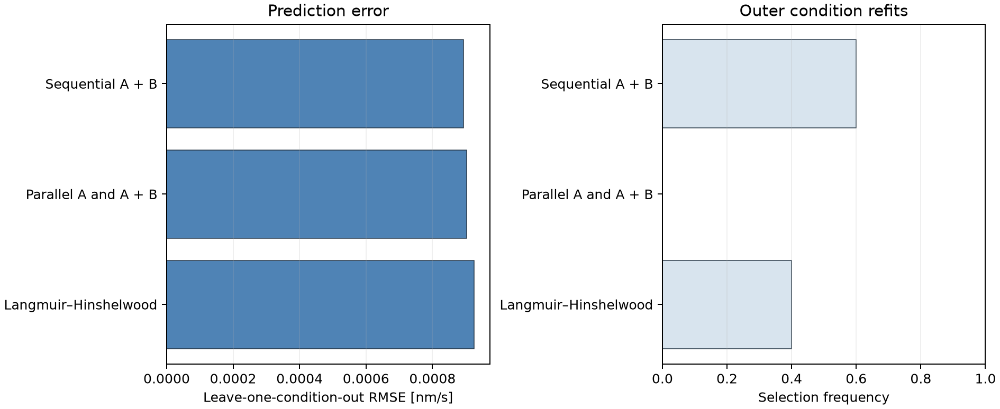

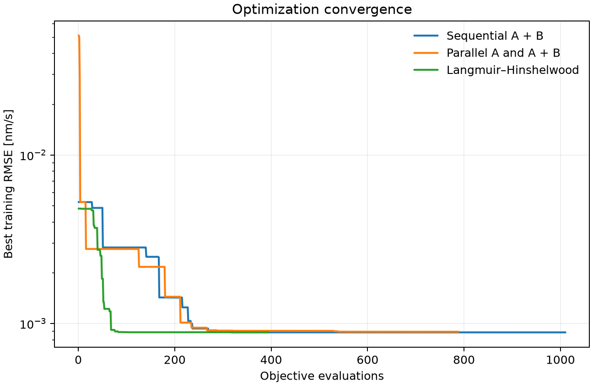

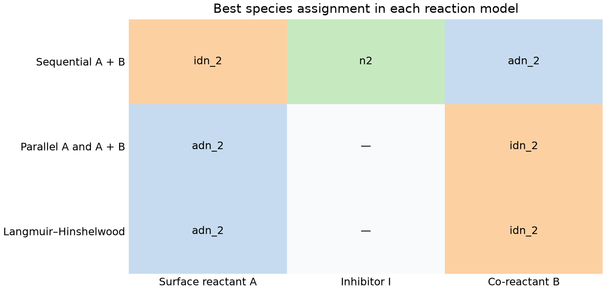

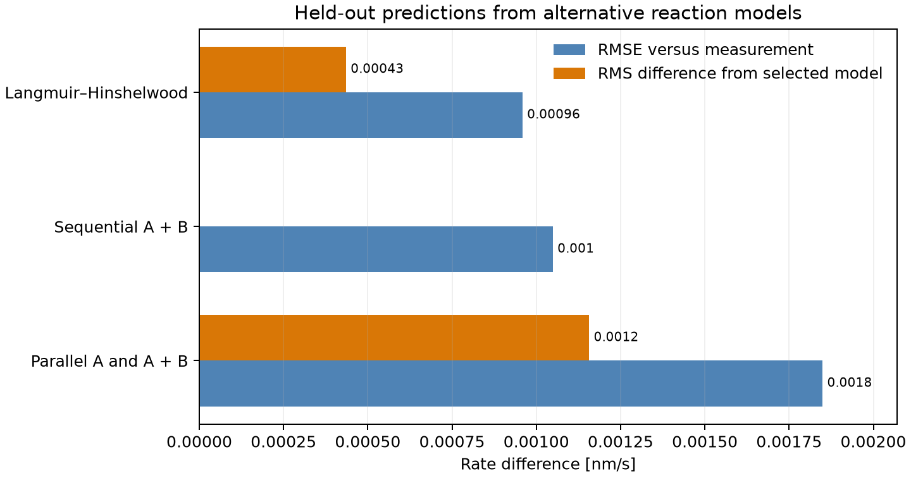

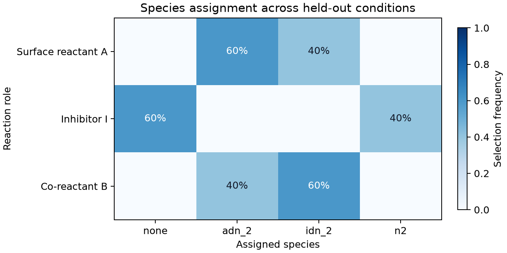

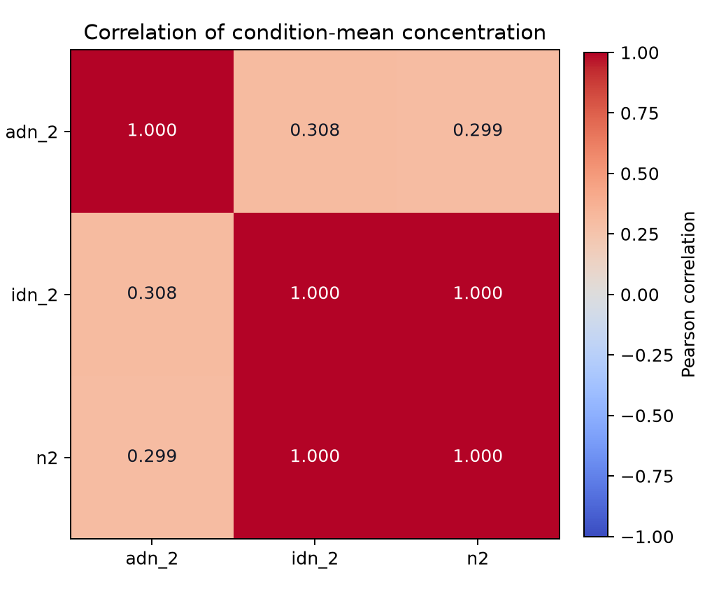

Physical reading by family:
- `aib_qss` — Does adsorbed A require a sequential B-assisted conversion path, with optional blocking by I? Supported: improves the conditionwise constant-rate baseline; finite_loss improves its exact reduction. Unresolved: independent between-condition variation for idn_2, n2; independent A/B perturbations including a low-B regime; independent variation of the inhibitor candidate; consistent parent-versus-reduction benefit for I; stable equation-family selection across outer condition folds.
- `parallel_a_ab_qss` — Does growth contain an A-only path plus a B-assisted parallel path? Supported: improves the conditionwise constant-rate baseline; AB effect improves its exact reduction; AB raw-species assignment is separated in inner CV; finite_loss improves its exact reduction. Unresolved: consistent parent-versus-reduction benefit for A; stable equation-family selection across outer condition folds.
- `langmuir_hinshelwood_qss` — Do A and B compete for one site pool and react as two adsorbates? Supported: improves the conditionwise constant-rate baseline; AB raw-species assignment is separated in inner CV. Unresolved: independent A/B perturbations spanning low coverage and saturation; B adsorption, retention, or time-response evidence; A/B exchange with adsorption-parameter exchange; stable equation-family selection across outer condition folds.

Supported by the numerical winner's equation:
- improves the conditionwise constant-rate baseline
- finite_loss improves its exact reduction

Evidence still required:
- independent between-condition variation for idn_2, n2
- independent A/B perturbations including a low-B regime
- independent variation of the inhibitor candidate
- consistent parent-versus-reduction benefit for I

### Held-out prediction consequence of family choice

|Family|Assigned A|Assigned B|Assigned I|Held-out RMSE [nm/s]|RMS difference from selected [nm/s]|Difference / selected RMSE|
|---|---|---|---|---:|---:|---:|
|aib_qss|idn_2|adn_2|n2|0.00104863|0|0|
|parallel_a_ab_qss|adn_2|idn_2|—|0.0018489|0.0011563|1.1|
|langmuir_hinshelwood_qss|adn_2|idn_2|—|0.000958571|0.000434995|0.415|

The difference ratio measures the predictive consequence of choosing another fitted family. It is neither a mechanism probability nor an uncertainty interval.

## Reaction mechanisms

The pathway diagram shows the adsorption, blocking, and conversion stages represented by each fitted equation. Its arrows define the candidate mechanism; they do not by themselves establish elementary reactions.

|Mechanism|Pathways|State|Evaluation|Steady representation|Condition-CV RMSE [nm/s]|
|---|---|---|---|---|---:|
|aib_qss|AB|theta_A, theta_I|fitted|cvd:aib_qss:AIB:full:bulk_as_surface:A=idn_2,I=n2,B=adn_2|0.000894084|
|parallel_a_ab_qss|A, AB|theta_A, theta_I|fitted|cvd:parallel_a_ab_qss:AB:full:bulk_as_surface:A=adn_2,B=idn_2|0.000903338|
|langmuir_hinshelwood_qss|AB|theta_A, theta_B, theta_I|fitted|cvd:langmuir_hinshelwood_qss:AB:full:bulk_as_surface:A=adn_2,B=idn_2|0.000925961|
|mars_van_krevelen|A_reduction_growth, B_regeneration|oxidized_fraction|steady_observable_equivalent|cvd:aib_qss:AB:no_desorption:bulk_as_surface:A=adn_2,B=n2|0.018136|

The steady Mars-van Krevelen projection is algebraically equivalent to the AIB AB no-desorption response for the present concentration-only data. It is therefore represented once and does not receive a duplicate model-selection vote.
Time-resolved evidence required for Mars-van Krevelen discrimination:
- time-resolved A/B switching or pulse response separating reservoir memory
- surface or lattice oxidation-state observation for oxidized_fraction
- independent regeneration conditions that identify k_regenerate

### Model-conditional surface states and pathways

|Family|Quantity|Component|Mean|Minimum|Maximum|
|---|---|---|---:|---:|---:|
|aib_qss|site fraction|theta free|0.557095|0.535418|0.564849|
|aib_qss|site fraction|theta A|0.442559|0.4348|0.46425|
|aib_qss|site fraction|theta I|0.000346239|0.000332698|0.000350931|
|aib_qss|pathway fraction|path AB fraction|1|1|1|
|parallel_a_ab_qss|site fraction|theta free|0.952166|0.95099|0.955486|
|parallel_a_ab_qss|site fraction|theta A|0.0478344|0.0445136|0.0490101|
|parallel_a_ab_qss|pathway fraction|path A fraction|0.175331|0.163639|0.179656|
|parallel_a_ab_qss|pathway fraction|path AB fraction|0.824669|0.820344|0.836361|
|langmuir_hinshelwood_qss|site fraction|theta free|0.740935|0.727207|0.745756|
|langmuir_hinshelwood_qss|site fraction|theta A|0.0243763|0.0225903|0.025011|
|langmuir_hinshelwood_qss|site fraction|theta B|0.234689|0.229233|0.250202|
|langmuir_hinshelwood_qss|pathway fraction|path AB fraction|1|1|1|

These fractions are latent quantities calculated within each fitted equation. They are not direct measurements of surface coverage or elementary pathway flux.

## Data required for each target use

|Target use|Current evidence|Measurements to add|Evidence required for use|
|---|---|---|---|
|wafer spatial correction|demonstrated_on_supplied_holdouts|replicated, coordinate-registered film maps with pointwise uncertainty wall or near-wall species/transport fields; spatial temperature only if the uniform-temperature assumption is invalid|centered spatial prediction is positive on every independent holdout, residual structure is acceptably small, and the declared spatial tolerance is met|
|anonymous species role assignment|additional_data_required|independently varied candidate-species concentrations low-coverage and saturation conditions surface-state or outlet-species observation tied to the anonymous inputs|condition contrasts have full role rank and the same assignment and effect necessity transfer across independent condition refits|
|elementary kinetic parameter estimation|additional_data_required|time-resolved uptake, thickness, or surface-state response multiple calibrated substrate temperatures site density and absolute wall concentration or reacting-wall molar flux replicated dynamic observations with uncertainty|absolute surface balances are observed, transient and temperature responses resolve every fitted direction, and uncertainty intervals remain finite on external data|

`data_requirements.csv` records the experimental variation, the ambiguity resolved by each measurement, and how it enters the workflow.

## Coefficients

`v = R*uA*b*uB / (uA + (delta + b*uB)*(1 + kappa*uI))`

|Term|Value|Conditional spatial bootstrap 5-95%|
|---|---:|---|
|rate_scale_nm_s|2.52722|2.52761 - 2.57796|
|desorption_ratio|1.40746|1.33352 - 1.48551|
|conversion_ratio|0.0947464|0.0897687 - 0.0982172|
|inhibition_ratio|0.00051397|5.23299e-08 - 0.0159634|

Intervals condition on the numerical prediction winner and supplied conditions; they do not include model-selection uncertainty.

### Role importance and assignment stability

|Role|Raw species|Outer selection|RMS prediction change [nm/s]|Change / held-out RMSE|Reading|
|---|---|---:|---:|---:|---|
|A|idn_2|40.0%|0.0087144|8.31|influential assignment; unresolved across condition refits|
|I|n2|40.0%|4.46163e-06|0.00425|unstable; small prediction consequence in the tested range|
|B|adn_2|40.0%|0.0526467|50.2|influential assignment; unresolved across condition refits|

The ratio of one-at-a-time prediction change to held-out RMSE is a scale comparison; 1 is a visual reference rather than a statistical cutoff.

### Local kinetic-parameter sensitivity

|Parameter|RMS log-rate sensitivity|Mean log-rate sensitivity|
|---|---:|---:|
|desorption_ratio|0.566895|-0.566239|
|conversion_ratio|0.952872|0.952665|
|inhibition_ratio|0.00030078|-0.000300194|

|Parameter pair|Correlation of local log-rate sensitivities|
|---|---:|
|desorption_ratio / inhibition_ratio|-0.911973|
|conversion_ratio / desorption_ratio|-0.585535|
|conversion_ratio / inhibition_ratio|0.412234|

Small sensitivity magnitude identifies a locally inactive fitted direction; strong correlation identifies coupled response directions. These are local diagnostics rather than global parameter intervals.

The input sensitivity is the RMS change in prediction when one local role input is replaced by its fitted reference value. Because the reaction equations are nonlinear, these changes are not additive rate fractions.
The importance-versus-stability figure compares that prediction change with the held-out RMSE and with the frequency of the same raw-species assignment across condition refits. A low and unstable point is predictively negligible over the supplied range; a high and unstable point is influential but not identified.
Parameter loss slices re-optimize only the overall rate scale while one kinetic ratio is varied. The other kinetic ratios remain fixed, so the curves diagnose local flatness but are not joint confidence intervals.

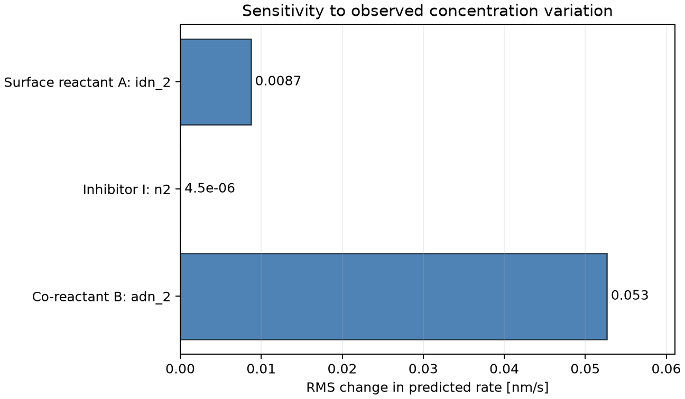

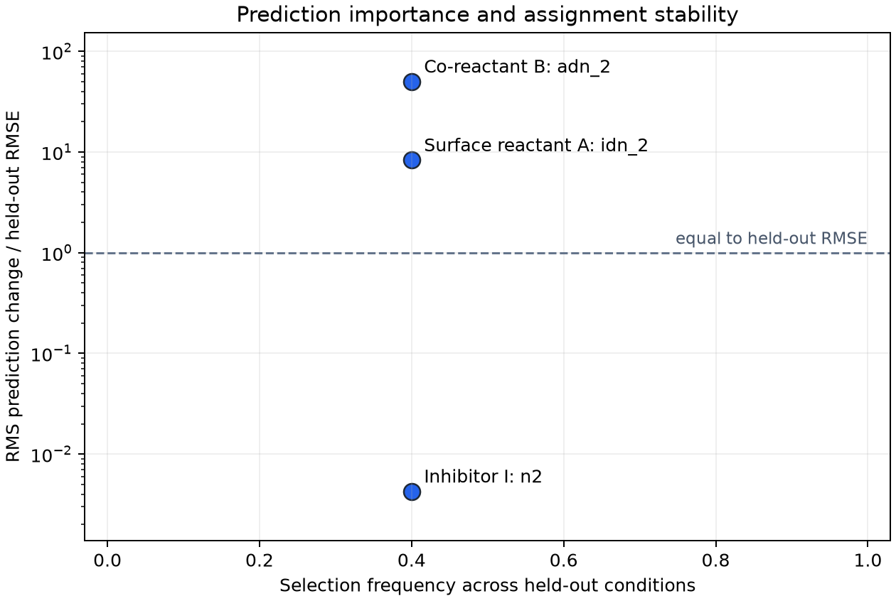

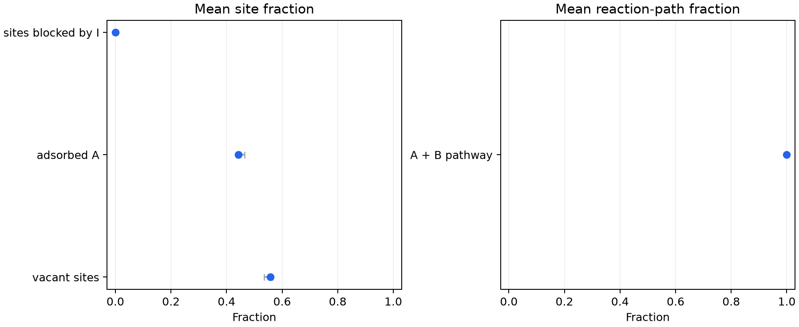

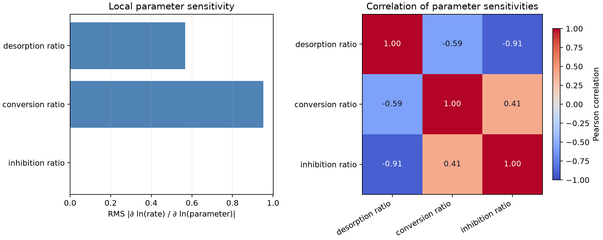

## Post-selection spatial response

Model: `radial_quartic`. It preserves the chemical condition mean and does not participate in reaction-role or equation selection.
Fixed-holdout centered R2: chemical -0.0147996; chemical + spatial 0.845158.
Fixed-holdout RMSE: chemical 0.00104863 nm/s; chemical + spatial 0.000570306 nm/s.
Positive centered R2 on every outer condition: `True`.

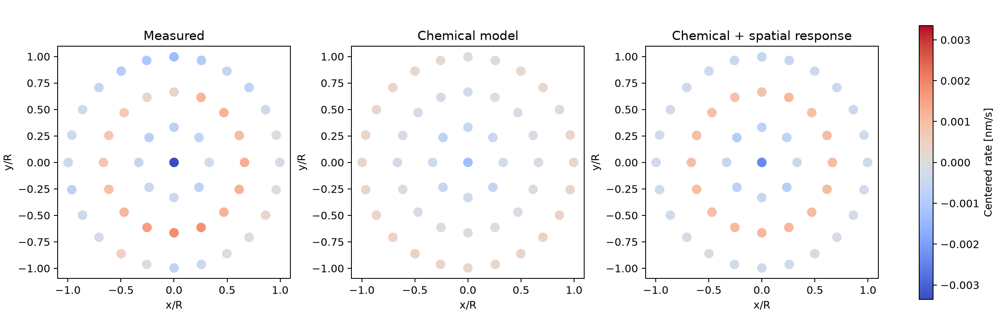

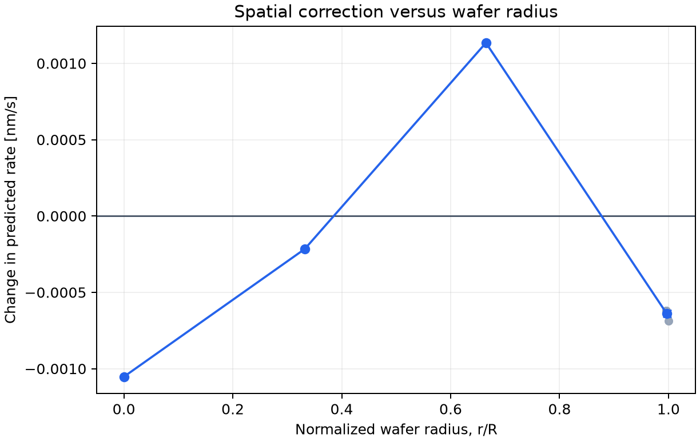

## Condition refits

|Held-out condition|Numerical winner|Response structure|Relative RMSE|Centered R2|
|---|---|---|---:|---:|
|1|cvd:aib_qss:AB:full:bulk_as_surface:A=adn_2,B=idn_2|surface_qss|0.6202%|-0.08457|
|2|cvd:aib_qss:AIB:full:bulk_as_surface:A=idn_2,I=n2,B=adn_2|surface_qss|0.6063%|-0.1063|
|3|cvd:aib_qss:AIB:full:bulk_as_surface:A=idn_2,I=n2,B=adn_2|surface_qss|0.7286%|-0.0148|
|4|cvd:langmuir_hinshelwood_qss:AB:full:bulk_as_surface:A=adn_2,B=idn_2|surface_lh_qss|0.5681%|0.03711|
|5|cvd:langmuir_hinshelwood_qss:AB:full:bulk_as_surface:A=adn_2,B=idn_2|surface_lh_qss|1.0325%|-0.199|

## Interpretation

Raw species are candidate inputs, not established chemical identities. Indistinguishable assignments remain unresolved.
Bulk concentrations are used as surface-response inputs; absolute wall flux is not calculated.
Measurement uncertainty and independent process conditions are needed to assess practical identifiability.

See role_summary.csv, role_ranking.csv, role_stability.csv, condition_scores.csv, model_structure_uncertainty.csv, and data_requirements.csv for decisions and evidence.
